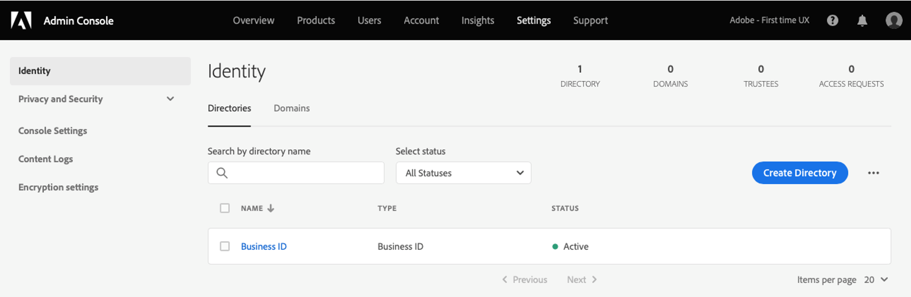
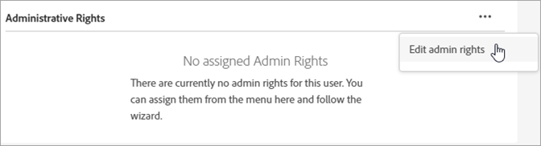

# Gebruikers en producten van Experience Cloud beheren

Leer hoe u zich aanmeldt bij de Admin Console, gebruikersmachtigingen voor Experience Cloud-gebruikers, productprofielen en browserondersteuning beheert.

>[!IMPORTANT]
>
>De volgende informatie is specifiek voor Experience Cloud toepassingen. Deze informatie vormt een aanvulling op de bredere administratieve informatie in de [Handboek voor Enterprise Administration](https://helpx.adobe.com/nl/enterprise/admin-guide.html) voor alle Adobe cloud-producten.

U kunt een sorteerbare en filterbare lijst van alle gebruikers van de Experience Cloud en hun details in het Hulpmiddel Admin bekijken. Zie [Experience Cloud-gebruikers weergeven in het Admin-gereedschap](admin-tool-experience-cloud.md).

## Aankondiging van update van voorziening{#provisioning}

Bijgewerkt: **20 juli 2022**

>[!IMPORTANT]
>
>Controleer de volgende kennisgeving met betrekking tot Experience Cloud-provisioning.

Adobe werkt zijn levering bij om alle klanten van de Experience Cloud toegang tot stichtingsmogelijkheden te verlenen die interoperabiliteit tussen sommige producten van Experience Cloud helpen. Gebruikers krijgen Adobe Experience Platform als nieuwe machtiging toegevoegd aan hun Experience Cloud-organisaties, met [!UICONTROL Data Collection] als inbegrepen dienst.

Adobe Experience Platform [!UICONTROL Data Collection] include [tags](https://experienceleague.adobe.com/docs/tags.html?lang=en) voor vereenvoudigd beheer van universele tags en biedt een vertrouwde, robuuste en complete, streaminggegevensinfrastructuur. Tags vereenvoudigen het verzamelen van gegevens door de klant en stroomlijnen de levering van ervaringen.

**Wijzigingen in Admin Console**

Beheerders kunnen de wijzigingen of toevoegingen aan de Admin Console als volgt zien:

* De Adobe Experience Platform-productkaart in de Admin Console bevat:

   * Plaatsen
   * Betrouwbaarheid
   * Naamruimte van identiteit
   * Sandboxes
   * Experience Data Model
   * Schema&#39;s
   * Gegevensstromen
   * Bezoekers-id

   Voor organisaties die momenteel geen Experience Platform gebruiken, ziet u nu de _Adobe Experience Platform_ in de Admin Console, met inbegrip van de hierboven vermelde mogelijkheden.

   Voor organisaties die momenteel Experience Platform gebruiken, _Plaatsen_ wordt nu geconsolideerd in de kaart van het Experience Platform.

* Adobe Experience Platform Data Collection (voorheen, Launch) en Privacy zullen als afzonderlijke productkaarten van de andere mogelijkheden van het Experience Platform blijven verschijnen.

Ga voor meer informatie over de nieuwe mogelijkheden naar de pagina&#39;s op het Experience League:

* [Gegevensverzameling](https://experienceleague.adobe.com/docs/analytics/analyze/reports-analytics/reporting-interface/overview-data-collection.html)
* [Plaatsen](https://experienceleague.adobe.com/docs/places/using/home.html?lang=nl)
* [Betrouwbaarheid](https://experienceleague.adobe.com/docs/platform-learn/implement-mobile-sdk/app-implementation/assurance.html)
* [Naamruimte van identiteit](https://experienceleague.adobe.com/docs/experience-platform/identity/home.html?lang=en)
* [Sandboxes](https://experienceleague.adobe.com/docs/experience-platform/sandbox/home.html?lang=en)
* [Experience Data Model](https://experienceleague.adobe.com/docs/experience-platform/xdm/home.html?lang=nl)
* [Schema&#39;s](https://experienceleague.adobe.com/docs/experience-platform/xdm/schema/composition.html)
* [Gegevensstromen](https://experienceleague.adobe.com/docs/experience-platform/edge/datastreams/overview.html?lang=en)
* [Bezoekers-id](https://experienceleague.adobe.com/docs/core-services/interface/services/core-services.html?lang=en#section_3C9F6DF37C654D939625BB4D485E4354)
* [Privacy](https://experienceleague.adobe.com/docs/experience-platform/privacy/home.html?lang=nl)

## Experience Cloud-gebruikersverificatie (geplande migratie){#migration}

Vanaf februari 2022 werkt Adobe zijn profielbeheersysteem bij om organisaties in staat te stellen bedrijfsrechten op individuele profielen beter te beheren. Als zodanig worden alle gebruikers met een persoonlijk profiel dat overeenkomt met een individuele Adobe ID (Type1), gemigreerd naar een nieuw bedrijfsprofiel. Dit profiel komt overeen met een _Zakelijke id_ (Type2e).

Zie [Identiteitstypen in Adobe Admin Console](https://helpx.adobe.com/enterprise/using/identity.html) voor informatie over identiteitstypen.

### Migratieproces

Wanneer het tijd is voor uw migratie, ontvangen organisatiebeheerders 30 dagen vóór de migratie een e-mail met een melding.

* De migratie zal tussen 10.00 uur worden gepland. - 6.00 uur, gebaseerd op de primaire tijdzone van de organisatie of op het weekend.
* Tijdens de migratie kan de Experience Cloud-toepassing ongeveer 15 minuten ontoegankelijk zijn en kan de Admin Console tot 30 minuten ontoegankelijk zijn. Anders verloopt deze migratie naadloos.

### Wijzigingen na de migratie

Admin Console

* Beheerders met meerdere accounts kunnen een profielkiezer zien wanneer ze zich aanmelden [!UICONTROL Admin Console].
* Individuele Adobe ID-gebruikers worden bijgewerkt naar de bedrijfs-id.
* De directory met bedrijfs-id wordt toegevoegd aan **[!UICONTROL Settings]** > **[!UICONTROL Identity]** > **[!UICONTROL Directories]**.

   

### Aanmelden na migratie

Uw aanmeldingservaring verandert niet met deze update:

1. Aanmelden bij `experience.adobe.com` dezelfde referenties gebruiken.

1. Er wordt een nieuw profiel gemaakt dat is gekoppeld aan de bedrijfs-id. U wordt gevraagd **[!UICONTROL Join now]** of **[!UICONTROL Skip]**.

1. Als u een van de opties gebruikt, wordt een bestaande landingspagina weergegeven.

1. Een Adobe-profiel is gekoppeld aan elk businessplan en biedt de mogelijkheid om elementen te organiseren die zijn gemaakt op basis van extra Adobe Cloud-aanbiedingen (Creative Cloud en Document Cloud).

Zie voor meer informatie [Introductie van Adobe-profielen](https://helpx.adobe.com/enterprise/kb/introducing-adobe-profiles.html).

## Wat is een productprofiel? {#section_AB50558124D541CF80A0D3D76D35A4BF}

_[!UICONTROL Product Profiles]_Dit zijn groepen producten en services die u aan gebruikers kunt toewijzen. In Experience Cloud zijn machtigingen gebaseerd op het profiel van een product, niet op de gebruiker. (U kunt beheerrechten echter delegeren aan specifieke gebruikers.)

Bijvoorbeeld, in Analytics kunt u een inzameling van rapporteringshulpmiddelen, zoals Analysis Workspace en Report Builder, samen met rapportsuites, metriek, en dimensies vormen. U kunt toestemming verlenen aan een Profiel van het Product door gebruikers aan het profiel toe te voegen.

* Zie [Toestemmingen van de toegang van Analytics aan een Profiel van het Product toewijzen](admin-getting-started.md#task_040673FE3E3E429B9531FBCB8B6A4391) op deze pagina.
* Zie [Beheerdersrollen delegeren aan gebruikers](#delegate-rights) op deze pagina

## Experience Cloud-productprofielen beheren {#task_16335111C52D40E9BAC73D0699584DBF}

U kunt een productprofiel maken en dit aan een machtigingengroep toewijzen.

Wanneer u een gebruiker naar een organisatie uitnodigt, kunt u de gebruiker toegang geven tot producten en productprofielen. U kunt beperkte administratieve toestemmingen aan een gebruiker ook delegeren. Op dezelfde manier kunt u gebruikersgroepen creëren, dan de groep toevoegen aan een Profiel van het Product om toegang toe te laten.

1. In de [Admin Console](https://adminconsole.adobe.com/enterprise/), selecteert u **[!UICONTROL Products]**.
1. Selecteer de naam van uw organisatie.
1. Selecteer **[!UICONTROL New Profile]**.
1. Configureer de profieldetails en selecteer vervolgens **[!UICONTROL Save]**.

Zie voor meer informatie (en voor hulp bij het beheer van Creative Cloud- en Document Cloud-producten) [Identiteit](https://helpx.adobe.com/enterprise/using/identity.html) in de [Gebruikershandleiding voor beheer](https://helpx.adobe.com/nl/enterprise/using/users.html).

**Gerelateerde help**

* [Producten en profielen beheren](https://helpx.adobe.com/enterprise/using/manage-products.html) in de Gebruikershandleiding voor Beheer.
* [Machtigingen voor zakelijke gebruikers](https://experienceleague.adobe.com/docs/target/using/administer/manage-users/enterprise/property-channel.html?lang=en) in Adobe Target Help voor meer informatie.
* Video: [Adobe Target-werkruimten configureren in Adobe Admin Console](https://experienceleague.adobe.com/docs/experience-cloud-kcs/kbarticles/KA-17521.html?lang=en)

## Beheerdersrollen delegeren aan gebruikers {#delegate-rights}

In de Admin Console, kunt u beperkte administratieve rechten aan anderen in uw organisatie delegeren. Met gedelegeerde rollen kunnen gebruikers softwaretoegang voor eindgebruikers beheren, toegangsimplementatiemogelijkheden bieden en als ondersteuningsafgevaardigden functioneren.

U kunt bijvoorbeeld:

* Laat uw creatieve regisseur toegang tot Creative Cloud verlenen.
* Laat uw marketingdirecteur toegang verlenen tot de Experience Cloud.
* Houd deze twee rollen afzonderlijk zodat kunnen zij elkaars rollen niet overstappen.

Door deze rollen te gebruiken, kunt u beheer aan anderen gelijktijdig delegeren zonder meer vermogen te verstrekken dan zij nodig hebben.

1. Selecteer in de Admin Console de optie **[!UICONTROL Users]** en selecteert u vervolgens de naam van de gebruiker.

   

1. Selecteer **[!UICONTROL Edit admin rights]**.

   

1. Geef de beheerdersrechten van de gebruiker op.
1. Selecteer **[!UICONTROL Save]**.

## Gebruikers en producten van Analytics beheren {#section_97DE101F92CD494AB073893680992F1A}

U kunt de toestemmingen van de het rapporttoegang van de Analyse (rapportreeksen, metriek, afmetingen, etc.) aan een Profiel van het Product toewijzen.

U kunt bijvoorbeeld een productprofiel maken dat meerdere analyseprogramma&#39;s bevat ([!UICONTROL Analysis Workspace], [!UICONTROL Reports & Analytics], en [!UICONTROL Report Builder]). Deze profielen bevatten machtigingen voor specifieke metriek en dimensies (inclusief eVars) en mogelijkheden zoals segmenten of het maken van berekende metriek.

1. Aanmelden bij de [Admin Console](https://adminconsole.adobe.com/enterprise)selecteert u vervolgens **[!UICONTROL Products]**.
1. Op de [!UICONTROL Products] pagina, selecteert u uw product en selecteert u vervolgens **[!UICONTROL Permissions]** (alleen beschikbaar voor beheerders).
1. De profielmachtigingen configureren:

| Element | Beschrijving |
|--- |--- |
| Rapportsuites | Schakel machtigingen in voor specifieke rapportsuites. |
| Metrics | Machtigingen inschakelen voor verkeer, conversie, aangepaste gebeurtenissen, toepassingsgebeurtenissen, inhoud behouden enzovoort. |
| Dimensies | Pas gebruikerstoegang op korrelig niveau, met inbegrip van eVars, verkeersrapporten, toepassingsrapporten, en wegrapporten aan. |
| Rapportsuite-gereedschappen | Schakel gebruikersmachtigingen in voor webservices, rapportbeheer, tools en rapporten en dashboarditems. |
| Analysegereedschappen | Laat gebruikerstoestemmingen voor Algemene punten (het factureren, logboeken, etc.), het Beheer van het Bedrijf, Hulpmiddelen, de Toegang van de Dienst van het Web, Report Builder, en de integratie van Data Connectors toe. De montages van het bedrijf van de Customize categorie van de Admin Console zijn verplaatst naar de Hulpmiddelen van Analytics. |

**Migratie van gebruikersaccount**

Er is een hulpprogramma voor de migratie van gebruikers-id&#39;s van Analytics beschikbaar om beheerders te helpen gebruikersaccounts te migreren van Analytics User Management naar de [Adobe Admin Console](https://adminconsole.adobe.com/enterprise/).

De accountmigratie wordt in fasen uitgevoerd naar klanten. Adobe brengt u op de hoogte en helpt u wanneer het uw tijd is om bestaande gebruikersaccounts te migreren van **[!UICONTROL Admin Tools]** > **[!UICONTROL User Management]** aan de Admin Console.

Na de migratie melden gebruikers zich aan met hun Adobe ID (of Enterprise ID) en verifiëren ze zich bij hun Experience Cloud-toepassingen en -services op [experience.adobe.com](https://experience.adobe.com). Als gebruikers proberen zich aan te melden via oude logins ([!DNL my.omniture.com], [!DNL sc.omniture.com] en [!DNL experiencecloud.adobe.com]) worden doorgestuurd naar [!DNL experience.adobe.com].

**Gerelateerde help**

* [Analyses in de Admin Console](https://experienceleague.adobe.com/docs/analytics/admin/admin-console/home.html?lang=en)
* [Migratie van gebruikers-id voor analyse](https://experienceleague.adobe.com/docs/analytics/admin/admin-tools/user-product-management/migrate-users/c-migration-tool.html?lang=en)

## Adobe Target beheren - Productprofielen versus werkruimten {#section_3860AF177C9E4C7E9C390D36A414F353}

In Adobe Target is een werkruimte een productprofiel. Het laat een organisatie een specifieke reeks gebruikers aan een specifieke reeks eigenschappen toewijzen. In veel opzichten is een werkruimte vergelijkbaar met een rapportsuite in Adobe Analytics.

Zie:

* [Machtigingen voor zakelijke gebruikers](https://experienceleague.adobe.com/docs/target/using/administer/manage-users/enterprise/property-channel.html?lang=en)
* [Producten en profielen beheren](https://helpx.adobe.com/enterprise/using/manage-products.html)
* Video: [Adobe Target-werkruimten configureren in Adobe Admin Console](https://experienceleague.adobe.com/docs/experience-cloud-kcs/kbarticles/KA-17521.html?lang=en)

## Campagneproductprofielen, huurders en beveiligingsgroepen beheren {#section_09CDF75366444CF5810CF321B7C712F3}

A *huurder* in Campagne wordt weergegeven als een *product* in de pagina van de Producten van de Admin Console.

*Beveiligingsgroep* wordt weergegeven als een productprofiel.

Zie [Groepen en gebruikers beheren](https://experienceleague.adobe.com/docs/campaign-standard/using/administrating/users-and-security/managing-groups-and-users.html?lang=en) voor informatie over veiligheidsgroepen en het toewijzen van gebruikers aan veiligheidsgroepen.

## Gegevensverzameling van Experience Platforms beheren (starten) {#section_F2DA6778DD2D48AA8F794041971EE6B1}

Experience Platform [!UICONTROL Data Collection] ([!UICONTROL Launch]) weergegeven op de [!UICONTROL Products] pagina in de [!UICONTROL Admin Console]. U kunt andere toepassingen en services opnemen in een productprofiel starten.

Gebruikers uitnodigen om [!UICONTROL Platform Launch] en wijs gebruikersrollen en rechten toe.

Zie [Gebruikersmachtigingen](https://experienceleague.adobe.com/docs/experience-platform/tags/admin/user-permissions.html?lang=en) voor meer informatie over gebruikersmachtigingen in de Admin Console en over het instellen van opstartopties, waaronder het toewijzen van rechten aan profielen.

## Experience Manager as a Cloud Service

Adobe Enterprise-klanten worden vertegenwoordigd als organisaties in de Adobe [!UICONTROL Admin Console]. De klanten van de Experience Manager kunnen de Adobe gebruiken [!UICONTROL Admin Console] productrechten en IMS-authenticatie voor Experience Manager als een [!UICONTROL Cloud Service].

Zie [IMS-ondersteuning voor as a Cloud Service Experience Manager](https://experienceleague.adobe.com/docs/experience-manager-cloud-service/content/security/ims-support.html?lang=en).

## Audience Manager {#section_C31E3FA8A1E14463B1B3E07235F1983C}

Maak gebruikers van Audience Managers en wijs deze toe aan groepen. U kunt ook limieten (kenmerken, segmenten, doelen, en [!DNL AlgoModel]).

Zie [Beheer](https://experienceleague.adobe.com/docs/audience-manager/user-guide/features/administration/administration-overview.html?lang=en) in Audience Manager Help.

## Ondersteunde browsers in de Experience Cloud

* [!DNL Microsoft® Edge] (Microsoft® heeft [beëindigde ondersteuning](https://www.microsoft.com/en-us/WindowsForBusiness/End-of-IE-support) voor Internet Explorer 8, 9 en 10. Als dusdanig, lost Adobe geen kwesties op die tegen deze specifieke versies van Internet Explorer worden gemeld.)
* [!DNL Google Chrome]
* [!DNL Firefox]
* [!DNL Safari]
* [!DNL Opera]

**Opmerking:** Hoewel de interface Experience Cloud deze browsers ondersteunt, ondersteunen afzonderlijke toepassingen niet elke browser. ([Analytics](https://experienceleague.adobe.com/docs/analytics/admin/admin-overview/sys-reqs.html?lang=en) biedt bijvoorbeeld geen ondersteuning voor [!DNL Opera] en [!DNL Adobe Target] biedt geen ondersteuning voor [!DNL Safari].)

### Oplossing en productvereisten

* [Analytics](https://experienceleague.adobe.com/docs/analytics/admin/admin-overview/sys-reqs.html?lang=en)
* [Report Builder](https://experienceleague.adobe.com/docs/analytics/analyze/report-builder/report-builder-setup/system-requirements.html?lang=en)
