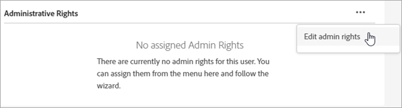
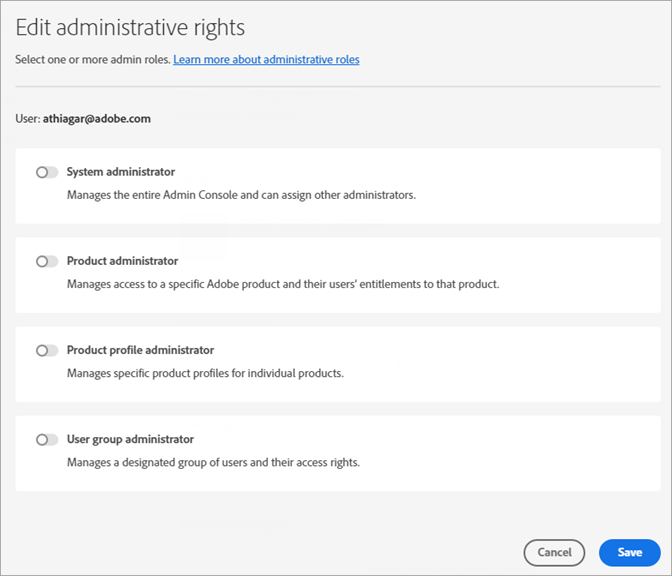

# Gebruikers en producten van Experience Cloud beheren

Leer hoe u zich aanmeldt bij de Admin Console, gebruikersmachtigingen en productprofielen voor Experience Cloud beheert en browserondersteuning.

>[!IMPORTANT]
>
>De volgende informatie is specifiek voor Experience Cloud toepassingen. Deze informatie vult de bredere administratieve informatie in [de Gids van de Gebruiker van het Beleid van de Onderneming](https://helpx.adobe.com/enterprise/admin-guide.html) voor alle Adobe wolkenproducten aan.

U kunt een sorteerbare en filterbare lijst van alle gebruikers van de Experience Cloud en hun details in het Hulpmiddel Admin bekijken. Zie [Gebruikers van Experience Cloud weergeven in het Admin-gereedschap](admin-tool-experience-cloud.md).

## Wat is een productprofiel? {#section_AB50558124D541CF80A0D3D76D35A4BF}

[!UICONTROL Product Profiles] Dit zijn groepen producten en services die u aan gebruikers kunt toewijzen. In Experience Cloud zijn machtigingen gebaseerd op het profiel van een product, niet op de gebruiker. (U kunt beheerrechten echter delegeren aan specifieke gebruikers.)

Bijvoorbeeld, in Analytics kunt u een inzameling van rapporteringshulpmiddelen, zoals Analysis Workspace en Report Builder, samen met rapportsuites, metriek, en dimensies vormen. U kunt machtigingen verlenen aan een productprofiel door gebruikers toe te voegen aan het profiel.

* Zie [Toestemmingen van de toegang van Analytics aan een productprofiel](../admin-getting-started/admin-getting-started.md#task_040673FE3E3E429B9531FBCB8B6A4391) op deze pagina toewijzen.
* Zie [Beheerdersrollen delegeren aan gebruikers](#delegate-rights) op deze pagina

## Experience Cloud-productprofielen beheren {#task_16335111C52D40E9BAC73D0699584DBF}

U kunt een productprofiel maken en dit aan een machtigingengroep toewijzen.

Wanneer u een gebruiker naar een organisatie uitnodigt, kunt u de gebruiker toegang geven tot producten en productprofielen. U kunt beperkte administratieve toestemmingen aan een gebruiker ook delegeren. Op dezelfde manier kunt u gebruikersgroepen creëren, dan de groep toevoegen aan een productprofiel om toegang toe te laten.

1. Klik in [Admin Console](https://adminconsole.adobe.com/enterprise/) op **[!UICONTROL Products]**.
1. Klik op de naam van uw organisatie.
1. Klik op **[!UICONTROL New Profile]**.
1. Configureer de profieldetails en klik vervolgens op **[!UICONTROL Save]**.

Zie [Identity](https://helpx.adobe.com/enterprise/admin-guide.html/enterprise/using/identity.ug.html) in de [Beheergebruikershandleiding](https://helpx.adobe.com/enterprise/admin-guide.html/enterprise/using/users.ug.html) voor meer informatie (en voor hulp bij productbeheer van Creative Cloud en Documenten Cloud).

**Gerelateerde help**

* [Beheer producten en ](https://helpx.adobe.com/enterprise/admin-guide.html/enterprise/using/manage-products.ug.html) profielen in de Gids van de Gebruiker van het Beleid.
* [De ](https://experienceleague.adobe.com/docs/target/using/administer/manage-users/enterprise/property-channel.html?lang=en) Machtigingen van de Gebruiker van de onderneming in Adobe Target helpen voor meer informatie.
* Video: [Adobe Target-werkruimten configureren in Adobe Admin Console](https://helpx.adobe.com/target/kb/how-to-configure-target-workspaces-in-adobe-admin-console0.html)

<!-- ## What's new in Experience Cloud user management {#concept_06A0A13362F644FB90F947238407637A}

Learn about the latest features in Experience Cloud user and product management.

### Business ID type

Adobe is introducing an identity type called Business ID. This identity type improves the control of user and product management. Adobe is migrating all Adobe IDs (owned by individuals) that are used for business to the new enterprise Business IDs owned by your organization.

If you are an existing Experience Cloud customer, Adobe will migrate all your users with Adobe IDs in the Admin Console to Business IDs. If you are a new enterprise or teams customer, you will add users to the Admin Console using one of the available identity types: Business ID, Enterprise ID, or Federated ID.

What to do

* Your users will need to accept Terms of Use (TOU) changes prior to accounts being migrated to Type2e. 
* Users that belong to multiple organizations might see a Profile Selection screen during the login workflow and need to select the correct one. This ensures that they are logging into the correct organization. (There might be multiple profiles to choose from if a user was a member of multiple organizations before the migration.)

Beginning May 2020, enterprise administrators cannot use the Adobe ID for new organizations created in the Admin Console. Latest: https://wiki.corp.adobe.com/pages/viewpage.action?spaceKey=engage&title=Type2e+DX+GTM-->

## Beheerdersrollen toewijzen aan gebruikers {#delegate-rights}

In de Admin Console, kunt u beperkte administratieve rechten aan anderen in uw organisatie delegeren. Met gedelegeerde rollen kunnen gebruikers softwaretoegang voor eindgebruikers beheren, toegangsimplementatiemogelijkheden bieden en als ondersteuningsafgevaardigden functioneren.

U kunt bijvoorbeeld:

* Laat uw creatieve regisseur toegang tot Creative Cloud verlenen.
* Laat uw marketingdirecteur toegang verlenen tot de Experience Cloud.
* Houd deze twee rollen afzonderlijk zodat kunnen zij elkaars rollen niet overstappen.

Door deze rollen te gebruiken, kunt u beheer aan anderen gelijktijdig delegeren zonder meer vermogen te verstrekken dan zij nodig hebben.

1. Klik in de Admin Console op **[!UICONTROL Users]** en klik vervolgens op de naam van de gebruiker.

   

1. Klik op **[!UICONTROL Edit admin rights]**.

   

1. Geef de beheerdersrechten van de gebruiker op.
1. Klik op **[!UICONTROL Save]**.

## Gebruikers en producten van Analytics beheren {#section_97DE101F92CD494AB073893680992F1A}

U kunt de toestemmingen van de het rapporttoegang van de Analyse (rapportreeksen, metriek, afmetingen, etc.) aan een productprofiel toewijzen.

U kunt bijvoorbeeld een productprofiel maken dat meerdere analyseprogramma&#39;s bevat ([!UICONTROL Analysis Workspace], [!UICONTROL Reports & Analytics] en [!UICONTROL Report Builder]). Deze profielen bevatten machtigingen voor specifieke metriek en dimensies (inclusief eVars) en mogelijkheden zoals segmenten of het maken van berekende metriek.

1. Meld u aan bij de [Admin Console](https://adminconsole.adobe.com/enterprise) en klik vervolgens op **[!UICONTROL Products]**.
1. Klik op de pagina [!UICONTROL Products] op uw product en klik vervolgens op **[!UICONTROL Permissions]** (alleen beschikbaar voor beheerders).
1. De profielmachtigingen configureren:

| Element | Beschrijving |
|--- |--- |
| Rapportsuites | Schakel machtigingen in voor specifieke rapportsuites. |
| Metrics | Laat toestemmingen voor verkeer, omzetting, douanegebeurtenissen, oplossingsgebeurtenissen, bewuste inhoud toe, etc. |
| Dimensies | Pas gebruikerstoegang op een korrelig niveau, met inbegrip van eVars, verkeersrapporten, oplossingsrapporten, en wegrapporten aan. |
| Rapportsuite-gereedschappen | Schakel gebruikersmachtigingen in voor webservices, rapportbeheer, tools en rapporten en dashboarditems. |
| Analysegereedschappen | Laat gebruikerstoestemmingen voor Algemene punten (het factureren, logboeken, etc.), het Beheer van het Bedrijf, Hulpmiddelen, de Toegang van de Dienst van het Web, Report Builder, en de integratie van de Verbindingen van Gegevens toe. De montages van het bedrijf van de Customize categorie van de Admin Console zijn verplaatst naar de Hulpmiddelen van Analytics. |

**Migratie van gebruikersaccount**

Er is een hulpprogramma voor de migratie van gebruikers-id&#39;s voor Analytics beschikbaar waarmee beheerders gebruikersaccounts kunnen migreren van Analytics User Management naar [Adobe Admin Console](https://adminconsole.adobe.com/enterprise/).

De accountmigratie wordt in fasen uitgevoerd aan klanten. Adobe geeft een melding en helpt u wanneer het uw tijd is om bestaande gebruikersaccounts te migreren van **[!UICONTROL Admin Tools]** > **[!UICONTROL User Management]** naar de Admin Console.

Na de migratie melden gebruikers zich aan met hun Adobe ID (of Enterprise ID) en verifiëren ze hun Experience Cloud-oplossingen en -services op [experience.adobe.com](https://experience.adobe.com). Als gebruikers proberen zich aan te melden via oude logins ([!DNL my.omniture.com], [!DNL sc.omniture.com] en [!DNL experiencecloud.adobe.com]), worden ze omgeleid naar [!DNL experience.adobe.com].

**Gerelateerde help**

Zie [Migratie van gebruikers-id voor analyse](https://experienceleague.adobe.com/docs/analytics/admin/user-product-management/user-management/migrate-users/c-migration-tool.html?lang=en) voor meer informatie

## Adobe Target beheren - productprofielen versus werkruimten {#section_3860AF177C9E4C7E9C390D36A414F353}

In Adobe Target is een werkruimte een productprofiel. Het laat een organisatie een specifieke reeks gebruikers aan een specifieke reeks eigenschappen toewijzen. In veel opzichten is een werkruimte vergelijkbaar met een rapportsuite in Adobe Analytics.

Zie:

* [Machtigingen voor zakelijke gebruikers](https://experienceleague.adobe.com/docs/target/using/administer/manage-users/enterprise/property-channel.html?lang=en)
* [Producten en profielen beheren](https://helpx.adobe.com/enterprise/admin-guide.html/enterprise/using/manage-products.ug.html)
* Video: [Adobe Target-werkruimten configureren in Adobe Admin Console](https://helpx.adobe.com/target/kb/how-to-configure-target-workspaces-in-adobe-admin-console0.html)

## Productprofielen, huurders en beveiligingsgroepen voor campagnes beheren {#section_09CDF75366444CF5810CF321B7C712F3}

Een *huurder* in Campagne toont als *product* in de pagina van de Producten van de Admin Console.

*Beveiligingsgroepen* worden weergegeven als een productprofiel.

Zie [Groepen en gebruikers beheren](https://experienceleague.adobe.com/docs/campaign-standard/using/administrating/users-and-security/managing-groups-and-users.html?lang=en) voor informatie over beveiligingsgroepen en het toewijzen van gebruikers aan beveiligingsgroepen.

## Gegevensverzameling van Experience Platforms beheren (starten) {#section_F2DA6778DD2D48AA8F794041971EE6B1}

Experience Platform [!UICONTROL Data Collection] ([!UICONTROL Launch]) wordt weergegeven op de pagina [!UICONTROL Products] in [!UICONTROL Admin Console]. U kunt andere oplossingen en de diensten in een het productprofiel van de Lancering omvatten.

Gebruikers uitnodigen om [!UICONTROL Platform Launch] te openen en gebruikersrollen en -rechten toe te wijzen.

Zie [Gebruikersmachtigingen](https://experienceleague.adobe.com/docs/launch/using/admin/user-permissions.html?lang=en#admin) voor meer informatie over gebruikersmachtigingen in de Admin Console en over het instellen van opstartspecifieke opties, waaronder het toewijzen van rechten aan profielen.

## Experience Manager as a Cloud Service

Adobe Enterprise-klanten worden vertegenwoordigd als organisaties in de Adobe [!UICONTROL Admin Console]. Klanten van Experience Managers kunnen de Adobe [!UICONTROL Admin Console] gebruiken om productrechten en IMS-verificatie te beheren voor Experience Manager als [!UICONTROL Cloud Service].

Zie [IMS-ondersteuning voor Experience Manager als een Cloud Service](https://experienceleague.adobe.com/docs/experience-manager-cloud-service/security/ims-support.html?lang=en).

## Audience Manager {#section_C31E3FA8A1E14463B1B3E07235F1983C}

Maak gebruikers van Audience Managers en wijs deze toe aan groepen. U kunt limieten (treits, segmenten, bestemmingen, en [!DNL AlgoModel]) ook bekijken.

Zie [Beheer](https://experienceleague.adobe.com/docs/dtm/using/admin/users.html?lang=en) in de Help van de Audience Manager.

## Ondersteunde browsers in de Experience Cloud

* [!DNL Microsoft® Edge] (Microsoft® heeft  [de ](https://www.microsoft.com/en-us/WindowsForBusiness/End-of-IE-support) ondersteuning voor Internet Explorer 8, 9 en 10 beëindigd. Als dusdanig, lost Adobe geen kwesties op die tegen deze specifieke versies van Internet Explorer worden gemeld.)
* [!DNL Google Chrome]
* [!DNL Firefox]
* [!DNL Safari]
* [!DNL Opera]

**Opmerking:** hoewel de interface Experience Cloud deze browsers ondersteunt, ondersteunen afzonderlijke toepassingen niet elke browser. ([Analytics](https://experienceleague.adobe.com/docs/analytics/admin/sys-reqs.html?lang=en) biedt bijvoorbeeld geen ondersteuning voor [!DNL Opera] en [Adobe Target](https://experienceleague.adobe.com/docs/target/using/implement-target/before-implement/supported-browsers.html?lang=en) biedt geen ondersteuning voor [!DNL Safari].)

### Oplossing en productvereisten

* [Analytics](https://experienceleague.adobe.com/docs/analytics/admin/sys-reqs.html?lang=en)
* [Report Builder](https://experienceleague.adobe.com/docs/analytics/analyze/report-builder/report-builder-setup/system-requirements.html?lang=en)
* [Adobe Target](https://experienceleague.adobe.com/docs/target/using/implement-target/before-implement/supported-browsers.html?lang=en)
