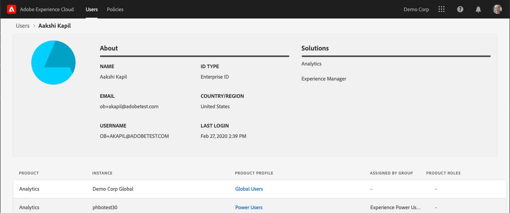

# Gebruikers en beleidsregels voor Experience Cloud weergeven in het beheerprogramma

Beheerders kunnen een sorteerbare en filterbare lijst met alle gebruikers en beleidsregels van de Experience Cloud weergeven met gegevens in het hulpmiddel Admin. De details van de gebruiker omvatten de het producttoegang van een gebruiker, rollen, en laatste betreden informatie. De details van het beleid omvatten gebruiker van een beleid (productprofiel), groep, ontwikkelaar, integratie en admin lijst, evenals gedetailleerde toestemming en middelinformatie voor het beleid.

>[!NOTE]
>
>Gebruiker- en productbeheer wordt geconfigureerd in de [Admin Console](admin-getting-started.md).

1. Aanmelden bij `https://experience.adobe.com/.`

   

1. Selecteer onder [!UICONTROL Quick Access] de optie **[!UICONTROL Admin Tool.]**

   (U kunt ook _home_ in de URL van de startpagina vervangen door _admin._)

   De pagina [!UICONTROL Users] wordt weergegeven.

## Gebruikerspagina

Deze pagina toont volledige lijst van gebruikers met toegang tot Experience Cloud in uw organisatie. Het verstrekt informatie over oplossingsbevoegdheid en laatste login. U kunt zoeken, sorteren en filteren op aangepaste weergaven van de gebruikerslijst.

| Element | Beschrijving |
|---|---|
| [!UICONTROL Name] | De voornaam en achternaam van de gebruiker. U kunt deze kolom sorteren van A tot Z en van Z tot A.  Selecteer de naam van een gebruiker om meer details over de gebruiker te zien. |
| [!UICONTROL Email] | Het e-mailadres dat aan de gebruiker is gekoppeld. Kolom kan A->Z, Z->A worden gesorteerd. |
| [!UICONTROL ID Type] | Het identiteitstype voor de account van de gebruiker. Filter kan worden toegepast op weergavespecifieke id-typen. Zie [Identiteitstypen beheren](https://helpx.adobe.com/enterprise/using/identity.html) voor meer informatie. |
| [!UICONTROL Solutions] | Overzicht van Experience Cloud-oplossingen waartoe de gebruiker toegang heeft. U kunt filters op versmalde benedenlijst van gebruikers met specifieke oplossingstoegang toepassen. |
| [!UICONTROL Last Login] | Tijd en datum van de meest recente gebruikersaanmelding bij de Experience Cloud. Deze kolom kan worden gesorteerd op oplopende of aflopende datums.   **Belangrijk:** Vanaf 13 januari 2020 worden de laatste aanmeldingsgegevens van een gebruiker 365 dagen bewaard. Deze informatie is bedoeld om de huidige aanmeldingsactiviteiten in de Experience Cloud te tonen en niet om een aanbeveling te doen om actie te ondernemen tegen inactieve accounts vóór 13 januari 2020. |

## De weergave van de gebruikerslijst aanpassen

U kunt de kolommen doorzoeken, sorteren of filteren om de gebruikerslijst aan te passen.

* Zoeken naar gebruikers op naam of e-mail. Zoekopdrachten komen overeen met de tekenreeks die u typt.
* Sorteer de kolom door waarden op te nemen of af te nemen. Deze sortering is van toepassing op [!UICONTROL Name,] [!UICONTROL Email,] en [!UICONTROL Last Login] Kolommen.
* Als u meerdere filters wilt toepassen op gebruikers met specifieke criteria, selecteert u het pictogram **[!UICONTROL Filter By]**. Wanneer er meerdere filtercategorieën worden toegepast, bevatten zoekopdrachten e-maildomein `AND` ID TYPE `AND` Oplossing.

| Element | Beschrijving |
|---------|----------|
| [!UICONTROL Email Domain] filter | Zoeken naar tekenreeksen in de kolom E-mail om de resultaten te beperken tot een of meerdere domeinen. Meerdere filters toevoegen door op Enter te drukken na elke zoekterm |
| [!UICONTROL ID Type] filter | Maak een keuze uit beschikbare id-typen. Meerdere id-typen kunnen als filter worden gebruikt. |
| [!UICONTROL Solution] filter | Kies uit beschikbare oplossingen. De veelvoudige oplossingsfilters zoeken naar resultaten die Oplossing 1 `OR` Oplossing 2 bevatten. |

## Gebruikersgegevens weergeven

Selecteer op de pagina [!UICONTROL Users] de e-mail van de gebruiker om de gegevens van de gebruiker weer te geven.

Een gedetailleerde mening van elke gebruiker toont belangrijke details over de de oplossingstoegang van de gebruiker, admin en productrollen, en laatste betreden informatie.

## Info

In deze sectie wordt een overzicht van de gebruikersaccount weergegeven, waaronder:

* Avatar gebruiker en de Badge van de Admin van het Systeem (indien van toepassing)
* Naam
* Email
* Gebruikersnaam (gebruikersnamen van Federated ID-accounts kunnen verschillen van die van het e-mailadres)
* [Type id](https://helpx.adobe.com/enterprise/using/identity.html)
* Land
* Laatste aanmelding

## Overzicht van oplossingen

In deze sectie wordt een overzicht weergegeven van de Experience Cloud-oplossingen waartoe de gebruiker toegang heeft. Bevat, indien van toepassing, de administratieve rol van het product.

## Gedetailleerde lijst met producttoegang

In deze sectie wordt een volledige lijst weergegeven met alle productprofielen die zijn toegewezen aan de gebruiker.

| Element | Beschrijving |
|---------|----------|
| [!UICONTROL Product] | Naam van het product dat aan het productprofiel is gekoppeld. |
| [!UICONTROL Instance] | Naam van het exemplaar (zoals login bedrijf of huurder) verbonden aan het product en productprofiel. |
| [!UICONTROL Product Profile] | Unieke naam van het productprofiel. |
| [!UICONTROL Assigned by Group] | Naam van de Gebruikersgroep die de gebruiker aan een productprofiel associeert. Lege resultaten geven aan dat de gebruiker rechtstreeks en niet via een groep aan het productprofiel is toegewezen. |
| [!UICONTROL Product Roles] | Roltoewijzing van de gebruiker binnen het productprofiel. Deze informatie is momenteel alleen van toepassing op Adobe Target-productprofielen. |

## Pagina Beleid

Op deze pagina wordt een volledige lijst met beleid voor Experience Cloud in uw organisatie weergegeven. Het verstrekt informatie over producten, instanties, gebruikers, en ontwikkelaars. U kunt zoeken, sorteren en filteren op aangepaste weergaven van de lijst met beleidsregels.

| Element | Beschrijving |
|---|---|
| [!UICONTROL Product Profile] | De naam van het productprofiel. Kolom kan A->Z, Z->A worden gesorteerd. Als u meer details over het beleid wilt zien, selecteert u de naam van een productprofiel. |
| [!UICONTROL Product] | Het product dat aan het productprofiel is gekoppeld. Kolom kan A->Z, Z->A worden gesorteerd. |
| [!UICONTROL Instance] | Het exemplaar (bijvoorbeeld, huurder of login bedrijf) verbonden aan productprofiel. Op producten die geen unieke exemplaren of huurders hebben, wordt &#39; - &#39; voor de waarde weergegeven. Kolom kan A->Z, Z->A worden gesorteerd. |
| [!UICONTROL Number of Users] | Unieke telling van gebruikers die zijn gekoppeld aan het productprofiel, inclusief rechtstreekse toewijzing en groepstoewijzing. Kolom kan het kleinst tot het grootst of het grootst tot het kleinst worden gesorteerd. |
| [!UICONTROL Number of Developers] | Aantal rollen van ontwikkelaars verbonden aan het productprofiel. Kolom kan het kleinst tot het grootst of het grootst tot het kleinst worden gesorteerd. |

## De beleidslijstweergave aanpassen

U kunt de kolommen zoeken, sorteren of filteren om de lijst met beleidsregels aan te passen.

* Zoek naar productprofielen op naam. Zoekopdrachten komen overeen met de tekenreeks die u typt.
* Sorteer de kolom door waarden op te nemen of af te nemen. Deze sortering is van toepassing op [!UICONTROL Product Profile,] [!UICONTROL Product,] [!UICONTROL Instance,] [!UICONTROL Number of users,] en [!UICONTROL Number of Developers,] Kolommen.
* Selecteer het pictogram **[!UICONTROL Filter By]** om meerdere filters toe te passen op de lijst met productprofielen met specifieke criteria. Wanneer de veelvoudige filtercategorieën worden toegepast, bevatten de onderzoeken Groepen verbonden `AND` Instantie `AND` Oplossing.

| Element | Beschrijving |
|---------|----------|
| [!UICONTROL Instance] filter | Zoek naar tekenreeksen in de instantiekolom om de resultaten tot één of meerdere instanties te beperken. Voeg veelvoudige filters toe door te drukken binnengaan na elke onderzoekstermijn. |
| [!UICONTROL Solution] filter | Kies uit beschikbare oplossingen. De veelvoudige oplossingsfilters zoeken naar resultaten die Oplossing 1 `OR` Oplossing 2 bevatten. |

## Beleidsdetails weergeven

Selecteer op de pagina [!UICONTROL Policies] de naam van het productprofiel om de details van een beleid weer te geven.

Een gedetailleerde weergave van elk productprofiel geeft belangrijke details weer over de onderwerpen van het productprofiel (gebruikers, groepen, enzovoort). Ook worden machtigingen en bronnen weergegeven die door het productprofiel zijn ingeschakeld.

Details van het productprofiel kunnen worden geëxporteerd naar CSV-bestanden. Met de optie [!UICONTROL Export CSV] worden twee CSV-bestanden gemaakt:

* Onderwerpdetails (gebruikers, gebruikersgroepen, ontwikkelaars, integratie, beheerders)
* Machtigingen en middelen

## Samenvattingssectie

In deze sectie wordt een samenvatting van het productprofiel weergegeven, waaronder:

* Naam van productprofiel
* Aantal gebruikers
* Aantal ontwikkelaars
* Aantal integraties
* Bijbehorende producten
* Instantie

## Gedetailleerde onderwerpenlijst

Deze sectie toont een volledige lijst van alle gebruikers, gebruikersgroepen, ontwikkelaars, integraties, en beheerders die aan het productprofiel worden toegewezen.

| Tab | Beschrijving |
|---------|----------|
| [!UICONTROL Users] | Lijst met gebruikers die zijn opgenomen in het productprofiel. Gebruikersgroepkoppeling wordt weergegeven in de kolom [!UICONTROL Assigned by group]. |
| [!UICONTROL User Groups] | Lijst met gebruikersgroepen die aan het productprofiel zijn gekoppeld. |
| [!UICONTROL Developers] | Lijst met ontwikkelaars die zijn gekoppeld aan het productprofiel. |
| [!UICONTROL Integrations] | Lijst met integraties die aan het productprofiel zijn gekoppeld. |
| [!UICONTROL Administrators] | Lijst met beheerders die zijn gekoppeld aan het productprofiel. |

## Gedetailleerde lijsten met machtigingen en bronnen

In deze sectie wordt een volledige lijst weergegeven met rechten en bronnen die beschikbaar zijn voor het productprofiel. Machtigingen en bronnen die in het productprofiel zijn opgenomen, zijn gemarkeerd met een ✔. De lijsten met machtigingen en bronnen zijn ingedeeld in tabbladen en kolommen voor een betere weergave. Tabs en kolommen geven de lijst met secties weer die van toepassing zijn op het huidige product.
