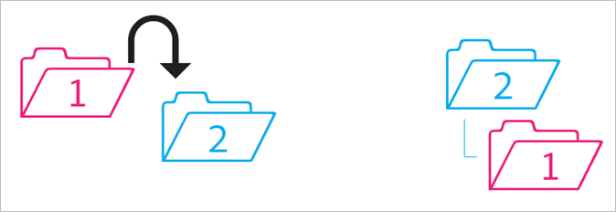

# Gedrag van gedeelde mappen

Regels voor het gedrag van gedeelde mappen wanneer deze worden verplaatst, verwijderd en hersteld.

>[!NOTE]
>
>De gedeelde omslagen en de activa van het Experience Cloud worden weerspiegeld aan de Desktop van het Creative Cloud in een 1:1 verhouding. Als een gebruiker van een Experience Cloud een map wijzigt (het delen verwijdert, toevoegt of verwijdert), wordt de actie gespiegeld op het bureaublad en het web van het Creative Cloud. Als een map niet wordt gedeeld, worden de map en de middelen daarom van uw lokale computer verwijderd. Nadat het delen is verwijderd, worden de map en de inhoud ervan verplaatst naar de prullenbak op uw lokale computer, waar u ze handmatig op uw computer kunt terugzetten.

## Niet-gedeelde map in gedeelde map {#section_A9BAC1A244A246A984AC62660E61E0C0}

U verplaatst een niet-gedeelde map naar een gedeelde map:

**Resultaat**: Beide mappen worden gedeeld.

## Gedeelde map in niet-gedeelde map {#section_8BA83001DCEC4CF084B980C4A660F59A}

U verplaatst een gedeelde map naar een niet-gedeelde map.

**Resultaat**: De niet-gedeelde map blijft niet gedeeld. De gedeelde map blijft gedeeld.

## Inhoud van niet-gedeelde map in gedeelde map {#section_2941ED0DC52E4573AC1AB4C22313DD8E}

U verplaatst inhoud van een niet-gedeelde map naar een gedeelde map.

**Resultaat** De inhoud wordt nu gedeeld en alle deelnemers kunnen deze zien. De opslag neemt toe met de grootte van de inhoud.

## Gearchiveerde en verwijderde gedeelde inhoud {#section_5210D5F4943A44D0BA675D8EB4EAE20F}

U archiveert of verwijdert inhoud die zich in een gedeelde map bevindt.

**Resultaat** Inhoud wordt gearchiveerd voor de eigenaar van de map. Medewerkers die geen eigenaar zijn van de inhoud, hebben geen toegang meer tot de inhoud.

## Gedeelde inhoud eigendom van een niet-gedeelde map {#section_3810A364B67E4B8C9CA244BC52BF91BB}

U verplaatst inhoud van een gedeelde map die u hebt naar een niet-gedeelde map.

**Resultaat** De inhoud wordt nu niet gedeeld. De deelnemers aan de gedeelde map hebben niet langer toegang tot de inhoud.

## Inhoud niet naar een niet-gedeelde map is verzonden {#section_310766EBF0DC4C0BB4AB3E8A4DAEBE07}

U verplaatst inhoud van een gedeelde map die eigendom is van iemand anders naar een niet-gedeelde map.

**Resultaat** De inhoud wordt weergegeven in de niet-gedeelde map en wordt verwijderd uit de gedeelde map. De deelnemers aan de gedeelde map hebben niet langer toegang tot de inhoud. De inhoud wordt gearchiveerd voor de eigenaar van de gedeelde map.

Eigenaars en editors kunnen inhoud verplaatsen die ze niet hebben, maar viewers niet. Als eigenaars en editors inhoud verplaatsen, is deze niet beschikbaar in een gedeelde map voor een gebruiker.

## Gearchiveerde of verwijderde map {#section_B314B13512A5409C87C49DFDB7602E14}

U archiveert (via het web) of verwijdert (via het bureaublad) een gedeelde map die u bezit.

**Resultaat** De map wordt niet gedeeld en vervolgens gearchiveerd. De deelnemers hebben geen toegang meer tot de map.

## Gedeelde map naar een andere gedeelde map {#section_0A3F203D048D4D1586E9850DC92C51E9}

U verplaatst een gedeelde map die u hebt naar een andere gedeelde map die u wel of niet in uw bezit hebt.

**Resultaat** Wanneer de map naar map 2 wordt verplaatst, wordt deze gedeeld met de nieuwe deelnemers.

## Gedeelde inhoud naar een andere gedeelde map {#section_69F6C312792A4CD2831BD14A340F850E}

U verplaatst inhoud van een gedeelde map naar een andere gedeelde map.

**Resultaat** De inhoud wordt weergegeven in map 2 en wordt nu gedeeld met nieuwe medewerkers. De inhoud wordt verwijderd uit map 1 en de eigenaar ziet deze als gearchiveerd, terwijl de andere deelnemers er geen toegang meer toe hebben.

## Herstelde inhoud uit archief {#section_DEA990B3581741F89FBB81D18C2AB449}

U herstelt inhoud uit een archief dat tot een gedeelde map behoorde. U was eigenaar van de inhoud op het moment dat deze werd gearchiveerd.

**Resultaat** De inhoud wordt teruggezet naar de gedeelde map en alle deelnemers kunnen deze weer openen. Als de gedeelde map niet meer bestaat, wordt de inhoud in een niet-gedeelde kopie van de originele bovenliggende map(pen) geplaatst.
