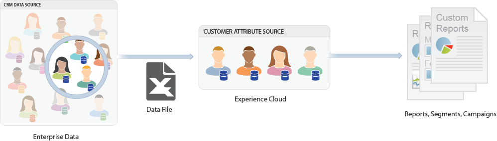

# Overzicht van klantkenmerken

>[!NOTE]
>
>Kenmerken van klanten zijn een oudere kernservice, die nu in gebruik is.

De Attributen van de klant in Adobe Experience Cloud laten u toe om uw gevangen ondernemingsgegevens van een gegevensbestand van het het relatiebeheer van de klant (CRM) te uploaden. U kunt de gegevens uploaden naar een gegevensbron voor klantkenmerken in de Experience Cloud en vervolgens de gegevens in Adobe Analytics en Adobe Target gebruiken.

Navigeer naar **[!DNL Experience Platform]** > **[!UICONTROL People]** > **[!UICONTROL Customer Attributes]** om deze functie te zoeken.

## Vereisten voor het uploaden van klantkenmerken {#section_BD38693AFBF34926BA28E964963B4EA0}

* **Oplossingsactivering:** [Laat uw oplossingen voor de diensten](../core-services/core-services.md#concept_07ED1D5C64234E77976E6D572E78FB9C) van het Experience Platform toe.

* **Groepslidmaatschap:** gebruikers moeten lid zijn van de groep  Klantkenmerken om klantkenmerkgegevens te uploaden. U moet ook tot een Adobe Analytics-groep of een Adobe Target-groep behoren.

   Om te weten of uw bedrijf toegang tot de Attributen van de Klant heeft, zou uw [!DNL Experience Cloud] beheerder zich in [Experience Cloud](https://experience.adobe.com) moeten aanmelden. Ga naar **[!UICONTROL Administration]** > **[!UICONTROL Admin Console]** > **[!UICONTROL Products]**. Als *Klantkenmerken* als één van [!UICONTROL Product Profiles] toont, bent u klaar om te beginnen.

   De gebruikers die aan de Attributen van de Klant worden toegevoegd zullen [!UICONTROL Customer Attributes] menupunt op de linkerkant van de interface van Experience Cloud zien.

* **Adobe Target** `at.js`  (elke versie) of  `mbox.js` versie 58 of hoger is vereist voor Klantkenmerken.

   Zie [Hoe te om bij.js](https://docs.adobe.com/content/help/en/target/using/implement-target/client-side/deploy-at-js/how-to-deployatjs.html) of [Implementatie Mbox.js](https://docs.adobe.com/content/help/en/target/using/implement-target/client-side/mbox-implement/mbox-download.html) op te stellen.

## Wat zijn bedrijfsklantgegevens? {#section_6F34C29F11414842AA57D2B1248FA3C6}

Bedrijfsgegevens bevinden zich in andere systemen. Het kan complex zijn en verschillende dingen betekenen voor verschillende mensen. Deze gegevens kunnen informatie omvatten zoals lidmaatschap, loyaliteitsniveau, leeftijd, geslacht, producten bezeten, belangen, en de Waarde van het Leven.

De volgende afbeelding is een voorbeeld van een gegevensbestand met abonneegegevens voor producten, waaronder id&#39;s van leden, producten met de naam, producten die het meest worden gestart, enzovoort.

Nadat u het gegevensbestand creeert, kunt u het aan de bron van klantattributen uploaden die u in **[!UICONTROL Experience Cloud]** > **[!UICONTROL Customer Attributes]** creeert.

Zie [Klantkenmerkgegevens uploaden](../attributes/t-crs-usecase.md#task_BCC327B2A0EF4A1BBB2934013AB92B78) om deze workflow te leren.

## Voorbeelden van klantkenmerken in Analytics en Target {#section_4E77650F6CEE4C4ABCD0B3221A5AE5D9}

Nadat de gegevens in de Experience Cloud verblijven, kunt u het aanpassen en het aan oplossingen voor rapportering, segmentatie, activiteiten, en campagnes delen.

Bijvoorbeeld:

| Oplossing | Voordelen en gebruiksscenario&#39;s |
|--- |--- |
| Adobe Analytics | Marketers en analisten kunnen het volgende begrijpen:<ul><li>De online campagnes die het meest effectief zijn met uw klanten op goudniveau.</li><li>De producten die klanten op het niveau van goud naar tegenover producten zoeken die platina-vlakke klanten naar zoeken.</li><li>Of het herontwerp van uw site een positief effect heeft op de conversietarieven voor oudere klanten.</li><li>Welke producten klanten met een lage levenwaarde doen neigen aan onderzoek op mijn plaats.</li></ul> |
| Adobe Target | Met kenmerkgegevens kunnen Adobe Target-gebruikers:<ul><li>Speciale kortingen en aanbiedingen voor leden van loyaliteitsclubs weergeven.</li><li>U kunt duurdere producten aanbevelen aan uw luxe klanten.</li><li>Voor klanten die al e-mailberichten ontvangen, een up-sell-aanbieding weergeven in de ruimte die normaal gesproken is gereserveerd voor e-mailaanmelding</li></ul> |
