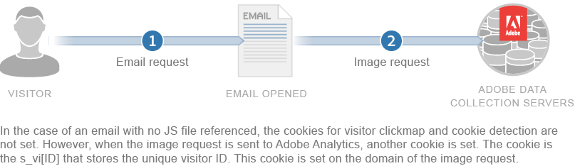

# Informatie over cookies en privacy{#about-cookies-and-privacy}

De privacy van klanten en gegevensbeveiliging blijven de belangrijkste prioriteiten van Adobe. Adobe neemt deel aan meerdere privacyorganisaties en werkt samen met privacyregulatoren en zelfreguleringsbeginselen (zoals het Digital Advertising Alliance AdChoices-programma) om klanten informatie te bieden over hoe hun informatie wordt gebruikt en over het gebruik ervan.

De meeste cookies die zijn ingesteld door Experience Cloud bevatten geen persoonlijk identificeerbare informatie. Deze cookies en bijbehorende gegevens zijn beveiligd en worden alleen gebruikt voor bedrijfsrapporten en voor relevante inhoud en advertenties. De gegevens zijn niet beschikbaar voor derden of andere Adobe-klanten, tenzij deze worden gebruikt in geaggregeerde brancherapporten. Zo worden bijvoorbeeld geaggregeerde en anonieme gegevens [!DNL Digital Marketing Insight Report] geanalyseerd in de detailhandel.

Adobe voegt geen informatie op browserniveau samen tussen bedrijven. Om de privacy en veiligheid van de gegevens van klanten te beschermen, bieden sommige diensten binnen de Cloud van de Ervaring bedrijven de capaciteit om een afzonderlijke reeks koekjes voor elke gevolgde plaats te gebruiken. Sommige van de aanbiedingen van de Reeks bieden klanten ook de capaciteit om hun eigen domeinnaam als eigenaar van het koekje te gebruiken. Met deze methode wordt een extra laag met privacy en beveiliging gemaakt, omdat de Experience Cloud-cookies *als eerste cookies* van de leverancier worden gemaakt die permanent bij de website van het bedrijf horen.

Cookies kunnen alleen de gegevens opslaan en verstrekken die eerder in de cookies zijn opgeslagen. Ze kunnen geen code uitvoeren of toegang krijgen tot andere informatie die op de computer is opgeslagen. Bovendien beperken webbrowsers de toegang tot cookiegegevens. Browsers voeren een beveiligingsbeleid voor cookies in dat alle gegevens van cookies alleen beschikbaar maakt voor de website die de informatie oorspronkelijk heeft ingesteld.

Gegevens in cookies die zijn ingesteld op de website Adobe.com kunnen bijvoorbeeld niet worden bekeken door andere websites dan Adobe.com.

In het volgende diagram wordt het gebruik van cookies voor een standaardafbeeldingsaanvraag geïllustreerd:

In het volgende diagram ziet u hoe cookie wordt gebruikt voor een verzoek om een rechte afbeelding (wordt gebruikt in scenario&#39;s waarbij een JS-bestand niet wordt geladen):

