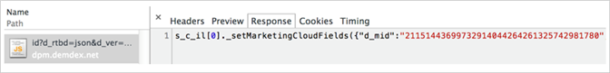

# Implementatie voor Experience Cloud-services inschakelen

Als u onlangs Experience Cloud gebruikend Experience Platform Launch uitvoerde, bent u reeds opstelling voor de Attributen van de Klant en het publiek van Experience Cloud. U kunt gebruikers en producten in de Admin Console ook beheren.

Voor bestaande klanten, kunt u uw oplossingsimplementaties moeten moderniseren en Experience Cloud uitvoeren. Zo kunt u de kenmerken van de klant en de publieksfuncties in Adobe Analytics, Audience Manager en Adobe Target benutten. Voor deze implementatie gaat u als volgt te werk:

1. [Deelnemen aan de Experience Cloud en beheerder worden](#section_2423F0BD3DF642658103310EE5EA6154)
1. [De Experience Cloud ID-service implementeren](#section_3C9F6DF37C654D939625BB4D485E4354)
1. [Kaart rapportsuites aan een organisatie van de Experience Cloud toe](#section_7B08516B01BA421681DF03D0E86CE3BA)
1. [Uw Analytics AppMeasurement-code bijwerken](#section_1798D9D0F05C47E29816AC4EEB9A0913)
1. [Adobe Target-implementatie bijwerken](#section_C2F4493C7A36406DAE2266B429A4BD24)
1. [De implementatie controleren](#section_E641782A0F4F44AF8C9C91216BE330D5)
1. [Gebruikers en producten beheren](#section_B6E95F4E0E12483CB9DA99CBC0C5A4AF)
1. [Begin met het delen van kenmerk- en publieksgegevens](#section_960C06093623462E8EA247B3E97274A1)

## Sluit u aan bij de Experience Cloud en word beheerder {#section_2423F0BD3DF642658103310EE5EA6154}

Wat u moet doen om zich bij de Experience Cloud aan te sluiten:

1. Zorg ervoor dat u de juiste Adobe Analytics- of Adobe Target-SKU&#39;s hebt.

   * **Adobe Analytics:** Standard of Premium (niet de verouderde  [!DNL SiteCatalyst] SKU).
   * **Adobe Target:** Standard of Premium.

   >[!NOTE]
   >
   >Voor [!DNL Target] migreert u naar at.js vanuit [!DNL mbox.js]. Zie [Upgraden vanaf at.js 1. x tot at.js 2. x](https://docs.adobe.com/content/help/en/target/using/implement-target/client-side/upgrading-from-atjs-1x-to-atjs-20.html).

1. Moderniseer uw implementatie en krijg provisioned een beheerder.

   * Voer de onderstaande stappen uit in [[!UICONTROL Experience Cloud ID Service]](../core-services/core-services.md#section_3C9F6DF37C654D939625BB4D485E4354) implementeren.
   * Neem contact op met uw accountmanager en start het inrichtingsproces voor de Experience Cloud.

1. Gebruikers en producten beheren in [!UICONTROL Admin Console].

### Beheerdersaanmelding

Als u een beheerder bent, kunt u zich aanmelden bij [ExperienceCloud.adobe.com](https://experiencecloud.adobe.com).

De koppeling **[!UICONTROL Administration]** wordt weergegeven in de navigatie in het menu Experience Cloud.

Zie [Experience Cloud gebruiker en producttoediening](../admin-getting-started/admin-getting-started.md#topic_3FCB4099640647E3B2411ADBFCE81909) voor meer informatie.

### Gebruikersaanmelding

Als u zich wilt aanmelden bij de Experience Cloud, moeten uw gebruikers:

* Heb een Adobe ID (of Enterprise ID voor uw bedrijf).
* Meld u aan bij [ExperienceCloud.adobe.com](https://experiencecloud.adobe.com).
* Behoort tot een oplossingsgroep die is toegewezen aan een ondernemingsgroep.
* Koppel zo nodig hun oplossingsaccounts aan hun Adobe ID (zie hieronder).

### Optioneel: Bestaande gebruikersaccounts koppelen.

Het meest waarschijnlijk, hebt u gebruikers die reeds lid van oplossingsgroepen, zoals een groep van Analytics zijn die u eerder in [!UICONTROL Analytics] > [!UICONTROL Admin Tools] beheerde.

Wanneer u deze groepen aan de ondernemingsgroepen van Experience Cloud in kaart brengt, moeten die gebruikers hun geloofsbrieven van de oplossingsrekening aan hun Adobe ID manueel verbinden.

Zie [Accounts koppelen in de Experience Cloud](../admin-getting-started/organizations.md#topic_C31CB834F109465A82ED57FF0563B3F1)

>[!NOTE]
>
>Nadat de onderneming en de oplossingsgroepen in kaart worden gebracht, worden de nieuwe gebruikers automatisch verbonden. (De geloofsbrieven van de Oplossing worden automatisch gecreeerd en met hun Adobe ID verbonden.)

In de volgende secties wordt beschreven hoe u uw implementatie kunt moderniseren. Door de implementatie te moderniseren, zijn de kernservices in de Experience Cloud mogelijk.

## [!UICONTROL Experience Cloud ID Service] {#section_3C9F6DF37C654D939625BB4D485E4354} implementeren

[!UICONTROL Experience Cloud ID Service] verstrekt een gemeenschappelijke identiteitskaart voor dwars-oplossingsintegratie. Het verstrekt de identificatie van de dwars-domeinbezoeker en een weg voor dwars-apparaat/browser richtend en verpersoonlijking die op de gegevens van CRM wordt gebaseerd die via [!UICONTROL Customer Attributes] worden geupload.

De eenvoudigste methode voor het inschakelen van Experience Cloud core services is het automatisch activeren van Analytics en Adobe Target via de [Experience Cloud ID Service extension](https://experienceleague.adobe.com/docs/launch/using/extensions-ref/adobe-extension/id-service-extension/overview.html?lang=en#extensions-ref) in [!UICONTROL Experience Platform Launch].

Voor volledige Experience Cloud ID-service (voorheen, bezoekersidentiteitskaart) gaat u [hier](https://experienceleague.adobe.com/docs/id-service/using/intro/overview.html?lang=en#intro).

**Gebruikt  [!UICONTROL Experience Platform Launch] of  [!UICONTROL Dynamic Tag Management]?**

Als u [!UICONTROL Experience Platform Launch] of [!UICONTROL Dynamic Tag Management] niet gebruikt, voer manueel de dienst van identiteitskaart via de Plaatsing JavaScript ([!DNL VisitorAPI.js]) uit, als volgt:

| Taak | Beschrijving |
| -----------| ---------- |  
| [Implementeer de Experience Cloud ID-service voor analyse](https://docs.adobe.com/content/help/en/id-service/using/implementation/setup-analytics.html) | Adobe raadt ook aan extra [klant-id&#39;s](https://docs.adobe.com/content/help/en/id-service/using/reference/authenticated-state.html) in te stellen. Deze id&#39;s zijn gekoppeld aan elke bezoeker en maken huidige en toekomstige functionaliteit in Experience Cloud mogelijk. |
| Werk uw bestaande [!DNL s_code] aan versie H.27.3 of later, of uw bestaande [!DNL AppMeasurement.js] aan versie 1.4 of later bij. | Deze bestanden kunnen worden gedownload in [Codebeheer](https://docs.adobe.com/content/help/nl-NL/analytics/admin/admin-tools/code-manager-admin.html) in Analytics Admin Tools. (De handleiding [JavaScript-implementatie](https://docs.adobe.com/content/help/en/analytics/implementation/javascript-implementation/javascript-implementation-overview.html) is beschikbaar als u meer informatie nodig hebt over [!DNL AppMeasurement.js].) |
| De klant-id voor Analytics synchroniseren | Zie [Analyse - synchroniseren van de klant-id](../core-services/core-services.md#section_AD473A6A21C1446498E700363F9A8437) (hieronder). |

### Analyse en Adobe Target - de klant-id synchroniseren {#section_AD473A6A21C1446498E700363F9A8437}

Als onderdeel van het instellen van de Experience Cloud-id-service raadt Adobe u aan om Analytics op te geven en [!DNL Target] om uw [klant-id&#39;s](https://docs.adobe.com/content/help/en/id-service/using/reference/authenticated-state.html) te synchroniseren met de Experience Cloud.

In Adobe Target moet de `mbox3rdpartyid` de klant-id ophalen en naar [!DNL Target] verzenden. (Zie [Werken met klantkenmerken](https://docs.adobe.com/content/help/en/target/using/audiences/visitor-profiles/working-with-customer-attributes.html) in [!DNL Target].)

Wanneer een bezoeker op uw website voor authentiek verklaart, of anders zich identificeert, moet uw implementatie de klantenidentiteitskaart van CRM van die persoon aan de pagina of app blootstellen. Vervolgens kunt u de juiste functieaanroep gebruiken om uw klant-id te synchroniseren met de Experience Cloud. Deze synchronisatie slaat de klant-id van CRM van de bezoeker op in de Experience Cloud en activeert de attributen van die klant voor gebruik in de Experience Cloud.

Bijvoorbeeld, veronderstel dat het Loodje identiteitskaart `52mc210tr42` in uw systeem van CRM heeft. Wanneer het Loodje op uw plaats voor authentiek verklaart, moet u deze identiteitskaart op de pagina blootstellen, en identiteitskaart gebruiken om het op één van twee manieren te synchroniseren:

* Roep `visitor.setCustomerIDs({"crm_id":"52mc210tr42"})` aan met behulp van de service Bezoeker-id. Of
* Vul de *`Customer ID (52mc210tr42)`* in een eigenschap of eVar.

De klant-id moet worden ingesteld op elk [!DNL Analytics]-servergesprek waarvan de klant-id bekend is.

### Mobiele SDK&#39;s

Zie de sectie *Experience Cloud ID Service* voor syntaxisvoorbeelden over hoe u extra klant-id&#39;s instelt in [Android](https://docs.adobe.com/content/help/nl-NL/mobile-services/android/overview.html) en [iOS](https://docs.adobe.com/content/help/nl-NL/mobile-services/ios/overview.html) Mobiele toepassingen.

### Kenmerken inschakelen voor historische gegevens

Kenmerkgegevens van de klant worden beschikbaar gesteld nadat bezoekers zich hebben aangemeld. Als u de recentste Dienst van identiteitskaart van Experience Cloud nog niet hebt uitgevoerd, en als u klant IDs in een steun of een eVar historisch hebt gevolgd, kunt u om een proces verzoeken dat historische logins naar de Experience Cloud verzendt. Met dit proces kunt u direct beginnen met het gebruik van Customer Attributes.

Neem contact op met de klantenservice om historische gegevens in te schakelen.

## Rapportsuites toewijzen aan een Experience Cloud-organisatie {#section_7B08516B01BA421681DF03D0E86CE3BA}

>[!NOTE]
>
>De functie voor het toewijzen van rapportsuite is in november 2020 afgekeurd. Neem contact op met de Klantenondersteuning voor alle vragen.

Experience Cloud-services (zoals Experience Cloud ID-service en [!UICONTROL People service]) zijn gekoppeld aan een Experience Cloud-organisatie in plaats van aan een afzonderlijke Analytics-rapportsuite. Om ervoor te zorgen dat deze diensten correct werken, moet elke het rapportreeks van Analytics aan een organisatie van Experience Cloud worden in kaart gebracht.

Zie [Rapportreeksen toewijzen aan een organisatie](report-suite-mapping.md).

## Werk uw Analytics AppMeasurement-code {#section_1798D9D0F05C47E29816AC4EEB9A0913} bij

Als u Analytics gebruikt, verifieer dat u op regionale gegevensinzameling (RDC) bent. Als uw gegevensverzamelingsdomein [!DNL omtrdc.net] is, of als uw CNAME aan [!DNL omtrdc.net] in kaart wordt gebracht, bent u op RDC. Zie [Overschakelen naar RDC](https://docs.adobe.com/content/help/en/analytics/technotes/rdc/regional-data-collection.html) voor meer informatie. Als u de koekjes van de eerste partij gebruikt, verwijs naar [CNAME en de Dienst van identiteitskaart van Experience Cloud](https://docs.adobe.com/content/help/en/id-service/using/reference/analytics-reference/cname.html) voor informatie over gegevensinzameling CNAMEs en dwars-domein het volgen.

U wordt aangeraden de analytische implementatie te moderniseren door uw JavaScript-bibliotheken bij te werken, inclusief de API voor bezoekers. De eenvoudige manier om dit te verwezenlijken is een [!DNL Adobe Analytics] hulpmiddel in Dynamisch Beheer van de Markering toe te voegen, die *`Automatic`* als configuratiemethode specificeren.

Klik in [!UICONTROL Dynamic Tag Management] op **`<Web Property Name>`** > **[!UICONTROL Overview]** > **[!UICONTROL Add a Tool]** > **[!UICONTROL Adobe Analytics]**. Zie [Adobe Analytics Settings](https://docs.adobe.com/content/help/en/dtm/using/tools/analytics-dtm.html) in Dynamic Tag Management voor implementatiegegevens.

## Uw Adobe Target-implementatie {#section_C2F4493C7A36406DAE2266B429A4BD24} bijwerken

* U wordt aangeraden een [Adobe Target-extensie](https://docs.adobe.com/content/help/en/launch/using/extensions-ref/adobe-extension/targetv2-extension/adobe-target-extension-v2.html) toe te voegen in [!UICONTROL Experience Platform Launch], zodat de bibliotheek automatisch wordt opgehaald. U kunt de [Experience Cloud ID Service-extensie ](https://docs.adobe.com/content/help/en/launch/using/extensions-ref/adobe-extension/id-service-extension/overview.html) voor Adobe Target (en andere oplossingen) ook instellen met [!UICONTROL Experience Platform Launch]. De [!UICONTROL Experience Cloud ID Service]-update **is vereist** voor Adobe Target om kernservices te kunnen gebruiken. (Als u [!UICONTROL Dynamic Tag Management] gebruikt, voegt u een [Adobe Target-gereedschap](https://docs.adobe.com/content/help/en/dtm/using/tools/target.html) toe. U kunt [!UICONTROL Dynamic Tag Management] ook gebruiken om de Experience Cloud ID-service voor Adobe Target te implementeren.)
* Als u [!UICONTROL Experience Platform Launch] of [!UICONTROL Dynamic Tag Management] niet gebruikt, [werk uw mbox bibliotheek](https://docs.adobe.com/content/help/en/target/using/implement-target/client-side/mbox-implement/target-download-config-mbox.html) manueel bij.
* Toegang aanvragen om Adobe Analytics als rapportagebron voor [!DNL Adobe Target] te gebruiken. [!DNL Target] en de  [!DNL Analytics] gegevens worden gecombineerd op de zelfde servervraag tijdens verwerking zodat de bezoekers tussen de twee oplossingen worden aangesloten. Zie [Analytics for Target Implementation](https://docs.adobe.com/content/help/nl-NL/target/using/integrate/a4t/a4t.html).

   >[!IMPORTANT]
   >
   >Alle klanten van Analytics zijn reeds provisioned voor de kerndiensten zoals de Attributen van de Klant. Als u geen klant van de Analyse bent, contacteer de Zorg van de Klant om te verzoeken om levering.

## De implementatie controleren {#section_E641782A0F4F44AF8C9C91216BE330D5}

Gebruik het volgende proces om ervoor te zorgen dat de Experience Cloud-id-service correct op uw site wordt geïmplementeerd.

1. Wis koekjes voor uw plaats zodat kunt u het verzoek aan de Dienst van identiteitskaart van de Experience Cloud zien (het verzoek gebeurt bij het eerste bezoek, dan ongeveer eens per bezoeker per week).
1. Gebruikend een pakketanalyse of het netwerkpaneel in Webbrowser debugger, zoek een verzoek die naar [!DNL dpm.demdex.net] gaat.
1. Controleer of de reactie `d_mid` en een waarde bevat, bijvoorbeeld: `_setMarketingCloudFields({"d_mid":"4235...`
1. Verifieer dat het verzoek van de Analyse de `mid` parameter (Experience Cloud identiteitskaart) bevat. Tijdens de respijtperiode (als deze is ingeschakeld) moet u ook een parameter `aid` (de bezoeker-id van Analytics) zien.

Verwachte reactie met de Experience Cloud-id:

Analytische afbeeldingsaanvraag met de Experience Cloud-id (ook wel `mid` of _bezoeker-id_ genoemd):

Experience Cloud-id in de mbox-aanvraag:

### Wat is de respijtperiode?

Nadat u de dienst van identiteitskaart van de Experience Cloud opstelt, ontvangen de nieuwe bezoekers niet meer een identiteitskaart van de Experience Cloud van Analytics van uw server van de gegevensinzameling. Als gedeelten van uw site de Experience Cloud-id-service nog niet hebben geïmplementeerd en bezoekers naar deze secties bladeren, wordt de Experience Cloud-id niet herkend en krijgen bezoekers een oude Analytics-bezoeker-id toegewezen. Dit kan mogelijke problemen veroorzaken, zoals dubbele bezoeken en onjuiste toewijzing.

Als de ondersteuningssectie van uw site bijvoorbeeld in een aparte CMS wordt beheerd, hebt u mogelijk een ander JavaScript-bestand voor Analytics voor deze sectie. Als u de Experience Cloud-id op uw hoofdsite implementeert voordat u de id-service op de ondersteuningssite implementeert, ontvangen nieuwe bezoekers een oude Analytics-id wanneer ze de ondersteuningssectie bezoeken, en worden bezoeken die beide sitesecties beslaan, gerapporteerd als verschillende bezoeken.

Het implementeren van de Experience Cloud-id-service op sites die meerdere JavaScript-bestanden of andere technologieën (zoals Flash) gebruiken, kan coördinatieproblemen veroorzaken omdat u de Experience Cloud-id-service op alle delen van uw site tegelijk moet inschakelen. Door een respijtperiode in te stellen, kunnen nieuwe bezoekers een Analytics-bezoeker-id blijven ontvangen van de ID-service, zodat bezoekers consistent kunnen worden geïdentificeerd op gedeelten van uw site die niet zijn bijgewerkt voor gebruik van de bezoeker-id-service.

## Gebruikers en producten beheren {#section_B6E95F4E0E12483CB9DA99CBC0C5A4AF}

Als u weer aan de slag bent, navigeert u naar de [Admin Console](https://adminconsole.adobe.com/), waar u gebruikers en productprofielen kunt beheren.

Zie [Experience Cloud gebruiker- en productbeheer](../admin-getting-started/admin-getting-started.md#topic_3FCB4099640647E3B2411ADBFCE81909).

### Klantkenmerken

Gebruikers die aan de [!UICONTROL Customer Attributes] groep worden toegevoegd zullen [!UICONTROL Customer Attributes] menupunt op de linkerkant van de interface van Experience Cloud zien.

## Begin delend attribuut en publieksgegevens {#section_960C06093623462E8EA247B3E97274A1}

Profiteer van de volgende functies.

### [!UICONTROL People] > [!UICONTROL Customer Attributes]

Als u de gegevens van de ondernemingsklant in een gegevensbestand van het klantenrelatiebeheer (CRM) vangt, kunt u de gegevens in een gegevensbron van de klantenattributen in de Experience Cloud uploaden. Na uploaden kunt u de gegevens in [!DNL Adobe Analytics] en [!DNL Adobe Target] gebruiken.

Zie [Klantkenmerken](../attributes/attributes.md#concept_ACFEE7C8B8E94875BA0825CDF4913AF1)

### [!UICONTROL People] >  [!UICONTROL Audience Library]

Experience Cloud [!UICONTROL Audiences] is de interface waarmee u een publiek kunt maken, bestaande soorten publiek kunt combineren om een samengesteld publiek te maken en alle gedeelde soorten publiek kunt bekijken.

Zie [Soorten publiek](../audience-library/audience-library.md#topic_679810123CAA4E0CA4FA3417FB0100C7)

## Gegevensopslag en openbaarmaking van privacy

Als u in real time publieksprofilering en andere kerndiensten binnen de Adobe [!DNL Experience Cloud] hefboomt, zou het gebruik van deze diensten kunnen beïnvloeden welk gegevenscentrum (en land) uw gegevens verblijft. Met name omdat de kernservices van de Adobe [!DNL Experience Cloud] Adobe Audience Manager benutten, moeten gegevens die in de [!UICONTROL People]-service worden gebruikt, zich in de Audience Manager servers in de Verenigde Staten bevinden.

Wanneer het hefboomeffect van de kerndiensten die via de [!UICONTROL People] dienst ter beschikking worden gesteld, zijn de soorten gegevens die van andere producten van de Adobe naar publieksbeheer worden verzonden:

* [!DNL Analytics] sleutel/waardeparen (eigenschappen, eVars, lijstvariabelen, enzovoort). Door gebrek, omvatten de logboeklijnen IP adres, met inbegrip van het laatste octet van IP (veronderstellend dat het IP adres niet door IP verduisteringsmontages binnen Adobe [!DNL Analytics] werd gewijzigd).
* Treinen en segmenten waarvoor bezoekers in aanmerking komen op basis van in Audience Manager vastgestelde regels.
* (Optioneel) Een of meer van uw id&#39;s. Afhankelijk van uw implementatie van de id-service, verzendt u mogelijk ook een of meer van uw id&#39;s, zoals CRM-id&#39;s of gehashte e-mailadressen. Als deze gegevens naar Adobe [!DNL Analytics] worden verzonden, wordt het overgebracht naar het beheer van het Adobe publiek. Adobe beveelt aan geen persoonsgegevens aan te leveren aan Adobe [!DNL Analytics]. Gebruik liever een eenrichtingshash om de gegevens te maskeren voordat deze naar Adobe worden verzonden.
* Segmenten van [!DNL Analytics] via de back-end segmentdelingsmogelijkheid
* Het cookie demdex.net wordt ingesteld als cookies van derden niet worden geblokkeerd. Het cookie `AMCV_###@AdobeOrg` van de eerste partij wordt altijd ingesteld met de Experience Cloud ID-service.

Al deze gegevenselementen worden aan Adobe Audience Manager geleverd in de vorm van logbestanden. Audience Manager verwerkt en slaat deze gegevens op in de Verenigde Staten. Audience Manager biedt geen optie om deze gegevens buiten de Verenigde Staten op te slaan of te verwerken.

### Cookies en Opt-Outs

Bij het gebruik van realtime publiekprofilering wordt gebruik gemaakt van het cookie van de Audience Manager, in aanvulling op de cookies die worden gebruikt voor [!DNL Analytics] en [!DNL Target].

Als u de juiste opt-outmogelijkheid wilt bieden, moeten bezoekers van uw site de Audience Manager opt-out toevoegen aan uw bestaande opt-outproces.

Zie [Adobe Experience Cloud - Implementatie van Adobe Opt-Outs](https://docs.adobe.com/content/help/en/analytics/implementation/javascript-implementation/data-collection/opt-out.html) voor instructies.

Zie [CNAME&#39;s voor gegevensverzameling en domeinoverschrijdende tracering](https://docs.adobe.com/content/help/en/id-service/using/reference/analytics-reference/cname.html) voor het inschakelen van interdomeintracering.
