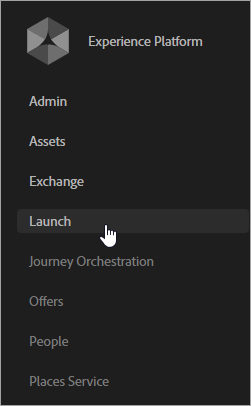

# Laat uw oplossingen voor de kerndiensten toe

Voor bestaande klanten, leer hoe te om uw oplossingsimplementaties te moderniseren en de Wolk van de Ervaring uit te voeren zodat u eigenschappen zoals klantenattributen en publiek kunt gebruiken. Hiervoor gaat u als volgt te werk:

1. [Word beheerder van de Experience Cloud](#section_2423F0BD3DF642658103310EE5EA6154)
1. [De Experience Cloud ID Service implementeren](#section_3C9F6DF37C654D939625BB4D485E4354)
1. [Rapportsuites toewijzen aan een Experience Cloud-organisatie](#section_7B08516B01BA421681DF03D0E86CE3BA)
1. [Uw Analytics AppMeasurement-code bijwerken](#section_1798D9D0F05C47E29816AC4EEB9A0913)
1. [De Adobe Target-implementatie bijwerken](#section_C2F4493C7A36406DAE2266B429A4BD24)
1. [Verifieer de belangrijkste de dienstenimplementatie](#section_E641782A0F4F44AF8C9C91216BE330D5)
1. [Gebruikers en producten beheren](#section_B6E95F4E0E12483CB9DA99CBC0C5A4AF)
1. [Basisservices gebruiken](#section_960C06093623462E8EA247B3E97274A1)

## Stap 1. Word beheerder van de Experience Cloud {#section_2423F0BD3DF642658103310EE5EA6154}

Wat u moet doen om lid te worden van de Experience Cloud:

 Zorg ervoor dat u over de juiste Adobe Analytics of Adobe Target SKU&#39;s beschikt.

* **Adobe Analytics:** Standaard of Premium (niet de verouderde [!DNL SiteCatalyst] SKU).
* **Adobe-doel:** Standaard of Premium.

>[!NOTE]
>
>Migreer bijvoorbeeld [!DNL Target]naar at.js vanuit [!DNL mbox.js]. Zie [Bijwerken vanaf at.js 1. x tot at.js 2. x](https://docs.adobe.com/content/help/en/target/using/implement-target/client-side/upgrading-from-atjs-1x-to-atjs-20.html).

 Moderniseer uw implementatie en krijg provisioned een beheerder.

1. Voer de onderstaande stappen uit in [De [!UICONTROL Experience Cloud ID Service]](../core-services/core-services.md#section_3C9F6DF37C654D939625BB4D485E4354)implementeren.
1. Neem contact op met uw accountmanager en start het inrichtingsproces voor de Experience Cloud.

 Gebruikers en producten beheren in de [!UICONTROL beheerconsole].

### Beheerdersaanmelding

Als u een beheerder bent, kunt u zich aanmelden op [ExperienceCloud.adobe.com](https://experiencecloud.adobe.com).

De koppeling **[!UICONTROL Beheer]** wordt weergegeven in de navigatie in het menu Experience Cloud.

Zie [Experience Cloud voor hulp en productbeheer](../admin-getting-started/admin-getting-started.md#topic_3FCB4099640647E3B2411ADBFCE81909) .

### Gebruikersaanmelding

Als u zich wilt aanmelden bij de Experience Cloud, moeten uw gebruikers:

1. Een Adobe-id (of Enterprise-id voor uw bedrijf) hebben.
1. Meld u aan bij [ExperienceCloud.adobe.com](https://experiencecloud.adobe.com).
1. Behoort tot een oplossingsgroep die is toegewezen aan een ondernemingsgroep.
1. Koppel zo nodig hun accounts voor de oplossing aan hun Adobe-id (zie hieronder).

 Optioneel: Bestaande gebruikersaccounts koppelen.

U hebt waarschijnlijk gebruikers die al lid zijn van oplossingsgroepen, zoals een groep Analytics die u eerder hebt beheerd in [!UICONTROL Analytics] > [!UICONTROL Admin Tools].

Wanneer u deze groepen toewijst aan Experience Cloud Enterprise-groepen, moeten deze gebruikers hun gegevens van de oplossingsaccount handmatig koppelen aan hun Adobe-id.

Zie [Accounts koppelen in de Experience Cloud](../admin-getting-started/organizations.md#topic_C31CB834F109465A82ED57FF0563B3F1)

>[!NOTE]
>
>Nadat de onderneming en de oplossingsgroepen in kaart worden gebracht, worden de nieuwe gebruikers automatisch verbonden. (De referenties van de oplossing worden automatisch gemaakt en gekoppeld aan hun Adobe-id.)

In de volgende secties wordt beschreven hoe u uw implementatie kunt moderniseren. Door uw implementatie te moderniseren, zijn de basisservices in de Experience Cloud beschikbaar.

## Stap 2. Implementeer de [!UICONTROL Experience Cloud ID-service] met [!UICONTROL Experience Platform Launch]of [!UICONTROL Dynamic Tag Management]{#section_3C9F6DF37C654D939625BB4D485E4354}

De [!UICONTROL Experience Cloud ID Service] biedt een gemeenschappelijke id voor integratie tussen oplossingen. Het verstrekt dwars-domein bezoekersidentificatie en een weg voor dwars-apparaat/browser richtend en verpersoonlijking die op de gegevens van CRM wordt gebaseerd die via de Attributen [!UICONTROL van de]Klant worden geupload.

De eenvoudigste methode voor het inschakelen van Experience Cloud core-services is het automatisch activeren voor Analytics en Adobe Target via de [Experience Cloud ID Service-extensie](https://docs.adobe.com/content/help/en/launch/using/implement/solutions/idservice-save.html) in [!UICONTROL Experience Platform Launch], of via het ECID-hulpprogramma in [!UICONTROL Dynamic Tag Management]. (Introductie van het Experience Platform wordt ten zeerste aanbevolen.)

Ga [hier](https://docs.adobe.com/content/help/en/id-service/using/home.html)voor de volledige Experience Cloud ID Service (voorheen, bezoekersidentiteitskaart).

**Gebruikt u geen[!UICONTROL Experience Platform Launch]of[!UICONTROL Dynamic Tag Management]?**

Als u geen [!UICONTROL Experience Platform Launch] of [!UICONTROL Dynamic Tag Management]gebruikt, implementeert u de id-service handmatig via de JavaScript-implementatie ([!DNL VisitorAPI.js]):

| Taak | Beschrijving |
| -----------| ---------- |  
| [Implementeer de Experience Cloud ID Service voor Analytics](https://docs.adobe.com/content/help/en/id-service/using/implementation/setup-analytics.html) | Adobe raadt ook aan extra [klant-id&#39;s in te stellen](https://docs.adobe.com/content/help/en/id-service/using/reference/authenticated-state.html). Deze id&#39;s zijn gekoppeld aan elke bezoeker en maken huidige en toekomstige functionaliteit in de Experience Cloud mogelijk. |
| Werk uw bestaande versie bij [!DNL s_code] naar versie H.27.3 of hoger, of uw bestaande versie [!DNL AppMeasurement.js] naar versie 1.4 of hoger. | Deze bestanden kunnen worden gedownload in [Codebeheer](https://docs.adobe.com/content/help/en/analytics/admin/admin-tools/code-manager-admin.html) in Analytics Admin Tools.  (De handleiding voor [JavaScript-implementatie](https://docs.adobe.com/content/help/en/analytics/implementation/javascript-implementation/javascript-implementation-overview.html) is beschikbaar als u meer informatie nodig hebt over [!DNL AppMeasurement.js].) |
| De klant-id voor Analytics synchroniseren | Zie [Analytics - synchroniseert de klant-id](../core-services/core-services.md#section_AD473A6A21C1446498E700363F9A8437) (hieronder). |

## Analyses en Adobe Target - de klant-id synchroniseren {#section_AD473A6A21C1446498E700363F9A8437}

Als onderdeel van het instellen van de Experience Cloud ID Service raadt Adobe aan om Analytics uit te voeren en [!DNL Target] om uw [klant-id&#39;s](https://docs.adobe.com/content/help/en/id-service/using/reference/authenticated-state.html) te synchroniseren met de Experience Cloud.

In Adobe Target `mbox3rdpartyid` moet de klant-id worden opgehaald en verzonden naar [!DNL Target]. (Zie [Werken met klantkenmerken](https://docs.adobe.com/content/help/en/target/using/audiences/visitor-profiles/working-with-customer-attributes.html) in [!DNL Target].)

Wanneer een bezoeker op uw website voor authentiek verklaart, of anders zich identificeert, moet uw implementatie de klantenidentiteitskaart van CRM van die persoon aan de pagina of app blootstellen. Vervolgens kunt u de juiste functieaanroep gebruiken om uw klant-id te synchroniseren met de Experience Cloud. Deze synchronisatie slaat de CRM-klant-id van de bezoeker op in de Experience Cloud en activeert de kenmerken van die klant voor gebruik in de Experience Cloud.

Bijvoorbeeld, veronderstel dat het Loodje identiteitskaart van de Klant `52mc210tr42` in uw systeem van CRM heeft. Wanneer het Loodje op uw plaats voor authentiek verklaart, moet u deze identiteitskaart op de pagina blootstellen, en identiteitskaart gebruiken om het op één van twee manieren te synchroniseren:

* Vraag `visitor.setCustomerIDs({"crm_id":"52mc210tr42"})` gebruikend de dienst van identiteitskaart van de Bezoeker. Of
* Vul de vorm in een *`Customer ID (52mc210tr42)`* proxy of eVar.

De klant-id moet worden ingesteld op elk [!DNL Analytics] servergesprek waarvan de klant-id bekend is.

### Mobiele SDK&#39;s

Raadpleeg de sectie *Experience Cloud ID Service* voor syntaxisvoorbeelden over het instellen van extra klant-id&#39;s in [Android](https://docs.adobe.com/content/help/en/mobile-services/android/overview.html) - en [iOS](https://docs.adobe.com/content/help/en/mobile-services/ios/overview.html) Mobile-toepassingen.

### Kenmerken inschakelen voor historische gegevens

Kenmerkgegevens van de klant worden beschikbaar gesteld nadat bezoekers zich hebben aangemeld. Als u de nieuwste Experience Cloud ID Service nog niet hebt geïmplementeerd en als u van oudsher id&#39;s van klanten in een Pro- of eVar hebt bijgehouden, kunt u een proces aanvragen dat historische logins naar de Experience Cloud verzendt. Met dit proces kunt u direct beginnen met het gebruik van klantkenmerken.

Neem contact op met de klantenservice om historische gegevens in te schakelen.

## Stap 3. Rapportsuites toewijzen aan een Experience Cloud-organisatie {#section_7B08516B01BA421681DF03D0E86CE3BA}

Experience Cloud-services (zoals Experience Cloud ID Service en de [!UICONTROL People-service]) zijn gekoppeld aan een Experience Cloud-organisatie in plaats van een afzonderlijke Analytics-rapportsuite. Om ervoor te zorgen dat deze services correct werken, moet elke serie Analytics-rapporten worden toegewezen aan een Experience Cloud-organisatie.

Zie [het rapportreeksen van de Kaart aan een organisatie](report-suite-mapping.md).

## Stap 4. (Adobe Analytics) Werk uw Analytics AppMeturement-code bij {#section_1798D9D0F05C47E29816AC4EEB9A0913}

Controleer of u regionale gegevensverzameling (RDC) gebruikt. Als uw gegevensverzamelingsdomein is [!DNL omtrdc.net], of als uw CNAME aan in kaart wordt gebracht [!DNL omtrdc.net], bent u op RDC. Zie [Overgang naar de regionale distributiewereld](https://docs.adobe.com/content/help/en/analytics/technotes/rdc/regional-data-collection.html) voor meer informatie. Als u eersteklas koekjes gebruikt, verwijs naar [CNAME en de Dienst](https://docs.adobe.com/content/help/en/id-service/using/reference/analytics-reference/cname.html) van identiteitskaart van de Ervaring Cloud voor informatie over gegevensinzameling CNAMEs en dwars-domein het volgen.

U wordt aangeraden de analytische implementatie te moderniseren door uw JavaScript-bibliotheken bij te werken, inclusief de API voor bezoekers. De eenvoudige manier om dit te verwezenlijken is een [!DNL Adobe Analytics] hulpmiddel in Dynamisch Beheer van de Markering toe te voegen, die *`Automatic`* als configuratiemethode specificeert.

Klik in [!UICONTROL Dynamisch tagbeheer]op **[!UICONTROL <Web Property Name>]**>**[!UICONTROL  Overzicht ]**>**[!UICONTROL  Een gereedschap ]**toevoegen >**[!UICONTROL  Adobe Analytics ]**. Zie[Adobe Analytics Settings](https://docs.adobe.com/content/help/en/dtm/using/tools/analytics-dtm.html)in Dynamic Tag Management voor informatie over de implementatie.

## Stap 5. (Adobe Target) Werk uw Adobe Target-implementatie bij {#section_C2F4493C7A36406DAE2266B429A4BD24}

* U wordt aangeraden een [Adobe Target-extensie](https://docs.adobe.com/content/help/en/launch/using/extensions-ref/adobe-extension/targetv2-extension/adobe-target-extension-v2.html) toe te voegen in [!UICONTROL Experience Platform Launch], zodat de bibliotheek automatisch wordt opgehaald. U kunt ook de [Experience Cloud ID Service-extensie](https://docs.adobe.com/content/help/en/launch/using/extensions-ref/adobe-extension/id-service-extension/overview.html) voor Adobe Target (en andere oplossingen) instellen met [!UICONTROL Experience Platform Launch]. Adobe Target kan alleen de kernservices gebruiken als de [!UICONTROL Experience Cloud ID Service] -update **is vereist** . (Als u [!UICONTROL Dynamisch tagbeheer]gebruikt, voegt u een [Adobe-doelprogramma](https://docs.adobe.com/content/help/en/dtm/using/tools/target.html)toe. U kunt ook [!UICONTROL Dynamic Tag Management] gebruiken om de Experience Cloud ID Service voor Adobe Target te implementeren.)
* Als u geen [!UICONTROL Experience Platform Launch] of [!UICONTROL Dynamic Tag Management]gebruikt, [werkt u de bibliotheek](https://docs.adobe.com/content/help/en/target/using/implement-target/client-side/mbox-implement/target-download-config-mbox.html) van de box handmatig bij.
* U kunt toegang aanvragen om Adobe Analytics te gebruiken als bron voor [!DNL Adobe Target]rapportage. [!DNL Target] en de [!DNL Analytics] gegevens worden gecombineerd op de zelfde servervraag tijdens verwerking zodat de bezoekers tussen de twee oplossingen worden aangesloten. Zie [Analytics voor Target Implementation](https://docs.adobe.com/content/help/en/target/using/integrate/a4t/a4t.html).

   >[!IMPORTANT]
   >
   >Alle klanten van Analytics zijn reeds provisioned voor de kerndiensten zoals klantenattributen. Als u geen klant van de Analyse bent, contacteer de Zorg van de Klant om te verzoeken om levering.

## Stap 6. Verifieer de belangrijkste de dienstenimplementatie {#section_E641782A0F4F44AF8C9C91216BE330D5}

Ga als volgt te werk om ervoor te zorgen dat de Experience Cloud ID Service correct wordt geïmplementeerd op uw site.

1. Wis cookies voor uw site zodat u de aanvraag voor de Experience Cloud ID Service kunt bekijken (de aanvraag vindt plaats bij het eerste bezoek en vervolgens ongeveer één keer per bezoeker per week).
1. Gebruikend een pakketanalysator of het netwerkpaneel in Webbrowser debugger, zoek een verzoek die naar gaat [!DNL dpm.demdex.net].
1. Controleer of de reactie een waarde `d_mid` en een waarde bevat, bijvoorbeeld: `_setMarketingCloudFields({"d_mid":"4235...`
1. Controleer of het verzoek Analytics de `mid` parameter bevat (de Experience Cloud-id). Tijdens de respijtperiode (als deze is ingeschakeld) wordt ook een `aid` parameter weergegeven (de bezoeker-id van Analytics).

Verwachte reactie met de Experience Cloud-id:

Aanvraag voor analysebestanden met de Experience Cloud-id (ook wel `mid` of _bezoeker-id_ genoemd):

Experience Cloud ID in de mbox-aanvraag:

### Wat is de respijtperiode?

Nadat u de Experience Cloud ID Service hebt geïmplementeerd, ontvangen nieuwe bezoekers geen Cloud-id voor Analytics Experience meer van uw gegevensverzamelingsserver. Als gedeelten van uw site de Experience Cloud ID Service nog niet hebben geïmplementeerd en bezoekers naar deze secties bladeren, wordt de Experience Cloud ID niet herkend en krijgen bezoekers een verouderde Analytics-bezoekersidentiteitskaart toegewezen. Dit kan mogelijke problemen veroorzaken, zoals dubbele bezoeken en onjuiste toewijzing.

Als de ondersteuningssectie van uw site bijvoorbeeld in een aparte CMS wordt beheerd, hebt u mogelijk een ander JavaScript-bestand voor Analytics voor deze sectie. Als u de Experience Cloud-id op uw hoofdsite implementeert voordat u de id-service op de ondersteuningssite implementeert, ontvangen nieuwe bezoekers een verouderde Analytics-id wanneer ze de ondersteuningssectie bezoeken en worden bezoeken die beide sitesecties omspannen, gerapporteerd als verschillende bezoeken.

Het implementeren van de Experience Cloud ID Service op sites die meerdere JavaScript-bestanden of andere technologieën (zoals Flash) gebruiken, kan coördinatieproblemen veroorzaken omdat u de Experience Cloud ID Service voor alle delen van uw site tegelijk moet inschakelen. Door een respijtperiode in te stellen, kunnen nieuwe bezoekers een Analytics-bezoeker-id blijven ontvangen van de ID-service, zodat bezoekers consistent kunnen worden geïdentificeerd op gedeelten van uw site die niet zijn bijgewerkt voor gebruik van de bezoeker-id-service.

## Stap 7. Manage users and products {#section_B6E95F4E0E12483CB9DA99CBC0C5A4AF}

Als u weer aan de slag bent, navigeert u naar de [beheerconsole](https://adminconsole.adobe.com/), waar u gebruikers en productprofielen kunt beheren.

Zie [Experience Cloud voor gebruikers- en productbeheer](../admin-getting-started/admin-getting-started.md#topic_3FCB4099640647E3B2411ADBFCE81909).

### Klantkenmerken

<!-- 
 
 <note type="important">
  To use the Customer Attributes feature, users must belong to the 
   Adobe Customer Attributes group, and to solution-level groups (Analytics or Adobe Target). 
 </note> 
 
 -->

Gebruikers die aan de groep [!UICONTROL Klantkenmerken] worden toegevoegd, zien de menuoptie [!UICONTROL Klantkenmerken] links van de interface Experience Cloud.

## Stap 8. Basisservices gebruiken {#section_960C06093623462E8EA247B3E97274A1}

Profiteer van de volgende kernfuncties van de service.

### [!UICONTROL Personen] > [!UICONTROl Klantkenmerken]

Als u gegevens van ondernemingsklanten in een gegevensbestand van het het relatiebeheer van de klant (CRM) vangt, kunt u de gegevens in een gegevensbron van de klantenattributen in de Wolk van de Ervaring uploaden. Gebruik na het uploaden de gegevens in [!DNL Adobe Analytics] en [!DNL Adobe Target].

Zie [Klantkenmerken](../attributes/attributes.md#concept_ACFEE7C8B8E94875BA0825CDF4913AF1)

### [!UICONTROL Personen] > [!UICONTROL Audience Library]

Experience Cloud [!UICONTROL Audiences] is de interface waarmee u publiek kunt maken, bestaande soorten publiek kunt combineren om een samengesteld publiek te maken en alle gedeelde soorten publiek kunt bekijken.

Zie [Soorten publiek](../audience-library/audience-library.md#topic_679810123CAA4E0CA4FA3417FB0100C7)

## Gegevensopslag en openbaarmaking van privacy

Als u real-time profielen voor het publiek en andere kernservices binnen Adobe benut, [!DNL Experience Cloud]kan het gebruik van deze services van invloed zijn op het datacenter (en het land) waar uw gegevens zich bevinden. Met name omdat Adobe Audience Manager de kernservices van Adobe [!DNL Experience Cloud] gebruikt, moeten gegevens die in de [!UICONTROL People] -service worden gebruikt, zich in de servers van Audience Manager in de Verenigde Staten bevinden.

Als u gebruik maakt van de kernservices die via de [!UICONTROL People] -service beschikbaar worden gesteld, kunt u het volgende doen:

* [!DNL Analytics] sleutel/waardeparen (eigenschappen, eVars, lijstvariabelen, enzovoort). Door gebrek, omvatten de logboeklijnen IP adres, met inbegrip van het laatste octet van IP (veronderstellend dat het IP adres niet door IP verduisteringsmontages binnen Adobe [!DNL Analytics]) werd gewijzigd.
* Traits en segmenten waarvoor bezoekers in aanmerking komen op basis van regels die zijn ingesteld in Audience Manager.
* (Optioneel) Een of meer van uw id&#39;s. Afhankelijk van uw implementatie van de id-service, verzendt u mogelijk ook een of meer van uw id&#39;s, zoals CRM-id&#39;s of gehashte e-mailadressen. Als deze gegevens naar Adobe worden verzonden [!DNL Analytics], worden ze overgebracht naar het publieksbeheer van Adobe. Adobe raadt u af om geen persoonlijke gegevens aan Adobe te leveren [!DNL Analytics]. Gebruik liever een one-way hash om de gegevens te maskeren voordat deze naar Adobe worden verzonden.
* Segmenten van oorsprong uit [!DNL Analytics] via de back-end segmentdelingsmogelijkheid.
* Het cookie demdex.net wordt ingesteld als cookies van derden niet worden geblokkeerd. Het cookie van de `AMCV_###@AdobeOrg` eerste partij wordt altijd ingesteld met de Experience Cloud ID Service.

Al deze gegevenselementen worden in de vorm van logbestanden aan Adobe Audience Manager geleverd. Audience Manager verwerkt en slaat deze gegevens op in de Verenigde Staten. Audience Manager biedt geen optie voor het opslaan of verwerken van deze gegevens buiten de Verenigde Staten.

### Cookies en Opt-Outs

Het gebruik van publiekprofilering in real time maakt gebruik van het cookie van Audience Manager, naast de cookies die worden gebruikt voor [!DNL Analytics] en [!DNL Target].

Bezoekers van uw site moeten de optie Audience Manager om te weigeren toevoegen aan uw bestaande procedure om te weigeren inschakelen als u wilt dat u de optie Weigeren inschakelt.

Zie [Adobe Experience Cloud - Adobe Opt-Outs](https://docs.adobe.com/content/help/en/analytics/implementation/javascript-implementation/data-collection/opt-out.html) implementeren voor instructies.

Zie CNAME&#39;s voor [gegevensverzameling en Domeinoverschrijdende tracering](https://docs.adobe.com/content/help/en/id-service/using/reference/analytics-reference/cname.html) voor het inschakelen van interdomeintracering.
