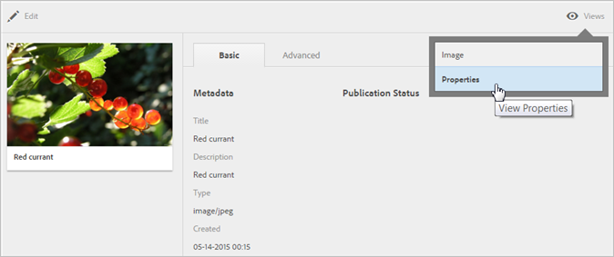

# Overzicht van Experience Cloud-middelen

Experience Cloud-middelen bieden één gecentraliseerde opslagplaats voor marketingklare middelen die u over verschillende oplossingen kunt delen. Middelen zijn digitale documenten, afbeeldingen, video of audio (of een deel daarvan) die meerdere uitvoeringen kunnen hebben en subelementen kunnen bevatten (bijvoorbeeld lagen in een [!DNL Photoshop]-bestand, dia&#39;s in een [!DNL PowerPoint]-bestand, pagina&#39;s in een PDF, bestanden in een ZIP).

De diensten van activa omvatten:

* Asset storage, management interface, embedded selection interface (toegankelijk via oplossingen).
* Integraties met Creative Cloud, Experience Cloud-samenwerking en Experience Cloud-oplossingen.

Het gebruik van middelen verbetert de consistentie en de naleving van het merk, en versnelt de tijd aan markt. U kunt workflows stroomlijnen in oplossingen:

* **[!DNL Social]**: Publiceren naar sociale eigenschappen, Facebook, Twitter, LinkedIn, Google+
* **[!DNL Target]**: Maak ervaringen voor A/B- en multivariatietests.
* **[!DNL Media Optimizer]**: Eenheden ontwikkelen op verschillende kanalen en campagnes
* **[!DNL Campaign]**: Plaats elementen in e-mailbulletins en campagnes.

In [!UICONTROL Experience Cloud Assets] kunt u:

* [Navigeren naar Experience Cloud-elementen](../experience-cloud-assets/experience-cloud-assets.md#section_3657039DD3524F2AA88753BFF4781125)
* [De werkbalk openen](../experience-cloud-assets/experience-cloud-assets.md#section_EC2E401D225148818F3753248556BE6B)
* [Elementen bewerken](../experience-cloud-assets/experience-cloud-assets.md#section_CD3C55A9D4574455B94D0955391C8FEC)
* [Zoeken naar elementen](../experience-cloud-assets/experience-cloud-assets.md#section_50FE049010B446FC9640AA6A30E5A730)
* [Elementen notities aanbrengen](../experience-cloud-assets/experience-cloud-assets.md#section_67FE1DFAAB744DA5B1CD3AD3CCEABF7A)
* [Op volledig scherm weergeven en zoomen](../experience-cloud-assets/experience-cloud-assets.md#section_A9F50D7D6BE341A2AB8244A4E42A4EF7)
* [Elementeigenschappen weergeven](../experience-cloud-assets/experience-cloud-assets.md#section_FED28711DAB14E1BBEEA7CA890EE9573)
* [Gebruiksrapporten uitvoeren](../experience-cloud-assets/experience-cloud-assets.md#section_15D782FFB8D74CF4A735116CC03AD902)
* [Delen van middelen met Experience Manager](../experience-cloud-assets/experience-cloud-assets.md#section_45C1B72F4D274F54BC6CCB64D2580AC5)

## Naar Experience Cloud-elementen navigeren {#section_3657039DD3524F2AA88753BFF4781125}

## De werkbalk {#section_EC2E401D225148818F3753248556BE6B} openen

Navigeer naar een element (of elementenmap) en klik op **[!UICONTROL Select]**.

De werkbalk biedt snel toegang tot functies, zoals Zoeken, Tijdlijn, Uitvoeringen, Bewerken, Annoteren en Downloaden.

## Elementen {#section_CD3C55A9D4574455B94D0955391C8FEC} bewerken

Als u een element bewerkt, zijn er functies mogelijk, zoals:

* Uitsnijden
* Roteren
* Omdraaien

## Middelen zoeken {#section_50FE049010B446FC9640AA6A30E5A730}

U kunt zoeken op trefwoord, bestandstype, grootte, laatst gewijzigd, publicatiestatus, afdrukstand en stijl.

## Elementen {#section_67FE1DFAAB744DA5B1CD3AD3CCEABF7A} annoteren

Klik op **[!UICONTROL Annotate]** door cirkels of pijlen op een afbeelding te tekenen en het element van annotatie te voorzien voor revisie door collega&#39;s.

## Elementen op volledig scherm weergeven en zoomen {#section_A9F50D7D6BE341A2AB8244A4E42A4EF7}

Klik op **[!UICONTROL Views]** > **[!UICONTROL Image]** om de volledige elementafbeelding weer te geven en zoomen in te schakelen.

## Elementeigenschappen weergeven {#section_FED28711DAB14E1BBEEA7CA890EE9573}

U kunt kiezen tussen de kaartweergave met eigenschappen, de lijstweergave en de kolomweergave, zodat u uw elementen gemakkelijker kunt vinden.

Klik op **[!UICONTROL Views]** > **[!UICONTROL Properties]** om de eigenschappen van een element weer te geven:

## Gebruiksrapporten {#section_15D782FFB8D74CF4A735116CC03AD902} uitvoeren

Zie het aantal gebruikers, de gebruikte opslagruimte en het totale aantal middelen.

Klik op **[!UICONTROL Tools]** > **[!UICONTROL Reports]** > **[!UICONTROL Usage Report]**

