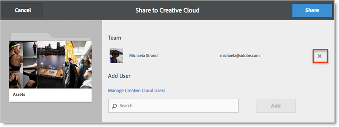

# Een map met Experience Cloud-middelen delen

U kunt een map Experience Cloud-middelen delen met Creative Cloud-gebruikers.

1. Klik op een map met middelen **[!UICONTROL Share to Creative Cloud]**.

   
1. Zoek op de pagina Delen naar Creative Cloud naar de gebruiker en klik vervolgens op **[!UICONTROL Add]**.

   

1. Klik op **[!UICONTROL Share]**.
1. Start het [!DNL Creative Cloud] bureaublad (of navigeer naar de [!UICONTROL Creative Cloud Files] pagina in een browser) en zoek het aanvraagbericht.

   
1. Open het verzoek en klik op **[!UICONTROL Accept]**.

   
1. Klik op **[!UICONTROL Open Folder]** (of **[!UICONTROL View on Web]**) om de inhoud van de map te openen.

   
1. Voeg verder opmerkingen toe op het gedeelde element:

   In Creative Cloud kunt u op een afbeelding klikken en vervolgens een opmerking toevoegen **[!UICONTROL Activity]** aan de afbeelding. Opmerkingen worden gesynchroniseerd op de elementen in de [!DNL Creative Cloud] en [!DNL Experience Cloud].

   

   Klik in de Experience Cloud op een afbeelding en klik vervolgens op het pictogram voor de tijdlijn om een opmerking aan de afbeelding toe te voegen. Opmerkingen worden gesynchroniseerd op de middelen in Creative Cloud en Experience Cloud.

   

1. Als u een map niet meer wilt delen, klikt u op **[!UICONTROL Share Using Creative Cloud]** (vergelijkbaar met [stap 3](../experience-cloud-assets/t-share-creative-cloud.md#step_BA17CFA185284641A9B878BA29551996)) en verwijdert u gebruikers door op X te klikken. Klik vervolgens op **[!UICONTROL Share]** Stap 3.

Nadat u alle Creative Cloud-gebruikers hebt verwijderd, wordt de map niet meer gedeeld en hebben de Creative Cloud-gebruikers geen toegang meer.
U kunt onder andere een gedeeld element gebruiken:

* Gebruik middelen in de [!UICONTROL Asset Selector] lijst [!DNL Adobe Social] voor sociale artikelen.
* Laad of verwissel elementen in de [aanbiedingenbibliotheek](https://docs.adobe.com/help/en/target/using/experiences/offers/manage-content.html) in [!DNL Adobe Target] voor afbeeldingen in activiteiten.

Nadat u een map hebt gedeeld met Creative Cloud, wordt het Creative Cloud-logo weergegeven in de map.

Verwante hulp:

* [Creative Cloud Help - Bestanden beheren en synchroniseren](https://helpx.adobe.com/creative-cloud/help/sync-files.html)
* [Creative Cloud Help - Samenwerken met anderen](https://helpx.adobe.com/creative-cloud/help/collaboration.html)
* [Creative Cloud Help - Veelgestelde vragen over samenwerken](https://helpx.adobe.com/creative-cloud/help/collaboration-faq.html)
