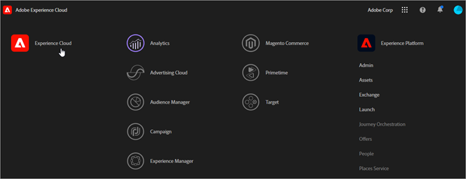

# Experience Cloud Interface Guide

De Experience Cloud is een geïntegreerde Adobe van digitale marketingoplossingen. Het is ook een intuïtieve interface waarmee u snel toegang hebt tot uw cloudoplossingen en kernservices.

De Adobe Experience Cloud Administration Guide biedt hulp bij het beheer van Experience Cloud-gebruikers en -producten, de Audience Library, Customer Attributes en Experience Cloud-middelen. De artikelen in deze handleiding omvatten:

* [[!UICONTROL Audience Library]](audience-library/audience-library.md)
* [[!UICONTROL Customer Attributes]](attributes/attributes.md)
* [[!UICONTROL Triggers]](activation/triggers.md)
* [Experience Cloud [!UICONTROL Assets]](experience-cloud-assets/experience-cloud-assets.md)
* [Experience Cloud cookies](cookies/cookies-privacy.md)
* [Gebruiker- en productbeheer](admin-getting-started/admin-getting-started.md) (Admin Console)
* [Laat uw oplossingen voor de kerndiensten toe](core-services/core-services.md)
* [Veelgestelde vragen](admin-getting-started/admin-getting-started.md)
* [Organisaties en accountkoppelingen](admin-getting-started/organizations.md)
* [Integraties](marketing-cloud-integrations.md)
* [Adobe Target integreren met de Experience Cloud](https://docs.adobe.com/content/help/nl-NL/target/using/integrate/a4t/a4t.html)
* [Overzicht van privacy en beveiliging bij Experience Cloud](assets/Adobe-Marketing-Cloud-Privacy-and-Security-Overview.pdf)
* [DNS-prefetch](admin-getting-started/admin-getting-started.md#concept_6BC8C6856E3644F8956D7AD0A96383B7)

## Hulplijnen

Verwante hulplijnen voor Experience Cloud zijn:

* [Adobe mobiel](https://docs.adobe.com/content/help/en/mobile-services/using/home.html)
* [Apparaatcoop](https://docs.adobe.com/content/help/nl-NL/device-co-op/using/home.html)
* [Exchange](https://experiencecloud.adobeexchange.com/)
* [Experience Cloud ID-service](https://docs.adobe.com/content/help/nl-NL/id-service/using/home.html)
* [Experience Platform Launch](https://docs.adobelaunch.com/)
* [Experience Cloud Debugger](https://docs.adobe.com/content/help/en/debugger/using/experience-cloud-debugger.html)
* [API voor algemene gegevensbeschermingsverordening (GDPR)](https://www.adobe.io/apis/experiencecloud/gdpr.html)
* [[!UICONTROL Dynamic Tag Management]](https://docs.adobe.com/content/help/nl-NL/dtm/using/dtm-home.html)

## Tutorials

Profiteer van zelfstudiemateriaal en snelle instructies in Experience League:

* [Alle zelfstudies in Experience League](https://experienceleague.corp.adobe.com/?lang=en#quick-how-tos)
* [Zelfstudies voor Experience Platforms](https://experienceleague.corp.adobe.com/docs/core-services-learn/tutorials/overview.html?lang=en)
* [Real-time Platform voor klantgegevens](https://experienceleague.corp.adobe.com/docs/platform-learn/tutorials/rtcdp/understanding-the-real-time-customer-data-platform.html?lang=en)

## Opmerkingen bij de release en verwante Experience Cloud Help

* [Productdocumentatie voor alle Experience Cloud-oplossingen](https://docs.adobe.com/content/help/en/experience-cloud/user-guides/home.html) - Blader voor hulp naar Experience Cloud Learn &amp; Support
* [Opmerkingen bij de release en productupdates](https://docs.adobe.com/content/help/nl-NL/release-notes/experience-cloud/current.html) - Nieuwe functies in de Experience Cloud en een abonnement voor updates
* [Tutorials voor de implementatie van kernservices](https://docs.adobe.com/content/help/en/core-services-learn/tutorials/overview.html) - Ontdek video&#39;s en zelfstudies over kernservices
* [Experthulp bij de Experience League](https://landing.adobe.com/experience-league/) - Leer met instructies van experts en de gemeenschap
* [Onderwijs en training](https://helpx.adobe.com/nl/learning.html?promoid=KAUDK) - Neem contact op met Adobe om ervoor te zorgen dat u optimaal profiteert van onze producten
* [Blog](https://theblog.adobe.com/customer-experience/) van Customer Experience - Lees de Experience Cloud-blog
* [Klantenservice](https://helpx.adobe.com/nl/contact/enterprise-support.ec.html) - Contact opnemen met de Adobe Klantenservice
