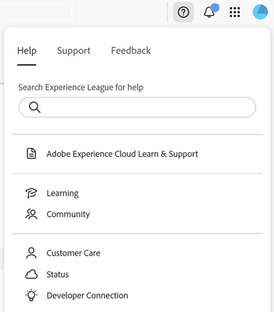
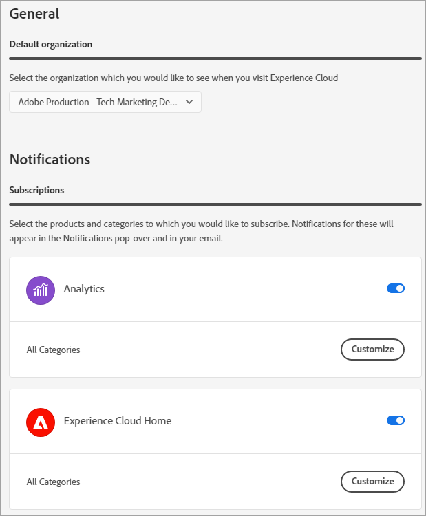
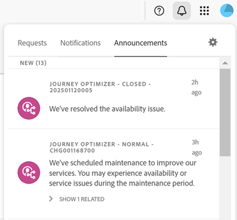

# Experience Cloud Central Interface Components Guide

[Ervaring met ](https://experience.adobe.com) Cloudis geïntegreerde familie van digitale marketingtoepassingen, producten en services. Via de intuïtieve interface hebt u snel toegang tot uw cloudtoepassingen, productfuncties en services.

Vanuit Experience Cloud kunt u:

* Toegang tot uw toepassingen en services
* Zoeken naar productdocumentatie, zelfstudies en communityberichten
* Zakelijke objecten wereldwijd zoeken met een algemene zoekopdracht (alleen voor gebruikers van Experience Platforms)
* Uw accountvoorkeuren beheren (waarschuwingen, meldingen en abonnementen)

## Aanmelden bij Experience Cloud {#signin}

Meld u aan en controleer of u zich in de juiste [organisatie](organizations.md) bevindt.

1. Navigeer naar [Adobe Experience Cloud](https://experience.adobe.com).
1. Selecteer **[!UICONTROL Sign in with an Adobe ID]**.
1. Controleer of u zich in de juiste organisatie bevindt.

   

   **Uw organisatie verifiëren**

   Om te verifiëren dat u aan uw correcte [organisatie](organizations.md) hebt het programma geopend, klik op uw profielavatar om de organisatienaam te zien. Als u toegang hebt tot meer dan één organisatie, kunt u ook bekijken en op een andere organisatie in de kopbalbar schakelen.

   Als uw organisatie Federated IDs gebruikt, staat Experience Cloud u toe om binnen met enige aanmelding van uw organisatie te ondertekenen zonder de behoefte om uw e-mailadres en wachtwoord in te gaan. Om dit te doen, voeg `#/sso:@domain` aan Experience Cloud URL (`https://experience.adobe.com`) toe.

   Stel bijvoorbeeld voor een organisatie met Federatieve id&#39;s en het domein `adobecustomer.com` de URL-koppeling in op `https://experience.adobe.com/#/sso:@adobecustomer.com`. U kunt ook rechtstreeks naar een specifieke toepassing gaan door een bladwijzer te maken van deze URL, die bij het toepassingspad wordt gevoegd. (Voor Adobe Analytics bijvoorbeeld `https://experience.adobe.com/#/sso:@adobecustomer.com/analytics`.)

## Toegang tot Experience Cloud-toepassingen {#navigation}

Nadat u zich hebt aangemeld bij Experience Cloud, hebt u vanuit de uniforme header snel toegang tot al uw toepassingen, services en organisaties.

Ga naar de toepassingskiezer  om toegang te krijgen tot Experience Cloud-toepassingen en -services die binnen uw organisatie voor u zijn ingericht.

## Browserondersteuning in Experience Cloud {#browser}

Voor de beste prestaties is Experience Cloud geoptimaliseerd voor de populairste browsers, waaronder de nieuwste versie en de twee vorige versies.

* Chroom
* Rand
* Firefox
* Opera
* Safari

Als uw browser niet in de lijst wordt vermeld, wordt deze mogelijk wel ondersteund, maar wordt u aangeraden een van de vermelde browsers te gebruiken.

>[!NOTE]
>
>Niet alle toepassingen die worden uitgevoerd op het Experience Cloud-domein ondersteunen alle browsers. Raadpleeg de documentatie bij een bepaalde toepassing als u dit niet zeker weet.

## Taalondersteuning in Experience Cloud {#languages}

Experience Cloud ondersteunt voorkeurstalen voor elke gebruiker, zoals ingesteld in de voorkeuren voor uw gebruikersaccount voor Adobe. Momenteel worden de volgende talen ondersteund:

* Chinees
* Engels
* Frans
* Duits
* Italiaans
* Japans
* Koreaans
* Portugees
* Spaans
* Taiwanees

Hoewel al het toepassingsteam aan globale taalsteun wordt geëngageerd, niet worden alle toepassingen aangeboden in alle hierboven vermelde talen. Als uw primaire taal niet in een toepassing van Experience Cloud wordt gesteund, kunt u een secundaire taal aan gebrek ook plaatsen aan wanneer toepasselijk. Dit kan worden gedaan in [Experience Cloud gebruikersvoorkeur](https://experience.adobe.com/preferences).

## Hulp en ondersteuning {#support}

U kunt leren en helpen met het Help-pictogram () in de koptekst, inclusief Help-inhoud (documentatie, zelfstudies en cursussen) op [Experience League](https://experienceleague.adobe.com/#home), en aanvullende bronnen voor afzonderlijke toepassingen. U kunt ook feedback voor onbepaalde tijd verzenden en geprioriteerde ondersteuningstickets maken.

Met het menu [!UICONTROL Help] hebt u ook toegang tot:

* **[!UICONTROL Support]:** Maak een ondersteuningsticket of neem contact  [!UICONTROL Support] op met Twitter.
* **[!UICONTROL Feedback]:** Deel feedback over uw Experience Cloud-ervaring. Je feedback wordt gebruikt om producten en services van Adobe te verbeteren.
* **[!UICONTROL Status]:** Navigeer aan  `https://status.adobe.com/experience_cloud` en controleer productoperationele status en  [!UICONTROL Manage Subscriptions].
* **[!UICONTROL Developer Connection]:** Navigatie naar de documentatie van de ontwikkelaar  `adobe.io` en zoek deze.

## Globaal zoeken naar objecten en entiteiten {#search}

Met de algemene zoekopdracht kunt u doorzoekbare zakelijke objecten of entiteiten zoeken in een naadloze, consistente, één-klik-ervaring. Deze zoekopdracht is gericht op de onlangs geopende objecten.

>[!NOTE]
>
>De algemene zoekopdracht is niet beschikbaar in alle Experience Cloud-toepassingen, maar wanneer meer inhoud wordt geïndexeerd, wordt deze toegevoegd aan de desbetreffende toepassingen. Beschikbaarheid vanaf juli 2021:

* Experience Platform
* Journey Optimizer

## Gebruikersprofiel en accountvoorkeuren {#preferences}

Voorkeuren voor Experience Cloud zijn onder andere meldingen, abonnementen en waarschuwingen. In het menu met accountvoorkeuren kunt u het volgende doen:

* Geef een donker thema op (niet alle toepassingen ondersteunen dit thema)
* Zoeken naar [Organisaties](organizations.md)
* Afmelden
* Accountvoorkeuren, meldingen en abonnementen configureren

Als u de voorkeuren wilt beheren, selecteert u **[!UICONTROL Preferences]** in het accountmenu .

Op [!UICONTROL Experience Cloud preferences], kunt u de volgende eigenschappen vormen:

| Functie | Beschrijving |
|--- |--- |
| Standaard [organisatie](organizations.md) | Selecteer de organisatie die u wilt zien wanneer u Experience Cloud start. |
| [!UICONTROL Subscriptions] | Selecteer de producten en categorieën waarop u zich wilt abonneren. Meldingen in de pop-up [!UICONTROL Notifications] en in uw e-mail. |
| [!UICONTROL Priority] | Selecteer de categorieën die u als hoge prioriteit wilt worden beschouwd. Deze categorieën zijn duidelijk met een Hoog markering en kunnen voor levering zoals alarm worden gevormd. |
| [!UICONTROL Alerts] | Selecteer de meldingen waarvoor u waarschuwingen wilt weergeven in uw browser. Er worden enkele seconden waarschuwingen weergegeven in de rechterbovenhoek van het venster. |
| E-mails | Geef de frequentie op waarmee je e-mailberichten wilt ontvangen. (Niet verzonden, onmiddellijk, dagelijks of wekelijks.) |

{style=&quot;table-layout:auto&quot;}

## Meldingen en aankondigingen {#notifications}

Selecteer **[!UICONTROL Notifications]** om te worden gealarmeerd over relevante en uitvoerbare updates, met inbegrip van productversies, onderhoudsberichten, gedeelde punten, en goedkeuringsverzoeken.

## Experience Cloud-domeinen {#domains}

Experience Cloud gebruikt de volgende hosts om de toepassing te leveren, de prestaties en de productervaring te verbeteren. Adobe raadt u aan deze domeinen voor een optimale ervaring toe te voegen aan de lijst van gewenste personen van uw firewall. Er kunnen ook extra domeinen worden gebruikt voor specifieke Experience Cloud-toepassingen, zoals Adobe Analytics. Raadpleeg de documentatie bij deze toepassingen voor meer informatie.

| Technologie | Domeinen |
|--- |--- |
| Adobe Experience Cloud-domeinen | `adobe.com`, `adobe.net`, `adobe.io` |
| Adobe Identity Management Service (IMS) | `adobelogin.com` |
| Experience Cloud-lettertypen | `typekit.net` |
| Geniet van inzicht (voor productbegeleiding en hulp) | `esp.aptrinsic.com` |

## Hulp bij beheer en services voor meerdere toepassingen

Deze gids verleent toegang tot hulp op gebruiker van Experience Cloud en productbeleid in de Admin Console, toelatend oplossingen voor de platformdiensten. U hebt ook toegang tot de Help-functie in de Audience Library, Customer Attributes, Experience Cloud Assets en meer:

* [[!UICONTROL Audience Library]](audience-library.md)
* [[!UICONTROL Customer Attributes]](attributes.md)
* [[!UICONTROL Triggers]](triggers.md)
* [Experience Cloud [!UICONTROL Assets]](experience-cloud-assets.md)
* [Experience Cloud cookies](cookies-privacy.md)
* [Gebruiker- en productbeheer](admin-getting-started.md)  (Admin Console)
* [Laat uw oplossingen voor de kerndiensten toe](core-services.md)
* [Veelgestelde vragen](admin-getting-started.md)
* [Organisaties en accountkoppelingen](organizations.md)
* [Integraties](marketing-cloud-integrations.md)
* [Adobe Target integreren met de Experience Cloud](https://experienceleague.adobe.com/docs/target/using/integrate/a4t/a4t.html?lang=en)
* [Overzicht van privacy en beveiliging bij Experience Cloud](assets/Adobe-Marketing-Cloud-Privacy-and-Security-Overview.pdf)
* [DNS-prefetch](admin-getting-started.md#concept_6BC8C6856E3644F8956D7AD0A96383B7)

## Hulplijnen

Verwante hulplijnen voor Experience Cloud zijn:

* [Adobe mobiel](https://experienceleague.adobe.com/docs/mobile-services/using/home.html?lang=en)
* [Experience Platform coop-grafiek](https://experienceleague.adobe.com/docs/device-co-op/using/home.html?lang=en)
* [Exchange](https://exchange.adobe.com/experiencecloud)
* [Experience Cloud ID-service](https://experienceleague.adobe.com/docs/id-service/using/home.html?lang=en)
* [Gegevensverzameling/starten van Experience Platform](https://experienceleague.adobe.com/docs/launch.html?lang=en)
* [Experience Cloud Debugger](https://experienceleague.adobe.com/docs/debugger/using/experience-cloud-debugger.html?lang=en)
* [API voor algemene gegevensbeschermingsverordening (GDPR)](https://www.adobe.io/apis/experiencecloud/gdpr.html)
* [[!UICONTROL Dynamic Tag Management]](https://experienceleague.adobe.com/docs/experience-platform/tags/home.html?lang=en)

## Tutorials

Profiteer van zelfstudiemateriaal en snelle zelfstudies in Experience League:

* [Alle zelfstudies in Experience League](https://experienceleague.adobe.com/?lang=en#quick-how-tos)
* [Zelfstudies voor Experience Platforms](https://experienceleague.adobe.com/docs/launch-learn/tutorials/overview.html?lang=en)
* [Real-time Platform voor klantgegevens](https://experienceleague.adobe.com/docs/platform-learn/tutorials/application-services/rtcdp/understanding-the-real-time-customer-data-platform.html?lang=en)

## Opmerkingen bij de release en verwante Experience Cloud Help

* [Productdocumentatie voor alle Experience Cloud-oplossingen](https://experienceleague.adobe.com/docs/home.html?lang=en)  - Blader voor hulp naar Experience Cloud Learn &amp; Support
* [Opmerkingen bij de release en productupdates](https://experienceleague.adobe.com/docs/release-notes/experience-cloud/current.html?lang=en) : Wat is er nieuw in de Experience Cloud en meld u aan om updates te krijgen
* [Tutorials voor de implementatie van kernservices](https://experienceleague.adobe.com/docs/launch-learn/tutorials/overview.html?lang=en)  - Ontdek video&#39;s en zelfstudies over kernservices
* [Deskundige hulp bij Experience League](https://experienceleague.adobe.com/)  - Leren met instructies van experts en de gemeenschap
* [Onderwijs en training](https://helpx.adobe.com/nl/learning.html?promoid=KAUDK)  - Neem contact op met Adobe om ervoor te zorgen dat u optimaal profiteert van Adobe
* [Customer Experience Blog](https://blog.adobe.com/en/topics/digital-transformation.html)  - Lees de Experience Cloud-blog
* [Klantenservice](https://experienceleague.adobe.com/?support-solution=General#support)  - Contact opnemen met de Adobe Klantenservice
