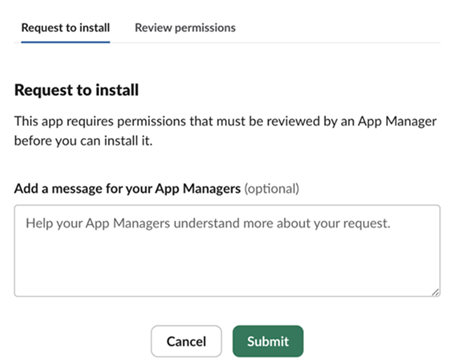

# Accountvoorkeuren en -meldingen {#preferences}

Experience Cloud [ voorkeur ](https://experience.adobe.com/preferences) omvat berichten (in-app, e-mail, en [!DNL Slack]), abonnementen, en alarm.

In de voorkeuren kunt u:

* Onderzoek naar [ Organisaties ](../administration/organizations.md)
* Geef een donker thema op (niet alle toepassingen ondersteunen dit thema).
* Gebruikersvoorkeuren, meldingen en abonnementen configureren.
* Afmelden bij Experience Cloud.

## Voorkeuren beheren

Om voorkeur te beheren, selecteer **[!UICONTROL Preferences]** van uw rekeningsmenu .

Op [!UICONTROL Experience Cloud preferences] kunt u de volgende functies configureren:

| Functie | Beschrijving |
|--- |--- |
| Standaard [ organisatie ](../administration/organizations.md) | Selecteer de organisatie die u wilt zien wanneer u het Experience Cloud start. |
| [!UICONTROL Product data collection] | Selecteer welke technologieën Adobe kan gebruiken om gegevens te verzamelen over hoe u uw producten van de Adobe gebruikt. |
| [ Meldingen ](#notifications-and-announcements) | Laat [!UICONTROL in-app], [!UICONTROL email], of [ Slack ](#slack-notifications) berichten toe. |
| [!UICONTROL Personalized learning recommendations and promotions] | Selecteer waar u [ gepersonaliseerde hulp ](personalized-learning.md) voor uw producten van de Adobe zou willen ontvangen. Deze Help is beschikbaar via e-mail, in-product, en de Gemeenschappen van de Experience League. |
| [!UICONTROL Subscriptions] | Selecteer de producten en categorieën waarop u zich wilt abonneren. Meldingen in de pop-up [!UICONTROL Notifications] en in uw e-mail. |
| [!UICONTROL Priority] | Selecteer de categorieën die u als hoge prioriteit wilt worden beschouwd. Deze categorieën zijn gemarkeerd met een tag [!UICONTROL High] en kunnen worden geconfigureerd voor levering zoals waarschuwingen. |
| [!UICONTROL Alerts] | Selecteer de meldingen waarvoor u waarschuwingen wilt weergeven in uw browser. Er worden enkele seconden waarschuwingen weergegeven in de rechterbovenhoek van het venster. |
| E-mails | Geef de frequentie op waarmee je e-mailberichten wilt ontvangen. (Niet verzonden, onmiddellijk, dagelijks of wekelijks.) |

## Abonneren op meldingen in Experience Cloud {#notifications}

Je kunt de producten en rubrieken selecteren waarop je je wilt abonneren. De berichten verschijnen in [!UICONTROL Notifications] popover (in-app), of in uw e-mail, of in [ Slack ](#slack-notifications) (afhankelijk van uw abonnementen).

Meldingen via e-mail en Slack zijn handig voor situaties waarin u niet bent aangemeld bij Experience Cloud.

### Abonneren op in-app- en e-mailmeldingen

1. Navigeer aan Experience Cloud [ voorkeur ](https://experience.adobe.com/preferences).

1. Schakel onder **[!UICONTROL Notifications]** **[!UICONTROL In-app]** of **[!UICONTROL Email]** in.

   Wijzigingen in meldingen worden automatisch opgeslagen.

### Abonneren op [!DNL Slack] meldingen {#slack}

>[!NOTE]
>
>De berichten van de Slack zullen vrijgeven: **11 September, 2024**

U kunt uw accountvoorkeuren zo configureren dat meldingen van Experiencen Cloud naar een [!DNL Slack] -kanaal worden verzonden.

**Vereisten**

* Je moet een Experience Cloud account hebben.
* U moet een [!DNL Slack] account hebben. Uw beheerder van de Slack laat de integratie van het Experience Cloud met Slack toe.
* U moet onderdeel zijn van ten minste één [!DNL Slack] -werkruimte.

**om aan de berichten van de Slack in te tekenen**

1. Navigeer aan Experience Cloud [ voorkeur ](https://experience.adobe.com/preferences)

1. Zoek [!DNL Slack] en klik vervolgens op **[!UICONTROL Add to Slack]** .

   

   Als [!DNL Slack] is geïnstalleerd, wordt de toepassing geopend en wordt een bericht met het verzoek om toestemming weergegeven.

   * Klik op **[!UICONTROL Allow]**.

   Als [!DNL Slack] niet geïnstalleerd is, a _Verzoek om_ berichtvertoningen te installeren:

   

   * Kies in de Slack de werkruimte in de rechterbovenhoek van de toepassing.

   * Klik op **[!UICONTROL Submit]** als u goedkeuring van een toepassing wilt aanvragen voor het Slack-werkruimtenbeheer.

   * U ontvangt een melding in [!DNL Slack] nadat de aanvraag is goedgekeurd.

   * Nadat u [!DNL Slack] goedkeuring hebt ontvangen, gaat u terug naar het Experience Cloud **[!UICONTROL Notifications]** en klikt u op **[!UICONTROL Add to Slack]** .

1. Schakel onder **[!UICONTROL Notifications]** [!DNL Slack] -meldingen in voor de gewenste producten en categorieën.

   

   Updates voor meldingen worden automatisch opgeslagen.

### Wat u ziet in [!DNL Slack]

In meldingen voor Slacks wordt de volgende informatie weergegeven:

* Het persoonlijke bericht zal van de toepassingsnaam _Adobe Experience Cloud_ worden ontvangen.
* Het bericht bevat het productlogo voor de specifieke toepassing, zoals Adobe Experience Platform, Adobe Experience Manager, enzovoort.
* Een koppeling om alle meldingen op het Experience Cloud weer te geven.
* Een koppeling voor het beheren van berichtgevingsvoorkeuren op Experience Cloud.

## Weergeven [!UICONTROL notifications] en aankondigingen in Experience Cloud {#view-notifications}

In de kopbal van het Experience Cloud, kunt u berichten bekijken waaraan u  intekende, evenals meningsaankondigingen.

1. Klik op het belpictogram in de koptekst. 

1. Klik op **[!UICONTROL Notifications]** of **[!UICONTROL Announcements]** .

   Op deze locatie ontvangt u belangrijke informatie over producten, uw samenwerking met andere gebruikers en andere relevante updates. De updates omvatten productversies, onderhoudsberichten, gedeelde punten, en goedkeuringsverzoeken.