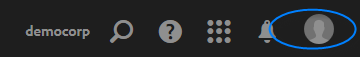
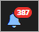

# Aanmelden en de instellingen van uw Experience Cloud-profiel beheren

Als u zich aanmeldt bij Experience Cloud (in plaats van zich aan te melden bij één toepassing), kunt u zich aanmelden bij alle toepassingen en services die u hebt. In deze Help wordt beschreven hoe u zich aanmeldt bij de Experience Cloud, wachtwoorden en meldingen beheert en een standaardbestemmingspagina opgeeft.

>[!IMPORTANT]
>
>Beheerders, zie [Beheer](admin-getting-started.md#topic_3FCB4099640647E3B2411ADBFCE81909) voor informatie over updates van gebruikers- en productbeheer.

## Aanmelden bij de Experience Cloud (beheerders) {#task_034FC955031347F3B02B686A09801A08}

Aanmelden en controleren of u zich aan de rechterkant bevindt [organisatie](organizations.md#topic_C31CB834F109465A82ED57FF0563B3F1).

1. Selecteer het menu Experience Cloud ( ), selecteert u vervolgens **[!UICONTROL Administration]**.

   Als de **[!UICONTROL Administration]** de verbinding wordt niet getoond, bent u geen beheerder van Experience Cloud voor getoond [organisatie](organizations.md#topic_C31CB834F109465A82ED57FF0563B3F1). Voor hulp bij het worden van een beheerder, contacteer de Zorg van de Klant of een bestaande beheerder van de Experience Cloud in uw bedrijf.
1. Selecteer **[!UICONTROL Administration]**.

1. Ga door door een van de volgende koppelingen te selecteren:

| Element | Beschrijving |
|--- |--- |
| [Grondbeginselen van Admin Console](experience-cloud.md) | Meer informatie over de eerste stappen die u moet uitvoeren om aan de slag te gaan met Experience Cloud-toepassingen. |
| [Identiteit instellen](https://helpx.adobe.com/nl/enterprise/using/set-up-identity.html) | Definieer en stel een identiteitssysteem in waarmee uw eindgebruikers worden geverifieerd. |
| [Gebruikersbeheer](https://helpx.adobe.com/nl/enterprise/using/users.html) | Leer hoe u zich aanmeldt bij de Admin Console en gebruikersmachtigingen en productprofielen voor Experience Cloud beheert. |
| [Admin Console starten](admin-getting-started.md) | De Admin Console is de centrale plaats voor het beheren van uw gebruikers van Adobe en productrechten over uw volledige organisatie. U kunt zich ook aanmelden bij de Admin Console met een [directe koppeling](https://adminconsole.adobe.com). |
| [Creative Cloud-gebruikers beheren](t-admin-add-cc-user.md) | Met Experience Cloud Assets kunnen marketers mappen delen, synchroniseren en aan mappen samenwerken met ontwerpers en andere creatieve elementen met behulp van de Creative Cloud. U kunt de Creative Cloud-gebruikers beheren die zijn goedgekeurd om hier met uw organisatie samen te werken. |
| [Uw rapportsets toewijzen](core-services.md) | (Alleen analyse) Experience Cloud core-services zijn gekoppeld aan een organisatie in plaats van aan een afzonderlijke rapportsuite. Om ervoor te zorgen dat deze services correct werken, moet elke analytische rapportensuite aan een organisatie worden toegewezen. (Deze taak maakt deel uit van een breder werkschema aan [Analyses inschakelen voor kernservices](core-services.md#concept_07ED1D5C64234E77976E6D572E78FB9C)). |
| [Organisatie-id](organizations.md) | De *organisatie-id* wordt gevonden in URL wanneer in de Admin Console. U kunt deze ook weergeven op het tabblad [!UICONTROL User Data Debugger] pop-up (`ctrl+i` of `cmd+i`) van elke pagina op `https://experience.adobe.com`. Deze id is de bijbehorende id van uw Experience Cloud-bedrijf. Deze id is een alfanumerieke tekenreeks van 24 tekens, gevolgd door (en moet bevatten) @AdobeOrg. |

{style=&quot;table-layout:auto&quot;}

## Aanmelden bij de Experience Cloud (gebruikers) {#task_1BFE87E20DCB44078CAC82F3CD44B985}

Help voor gebruikers zonder beheerdersrechten die zich aanmelden bij de Experience Cloud.

1. Controleer met uw beheerder of uw [organisatie](organizations.md) is opgenomen in de Experience Cloud.

1. Ga naar de [Adobe Experience Cloud](https://experience.adobe.com) ([!DNL experience.adobe.com]).
1. Selecteer **[!UICONTROL Sign In With Adobe ID]**.

   Uw Experience Cloud-beheerder kan u helpen het type account (Adobe ID of Enterprise ID) te bepalen.

1. Selecteer op de landingspagina het kiezerpictogram   voor toegang tot het keuzemenu.

   

   De toepassingen en services die in dit menu worden weergegeven, zijn afhankelijk van de toepassingsrechten die door uw [beheerder](admin-getting-started.md#topic_3FCB4099640647E3B2411ADBFCE81909).

## Standaardinstellingen voor persoonlijke accounts configureren {#task_73CBCAE6C91749D19C95421E5AC311BA}

U kunt persoonlijke gegevens bewerken en een standaardinstelling opgeven [organisatie](admin-getting-started.md#concept_705C626560A54CA2A4215F1C870C42B2) en de openingspagina die na aanmelding bij de Experience Cloud wordt weergegeven.

1. Meld u aan bij de Experience Cloud en selecteer vervolgens het profielpictogram.

   
1. Selecteer **[!UICONTROL Edit Profile]**.

   
1. Ga door met het configureren en bewerken van persoonlijke gegevens en selecteer vervolgens **[!UICONTROL Save Changes]**.

## Meldingen inschakelen {#concept_0105453AD71847B8BFCAF4A40915F157}

U ontvangt een melding (via e-mail of in-product) over updates van het systeem, onderhoudsberichten, publicaties, aantekeningen en gedeelde middelen. U kunt ook de producten en toepassingen opgeven waarvoor u meldingen wilt ontvangen, inclusief de uploadstatus voor Klantkenmerken.

Als u naar meldingen wilt navigeren, selecteert u de optie **[!UICONTROL Notifications]** pictogram  Selecteer vervolgens de **[!UICONTROL Settings]** pictogram  .

U kunt de vertoning van Meldingen sorteren op de berichttypes die voor u belangrijk zijn, en onderzoek naar berichten. U kunt ook het volgende doen:

* U kunt sorteren op de berichttypen die voor u van belang zijn.
* Zoeken naar meldingen.

<!-- 
 <b>Analytics</b> 
 
<ul id="ul_91BF597858124FA5BF338C36F6C5533F"> 
 <li id="li_FAD3E93CDE6242F58F14D55C8A6E23D7">Contribution analysis completed </li> 
 <li id="li_03D33D3228884CECA371B58656B2F3E7">Guided analysis shared </li> 
 <li id="li_DCF710F89317487B8DAA86CC05C694CA">Scheduled report failure </li> 
</ul> 

 <b>Adobe Target</b> 
 

Test started or stopped 
 

 <b>Media Optimizer</b> 
 

Performance alerts 
 

 <b>Dynamic Tag Manager</b> 
 
<ul id="ul_9ACDA418933E40918744D9C32A57DD4B"> 
 <li id="li_4DD0FFD3D9F84A428703611EF767D4D0">New web property created </li> 
 <li id="li_C6B923012E9D40BA91F4CBF7D2D72986">New user added </li> 
 <li id="li_EB0B9D1CFDE24E6987935CCCBFC7892A">Approvals - publishing and approval status for new rules, data elements, and tools </li> 
 <li id="li_17B0B176FF85435FB7EDD4317BC18201">Property has been published </li> 
</ul> -->

## Profielen en wachtwoorden beheren {#task_7B89F4F38E5A4C4EB0FF842953856382}

U kunt het profiel van uw Experience Cloud bewerken, een standaardorganisatie en een openingspagina opgeven, enzovoort.

1. Meld u aan bij Experience Cloud.

1. Selecteer bij Experience Cloud de profielafbeelding.

   
1. Selecteer **[!UICONTROL Edit Profile]**.

   Vul de velden en opties onder Persoonlijke gegevens in op de pagina Profiel en wachtwoorden.

## Uw wachtwoord herstellen {#task_46541A2806164CB1A4AE8239604E4EB1}

1. Navigeer naar de aanmeldingspagina van de oplossing.
1. Selecteer **[!UICONTROL Forgot Password]**.

   Het terugstellen van een oplossingswachtwoord zou wachtwoord moeten oplossen die kwesties voor Experience Cloud verbindt.

   Voor Adobe Analytics-gebruikers navigeert u naar [https://sc2.omniture.com/password_recovery.html](https://sc2.omniture.com/password_recovery.html).

## Toepassingsaanmelding configureren met behulp van een directe koppeling {#concept_8BE493A08786469B88B210E13F78FF2F}

Naar keuze, kunt u binnen aan een specifieke pagina in een oplossing ondertekenen, gebruikend authentificatie die door de Interface van Experience Cloud wordt verstrekt.

### URL-sjabloon

`https://experience.adobe.com/#/@<tenantId>/<solutionname>?destURL=<fullURL>`

Voorbeeld-URL:

`https://experience.adobe.com/#/@aem62tenant/analytics?destURL=https%3A%2F%2Fsc.omniture.com%2Freports%2F11562.html`

>[!NOTE]
>
>U moet een URL coderen voordat u deze doorgeeft aan de `destURL` parameter. (Coderingssites zoals [URL-decoder/Encoder](https://meyerweb.com/eric/tools/dencoder/) zijn beschikbaar.)

| Parameter | Beschrijving | Voorbeeld | Vereist/optioneel |
|--- |--- |--- |--- |
| `tenantId` | Naam van de huurder de gebruiker zou moeten login. | aem62huurder | Optioneel |
| `destURL` | De volledige URL naar de plaats waarnaar de gebruiker moet worden doorgestuurd. | http://sc.omniture.com/login/?r=%2Fx%2F1_7xxzf&amp;tenantId=obuengsc&amp;company=OBU+Eng+SC | Optioneel |
| `solutionname` | Naam van de Oplossing van MAC die de eigenaar van is `destURL` parameter. Hiermee wordt gecontroleerd of de gebruiker toegang heeft tot de toepassing die de eigenaar van de URL is.  Het is aan de toepassingen om ervoor te zorgen dat de `applicationname` is synchroon met de `destURL` parameter.  Bijvoorbeeld: Als de URL `solutionname` als sociale en `destURL` mits dit een analyse-URL is, wordt de gebruiker omgeleid naar de url, zelfs als hij geen toegang heeft tot analysemogelijkheden. Mac controleert NIET of de eigenaar van de `destURL` synchroon is met de naam van de toepassing. | analyse | Vereist indien `destURL` param wordt gebruikt. |

{style=&quot;table-layout:auto&quot;}
