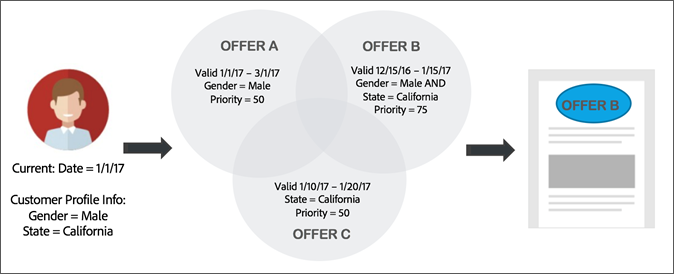

# Offertebeheerworkflow{#offer-management-workflow}

Leer de werkstroom op hoog niveau van [!UICONTROL Offer Management], met inbegrip van plaatsing en aanbieding creatie, het opnemen van aanbiedingsactiviteiten, en het bekijken rapporten.

## Stap 1 - Bepaal waar je in je e-mailtemplates persoonlijke aanbiedingen nodig hebt {#section_F184E589428B403EA8EB921BF230CF87}

Geef aan in welke e-mailcampagnes u persoonlijke aanbiedingen wilt invoegen. Bepaal van daaruit de locaties in uw e-mailsjabloon waar u deze aanbiedingen wilt invoegen. Bijvoorbeeld, zou u de productaanbieding kunnen willen wijzigen die op de industrie van de klant of persona wordt gebaseerd, het bericht veranderen dat op de zelfde criteria wordt gebaseerd, en het beeld variëren dat op de geografie van de klant wordt gebaseerd.

## Stap 2 - bepaal welke attributen van Campagne u wenst om hen met het Beheer van de Aanbieding te richten en te delen {#section_1461F1FAC0B943E5BBDED6B3B00E9D5C}

Bij het maken van een aanbieding in [!UICONTROL Offer Management]kunt u subsidiabiliteitsregels instellen die beperken welke profielen bepaalde aanbiedingen kunnen ontvangen. Deze subsidiabiliteitsregels kunnen worden ingesteld op basis van kenmerken (of velden) die in Adobe Campagne bestaan. Deze gebieden moeten van Campagne door een admin-vlakke gebruiker worden gedeeld alvorens zij in de bouwer van de [!UICONTROL Offer Management] geschiktheidsregel tonen.

Voor informatie bij het delen van deze attributen, zie de attributen van het [Aandeel van Campagne aan het Beheer](campaign.md#task_4DFA9A20D7B04E1F9AFF4774D67B6EBC)van de Aanbieding.

## Stap 3 - Voer de vereiste stages in [!UICONTROL Offer Management]{#section_71619756A86F4DB58B8200D8A1CE1B87}

Met een plaatsing zorgt u ervoor dat de inhoud van het juiste aanbod op de juiste locatie in uw e-mailsjabloon wordt weergegeven. Wanneer u inhoud aan een aanbieding toevoegt, wordt u gevraagd een plaatsing te selecteren waarin die inhoud kan worden weergegeven.

U kunt meerdere locaties met dezelfde plaatsing hebben. In het volgende voorbeeld zijn er twee plaatsen voor twee verschillende formaatbeelden en één enkele plaatsing voor de tekst die bij de bovenkant en de bodem van het malplaatje toont.

Nadat u hebt bepaald welke plaatsen u nodig hebt, kunt u hen aan het [!UICONTROL Placement] lusje toevoegen.

## Stap 4 - Je voorstellen maken {#section_C4F9732B0596425EB0BD5AE76E4BA6EF}

Maak de aanbiedingen die u in uw e-mailcampagne wilt gebruiken. Er zijn gegevens en inhoud die aan de aanbieding kunnen worden toegevoegd om de beste aanbieding te bepalen om te dienen en te bepalen welke inhoud te tonen. Wanneer u een representatie van de inhoud maakt, koppelt u deze aan een van de plaatsen die zijn gedefinieerd in [Plaatsen](placements.md). Zodra je een voorstel hebt gemaakt en ingediend, is het beschikbaar voor gebruik in een aanbiedingsactiviteit.

## Stap 5 - Maak uw e-mailcampagne en voeg een aanbiedingsactiviteit in {#section_6FD36404759B4C6E9FD3A65ACABB26C8}

Nu u uw aanbiedingen hebt gemaakt, kunt u deze in een e-mailcampagne gebruiken. In de inhoudeditor kunt u een blok selecteren en een aanbiedingsactiviteit invoegen. Met een aanbiedingsactiviteit kunt u een groep voorstellen selecteren uit uw aanbiedingsvoorraad, waaruit de beslissingsengine de beste aanbieding voor elke gebruiker bepaalt.

## Stap 6 - Uw e-mailcampagne voorbereiden en verzenden {#section_EDD8EA4696664130A678D7C4483DA806}

Wanneer u nu uw e-mailcampagne voorbereidt, [!UICONTROL Offer Management] bepaalt u de beste aanbieding voor elke bezoeker op basis van de huidige datum, profielkenmerken en prioriteit. Het bepaalt ook of er een inhoudsvertegenwoordiging beschikbaar voor de plaatsing van die plaats is.

In het volgende voorbeeld, veronderstel u een e-mailcampagne met een aanbiedingsactiviteit hebt die 3 aanbiedingen (A, B, C) bevat. U kunt bepalen welke aanbieding in één van de plaatsen in onze e-mail dient. Tijdens de voorbereiding zal [!UICONTROL Offer Management] het volgende gebeuren:

1. Analyseer de huidige datum, profielgegevens van elke gebruiker, en prioriteit.
1. Vergelijk die informatie met de gegevens over de aanbiedingen.
1. Bepaal de beste aanbieding om te dienen.

## Stap 7 - Rapporten weergeven {#section_2104BAACAE154DE29B6EEB967C46F226}

Je kunt een rapport bekijken over welke aanbiedingen werden gedaan en hoe ze in een aanbiedingsactiviteit hebben uitgevoerd. U kunt dit rapport weergeven door het tabblad Rapporten te selecteren op de startpagina van Adobe Campagne Standard.
