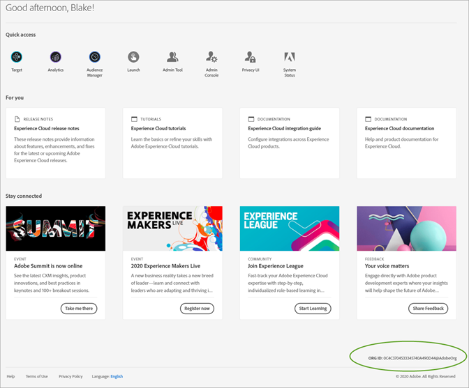

# Organisaties in Experience Cloud

Leer over het beheren van en het schakelen van organisaties in Experience Cloud.

## Uw organisatie identificeren {#concept_384D169B0B724B799D573B8ECB5C39BF}

An *organisatie* is de entiteit die een beheerder toelaat om groepen en gebruikers te vormen, en om enig teken-binnen in de Experience Cloud te controleren. De organisatie functioneert als een login bedrijf dat alle producten en toepassingen van de Experience Cloud overspant. Meestal is een organisatie uw bedrijfsnaam. Een bedrijf kan echter vele organisaties hebben.

Om te controleren dat u zich bij uw correcte organisatie hebt aangemeld, klikt u op uw profielavatar om de naam van de organisatie te zien. Als u toegang hebt tot meer dan één organisatie, kunt u ook bekijken en op een andere organisatie in de kopbalbar schakelen.

Als uw organisatie Federated IDs gebruikt, staat Experience Cloud u toe om binnen met enige aanmelding van uw organisatie te ondertekenen zonder de behoefte om uw e-mailadres en wachtwoord in te gaan. Hiervoor voegt u `#/sso:@domain` naar de Experience Cloud-URL (`https://experience.adobe.com`).

Bijvoorbeeld voor een organisatie met federatieve id&#39;s en het domein `adobecustomer.com`, stel uw URL-koppeling in op `https://experience.adobe.com/#/sso:@adobecustomer.com`. U kunt ook rechtstreeks naar een specifieke toepassing gaan door een bladwijzer te maken van deze URL, die bij het toepassingspad wordt gevoegd. (Bijvoorbeeld voor Adobe Analytics, `https://experience.adobe.com/#/sso:@adobecustomer.com/analytics`.)

## Zoek uw organisatie-id {#concept_EA8AEE5B02CF46ACBDAD6A8508646255}

Mogelijk moet u uw organisatie-id zoeken voor ondersteuningsdoeleinden. U kunt verifiëren dat u in de correcte organisatie bent, of tussen organisaties schakelt, gebruikend **[!UICONTROL Organization]** -menu.

De **organisatie-id** is identiteitskaart verbonden aan uw provisioned Experience Cloud bedrijf. Deze id is een alfanumerieke tekenreeks van 24 tekens, gevolgd door (en moet bevatten) @AdobeOrg.

Navigeer naar de bestemmingspagina van de Experience Cloud of selecteer ( ), selecteert u vervolgens **[!UICONTROL Administration]**. U vindt de organisatie-id onder aan het dialoogvenster [!UICONTROL Getting Started with the Experience Cloud] of de [!UICONTROL Administration] pagina.

## Een toepassingsaccount koppelen aan een Adobe ID {#task_FD389E78640848919E247AC5E95B8369}

Typisch, verlenen de beheerders van Experience Cloud toegang tot toepassingen en de diensten. In zeldzame gevallen moet u mogelijk toepassingsreferenties koppelen aan een Adobe ID.

1. Voer de stappen in uw e-mailuitnodiging voor de Experience Cloud uit.
1. Meld u aan met uw Adobe ID of Enterprise ID.
1. Selecteer de toepassingskiezer. ( ).

   

   De toepassingen waartoe u toegang hebt, zijn gekleurd.
1. Selecteer de gewenste toepassing.

   

   Dit type bericht wordt weergegeven als u deel uitmaakt van de desbetreffende groep (en toestemming hebt voor de toepassing) maar nog geen koppeling hebt gemaakt tussen uw accountgegevens en uw Adobe ID.
1. Selecteren **[!UICONTROL Link Account]** en geef vervolgens uw gegevens op.

## Een standaardorganisatie en -openingspagina opgeven {#concept_6A191B42A9874A9780882903BA18F071}

U kunt een standaardorganisatie en openingspagina opgeven die u wilt gebruiken wanneer u zich aanmeldt.

Selecteer in uw profiel **[!UICONTROL Edit Profile]**.

Bij Standaardorganisatie en -bestemmingspagina kunt u uw aanmeldingservaring aanpassen.

## Problemen met koppelingen tussen accounts oplossen {#concept_DFCB29A3B4834FC59AA29E0BBA301584}

Hulp bij problemen die het gevolg zijn van het koppelen van accounts.

Het koppelen van accounts mislukt doorgaans omdat de Adobe ID is gekoppeld aan een vorige gebruiker. Wanneer het koppelen van een account mislukt, kunt u:

* [Contact opnemen met Adobe-ondersteuning](https://experienceleague.adobe.com/?support-solution=General#support).
* Open uw toepassing met de standaardaanmeldingsnaam terwijl het probleem wordt opgelost.
