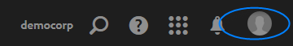
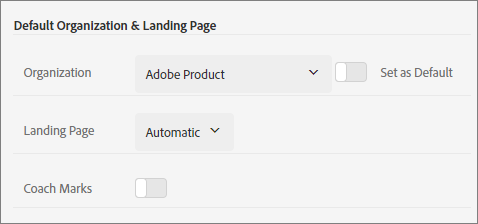

# Organisaties en accountkoppelingen

Leer over het beheren van organisaties en het verbinden van oplossingsrekeningen met Experience Cloud.

## Uw organisatie identificeren {#concept_384D169B0B724B799D573B8ECB5C39BF}

Een *organisatie* is de entiteit die een beheerder toelaat om groepen en gebruikers te vormen, en enig teken-binnen in de Experience Cloud te controleren. De organisatie functioneert als een aanmeldingsbedrijf dat alle producten en oplossingen van Experience Cloud omvat. Meestal is een organisatie uw bedrijfsnaam. Een bedrijf kan echter vele organisaties hebben.

Mogelijk moet u ook uw organisatie-id vinden voor ondersteuningsdoeleinden. Met het menu **[!UICONTROL Organization]** kunt u controleren of u zich in de juiste organisatie bevindt of kunt u schakelen tussen organisaties.

## Zoek uw organisatie-id {#concept_EA8AEE5B02CF46ACBDAD6A8508646255}

De **organisatie-id** is de id die is gekoppeld aan uw ingeleverde Experience Cloud-bedrijf. Deze id is een alfanumerieke tekenreeks van 24 tekens, gevolgd door (en moet bevatten) @AdobeOrg.

Als u uw organisatie-id wilt weergeven, navigeert u naar de bestemmingspagina van de Experience Cloud of selecteert u ( ) en selecteert u **[!UICONTROL Administration]**. U vindt de organisatie-id onder aan de pagina [!UICONTROL Getting Started with the Experience Cloud] of op de pagina [!UICONTROL Administration].

## Een oplossingsaccount koppelen aan een Adobe ID {#task_FD389E78640848919E247AC5E95B8369}

Typisch, verlenen de beheerders van Experience Cloud toegang tot oplossingen en de diensten. In zeldzame omstandigheden, kunt u oplossingsgeloofsbrieven aan een Adobe ID moeten verbinden.

1. Voer de stappen in uw e-mailuitnodiging voor de Experience Cloud uit.
1. Meld u aan met uw Adobe ID of Enterprise ID.
1. Selecteer de oplossingenkiezer. ( ).

   

   De oplossingen waartoe u toegang hebt, zijn gekleurd.
1. Selecteer de gewenste oplossing.

   

   Dit type bericht wordt weergegeven als u deel uitmaakt van de desbetreffende groep (en toestemming hebt voor de oplossing) maar uw accountgegevens nog niet aan uw Adobe ID hebt gekoppeld.
1. Selecteer **[!UICONTROL Link Account]** en geef uw referenties op.

## Een standaardorganisatie en -openingspagina opgeven {#concept_6A191B42A9874A9780882903BA18F071}

U kunt een standaardorganisatie en openingspagina opgeven die u wilt gebruiken wanneer u zich aanmeldt.

Selecteer **[!UICONTROL Edit Profile]** in uw profiel.

Bij Standaardorganisatie en -bestemmingspagina kunt u uw aanmeldingservaring aanpassen.

## Problemen met koppelingen tussen accounts oplossen {#concept_DFCB29A3B4834FC59AA29E0BBA301584}

Hulp bij problemen die het gevolg zijn van het koppelen van accounts.

Het koppelen van accounts mislukt doorgaans omdat de Adobe ID is gekoppeld aan een vorige gebruiker. Wanneer het koppelen van een account mislukt, kunt u:

* [Neem contact op met de Adobe-ondersteuning](https://experienceleague.adobe.com/?support-solution=General#support).
* Heb toegang tot uw oplossing gebruikend standaardlogin terwijl de kwestie wordt opgelost.
