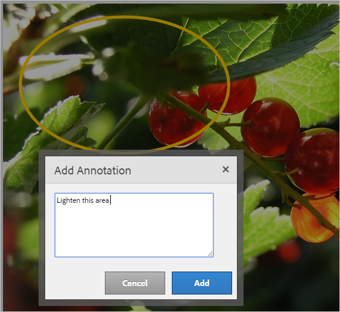
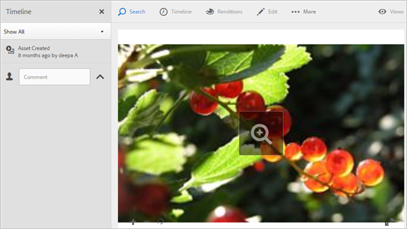

# Overzicht van Experience Cloud Assets

Experience Cloud Assets biedt één gecentraliseerde opslagplaats voor marketingklare middelen die u kunt delen tussen toepassingen. Middelen zijn digitale documenten, afbeeldingen, video of audio (of een deel daarvan) die meerdere uitvoeringen kunnen hebben en subelementen kunnen bevatten (bijvoorbeeld lagen in een [!DNL Photoshop] -bestand, dia&#39;s in een [!DNL PowerPoint] -bestand, pagina&#39;s in een PDF en bestanden in een ZIP).

De diensten van activa omvatten:

* Asset storage, management interface, embedded selection interface (toegankelijk via toepassingen).
* Integraties met Creative Cloud-, Experience Cloud- en Experience Cloud-toepassingen.

Het gebruik van middelen verbetert de consistentie en de naleving van het merk, en versnelt de tijd aan markt. U kunt workflows stroomlijnen in toepassingen:

* **[!DNL Adobe Target]**: Maak ervaringen voor A/B- en multivariatietests.
* **[!DNL Ad Cloud]**: ad-hocgroepen ontwikkelen via verschillende kanalen en campagnes
* **[!DNL Adobe Campaign]**: Plaats elementen in e-mailbulletins en campagnes.

## Naar Experience Cloud Assets navigeren {#section_3657039DD3524F2AA88753BFF4781125}

## De werkbalk openen {#section_EC2E401D225148818F3753248556BE6B}

Navigeer naar een element (of elementenmap) en selecteer vervolgens **[!UICONTROL Select]** .

De werkbalk biedt snel toegang tot functies, zoals Zoeken, Tijdlijn, Uitvoeringen, Bewerken, Annoteren en Downloaden.

>[!NOTE]
>
>Assets moet uit Adobe Target-activiteiten worden verwijderd voordat u deze kunt verwijderen uit [!DNL Target] .

## Elementen bewerken {#section_CD3C55A9D4574455B94D0955391C8FEC}

Als u een element bewerkt, zijn er functies mogelijk, zoals:

* Uitsnijden
* Roteren
* Omdraaien

 uit

## Middelen zoeken {#section_50FE049010B446FC9640AA6A30E5A730}

U kunt zoeken op trefwoord, bestandstype, grootte, laatst gewijzigd, publicatiestatus, afdrukstand en stijl.

## Elementen notities aanbrengen {#section_67FE1DFAAB744DA5B1CD3AD3CCEABF7A}

Selecteer **[!UICONTROL Annotate]** door cirkels of pijlen op een afbeelding te tekenen en het element van annotatie te voorzien voor revisie door collega&#39;s.

## Elementen op volledig scherm weergeven en zoomen {#section_A9F50D7D6BE341A2AB8244A4E42A4EF7}

Selecteer **[!UICONTROL Views]** > **[!UICONTROL Image]** om de volledige elementafbeelding weer te geven en zoomen in te schakelen.

## Elementeigenschappen weergeven {#section_FED28711DAB14E1BBEEA7CA890EE9573}

U kunt kiezen tussen de kaartweergave met eigenschappen, de lijstweergave en de kolomweergave, zodat u uw elementen gemakkelijker kunt vinden.

Selecteer **[!UICONTROL Views]** > **[!UICONTROL Properties]** om de eigenschappen van een element weer te geven:

## Gebruiksrapporten uitvoeren {#section_15D782FFB8D74CF4A735116CC03AD902}

Zie het aantal gebruikers, de gebruikte opslagruimte en het totale aantal middelen.

Selecteer **[!UICONTROL Tools]** > **[!UICONTROL Reports]** > **[!UICONTROL Usage Report]**

