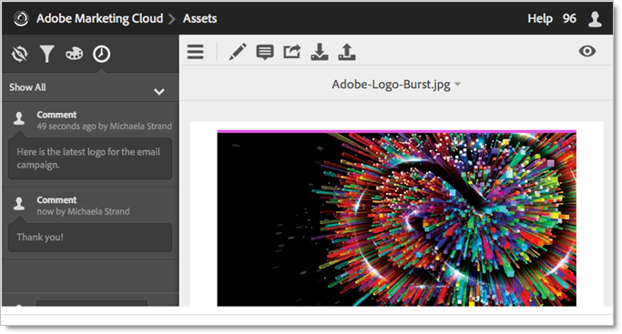

# Een map met Experiencen Cloud delen

Een map met Experiencen Cloud-elementen delen met gebruikers van Creatives Cloud.

1. Klik op **[!UICONTROL Share to Creative Cloud]** in een map met middelen.

   
1. Zoek op de pagina Delen naar Creative Cloud naar de gebruiker en klik vervolgens op **[!UICONTROL Add]** .

   

1. Klik op **[!UICONTROL Share]**.
1. Start het bureaublad van [!DNL Creative Cloud] (of navigeer naar de pagina van [!UICONTROL Creative Cloud Files] in een browser) en zoek de aanvraagmelding.

   
1. Open de aanvraag en klik op **[!UICONTROL Accept]** .

   
1. Klik op **[!UICONTROL Open Folder]** (of **[!UICONTROL View on Web]** ) om de inhoud van de map te openen.

   
1. Voeg verder opmerkingen toe op het gedeelde element:

   In Creative Cloud kunt u een afbeelding selecteren en vervolgens op **[!UICONTROL Activity]** klikken om een opmerking aan de afbeelding toe te voegen. Opmerkingen worden gesynchroniseerd op de elementen in de [!DNL Creative Cloud] en [!DNL Experience Cloud] .

    toe

   Selecteer in Experience Cloud een afbeelding en selecteer vervolgens het tijdlijnpictogram om een opmerking aan de afbeelding toe te voegen. Opmerkingen worden gesynchroniseerd op de elementen in het Creative Cloud en het Experience Cloud.

    toe

1. Om een omslag los te delen, klik **[!UICONTROL Share Using Creative Cloud]** (gelijkend op [ Stap 3 ](share.md)), dan verwijder gebruikers door X te selecteren, dan klik **[!UICONTROL Share]**.

Nadat u alle gebruikers van het Creative Cloud hebt verwijderd, wordt de map niet meer gedeeld en hebben de gebruikers van het Creative Cloud geen toegang meer.

Meer manieren om gedeelde activa te gebruiken omvatten het laden of het ruilen van activa in de [ Bibliotheek van Aanbiedingen ](https://experienceleague.adobe.com/docs/target/using/experiences/offers/manage-content.html) in Adobe Target voor beelden in activiteiten.

Nadat u een map naar het Creative Cloud hebt gedeeld, ziet u het logo van het Creative Cloud in de map.

Verwante hulp:

* [ Creative Cloud Help - beheer en synchroniseer dossiers ](https://helpx.adobe.com/creative-cloud/help/sync-creative-cloud-files.html)
* [ Hulp van het Creative Cloud - werk met anderen samen ](https://helpx.adobe.com/creative-cloud/help/collaboration.html)
* [ Hulp van het Creative Cloud - de Veelgestelde vragen van Collaboration ](https://helpx.adobe.com/creative-cloud/help/collaboration-faq.html)
