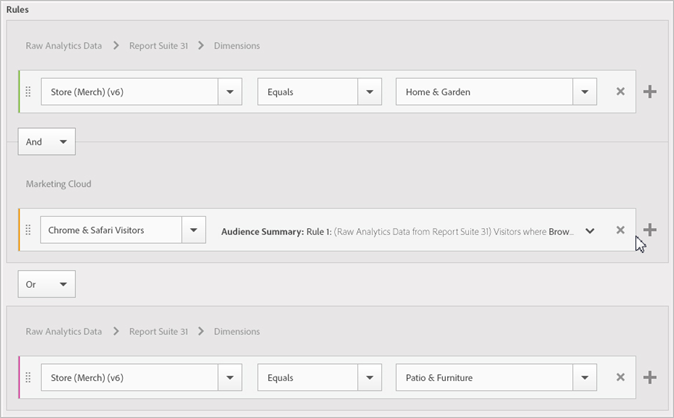

# Een publiek maken

Leer hoe te om attributenregels te gebruiken om een publiek tot stand te brengen en een samengesteld publiek in Experience Cloud te bepalen.

Dit artikel helpt u begrijpen hoe te:

* Een publiek maken
* Een regel maken
* Regels gebruiken om een samengesteld publiek te definiëren

De volgende afbeelding vertegenwoordigt twee regels in een samengesteld publiek.

Elke cirkel vertegenwoordigt een regel die publiekslidmaatschap bepaalt. Bezoekers die als leden in beide publieksregels worden gekwalificeerd, overlappen elkaar om het samengestelde, gedefinieerde publiek te worden.

>[!NOTE]
>
>Het publiek wordt volledig gedefinieerd nadat de gegevensverzameling voor de opgegeven periode is voltooid.

In het volgende voorbeeld ziet u hoe u de regels voor een samengesteld publiek maakt. Dit publiek bestaat uit:

* De sectie Home &amp; Garden is afgeleid van paginagegevens of onbewerkte analysegegevens.
* Chrome en gebruikers Safari die uit een [!DNL Adobe Analytics] segment [ worden afgeleid gepubliceerd ](overview.md) aan [!DNL Experience Cloud].

  

**om een publiek** te creëren

1. Klik in de lus [!DNL Experience Cloud] onder [!DNL Experience Platform] op **[!UICONTROL People]** > **[!UICONTROL Audience Library].**
1. Klik op de pagina [!UICONTROL Audiences] op **[!UICONTROL New]** . 

   

1. Geef op de pagina [!UICONTROL Create New Audience] een titel en beschrijving op.
1. Selecteer onder [!UICONTROL Rules] een kenmerkbron:

   * **[!UICONTROL Real-Time Analytics Data:]** (of Raw-gegevens) Dit zijn kenmerkgegevens die zijn afgeleid van Real-Time Analytics-afbeeldingsaanvragen en die gegevens bevatten zoals eVars en gebeurtenissen. U moet een rapportreeks selecteren wanneer het gebruiken van deze attributenbron, en de dimensie of de gebeurtenis bepalen om te omvatten. Deze selectie van de rapportreeks verstrekt de veranderlijke structuur die door de rapportreeks wordt gebruikt.
   >[!NOTE]
   >
   >Als gevolg van caching, vereisen de geschrapte rapportreeksen in Analytics 12 uur alvorens de schrapping in Experience Cloud wordt getoond.

   * **[!UICONTROL Experience Cloud:]** Kenmerkgegevens die zijn afgeleid van de [!DNL Experience Cloud] -bronnen. Dit kunnen bijvoorbeeld gegevens zijn van publiekssegmenten die u maakt in [!DNL Analytics] , of gegevens van [!DNL Audience Manager] .

1. Bepaal publieksregels, dan klik **[!UICONTROL Save].**

>[!NOTE]
>
>U zou een inzicht in uw implementatievariabelen moeten hebben wanneer het bepalen van publieksregels.

Definieer onder [!UICONTROL Rules] de selecties van het kenmerk *`Home & Garden`* :

* **[!UICONTROL Attribute Source:]** Onbewerkte analysegegevens
* **[!UICONTROL Report Suite:]** Report Suite 31
* Dimension = **[!UICONTROL Store (Merch) (v6)]** > **[!UICONTROL Equals]** > **[!UICONTROL Home & Garden]**

*Chrome &amp; de Bezoekers van Safari* is een publiekssegment dat van Analytics wordt gedeeld:

* **[!UICONTROL Attribute Source:]** Experience Cloud
* **[!UICONTROL Dimension:]** Bezoekers voor Chrome en Safari

Voor vergelijking, zou u een *OF* regel kunnen toevoegen om alle bezoekers aan een plaatssectie, zoals Patio &amp; Meubilair te zien.

De resulterende regel is een gedefinieerd publiek dat Chrome &amp; Safari-gebruikers omvat die Home &amp; Garden hebben bezocht. Het segment Patio &amp; Furniture biedt extra inzicht in alle bezoekers die dat gedeelte van de site bezoeken.

* **Historische Schatting:** (Gestippelde cirkel) vertegenwoordigt regels die op [!DNL Analytics] gegevens worden gecreeerd.
* **Ware Publiek:** (Ononderbroken cirkel) om het even welke gecreeerde regel die 30 dagen van gegevens van Audience Manager heeft. Wanneer de gegevens van de Audience Manager 30 dagen bereiken, wordt de lijn stevig en vertegenwoordigt daadwerkelijke aantallen.

Nadat de gegevensinzameling voor de gespecificeerde periode voltooit, combineren de cirkels om een bepaald publiek te tonen.

Nadat het publiek is opgeslagen, is het beschikbaar voor andere toepassingen. U kunt bijvoorbeeld een gedeeld publiek opnemen in een Adobe Target-activiteit.
