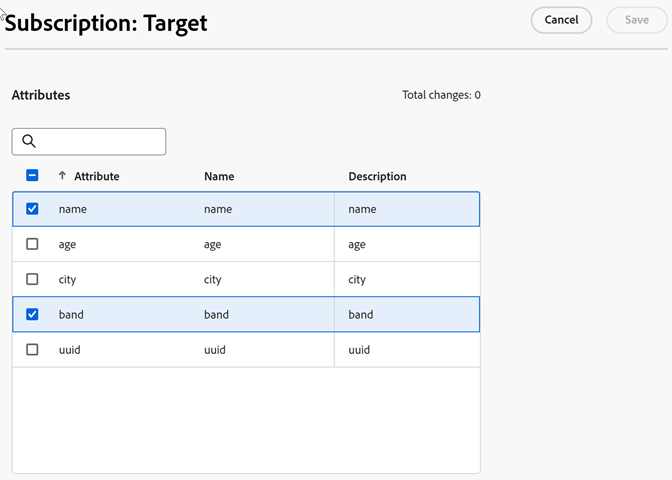

# Abonnementen configureren en de gegevensbron activeren

Met [!DNL Customer Attributes] -abonnementen kan de gegevensstroom van klantkenmerken worden ingesteld tussen Experience Cloud en toepassingen ([!DNL Analytics] en [!DNL Target] ).

Met een Adobe Analytics-abonnement worden bijvoorbeeld kenmerkgegevens in rapporten ingeschakeld. Als u [!DNL Adobe Target] gebruikt, kunt u klantenattributen voor het richten en segmentatie uploaden.

**om abonnementen te vormen en de gegevensbron te activeren**

1. Zoek de gegevensbron in [!DNL Customer Attributes] voor bewerking:

   In [!DNL Experience Cloud], klik **[!UICONTROL Apps]**  > **[!DNL Customer Attributes]**.

1. Klik op [!UICONTROL Edit Customer Attribute Source] op **[!UICONTROL File Upload]** .

1. Klik op **[!UICONTROL Configure Subscriptions]**.

   

1. Klik op **[!UICONTROL Active]** en vervolgens op **[!UICONTROL Save]** om de kenmerkbron van de klant te activeren.

1. Als u een abonnement op [!DNL Analytics] of [!DNL Target] wilt configureren, klikt u op **[!UICONTROL Configure]** .

   In het volgende voorbeeld wordt een [!DNL Target] -abonnement getoond:

   

   | Element | Beschrijving |
   |--- |--- |
   | Oplossing | **Uitgezocht van Adobe Analytics**  [!DNL Analytics], specificeer de rapportsuites aan dat u kenmerkgegevens, en de attributen wilt ontvangen om te omvatten. **Adobe Target**  U kunt klantenattributen voor het richten en segmentatie uploaden. Deze functie is handig als u een test wilt uitvoeren op basis van kenmerkgegevens of de gegevens beschikbaar wilt maken voor segmentatie in Analytics.  Geüploade gegevens van klantenattributen voor een bezoeker is beschikbaar bij login, in **[!DNL Target]** > **Soorten van publiek**.  de veelvoudige gegevensbronnen worden gesteund. Wanneer u klant-id&#39;s instelt op uw website, moet u controleren of ten minste een van de aliassen is geabonneerd op [!DNL Target] . |
   | Rapportsuite (Adobe Analytics) | Het rapport is afkomstig van Analytics.  u kunt niet meer dan een totaal van 10 rapportreeksen aan de abonnementen van Analytics binnen één enkele attributenbron toevoegen. Houd rekening met de volgende suggesties wanneer u kiest welke rapportsuites u wilt opnemen:<ul><li>Kies rapportsuites die een gemeenschappelijke reeks voor authentiek verklaarde klanten hebben. Als de voor authentiek verklaarde klanten in één rapportreeks niet met de voor authentiek verklaarde klanten in een andere rapportreeks overlappen, scheidt deze rapportreeksen in verschillende attributenbronnen.</li><li>Indien mogelijk, zouden de rapportreeksen inbegrepen in een attributenbron gelijkaardig verkeersvolume moeten hebben.</li></ul>  als u meer dan 10 rapportreeksen hebt die een gemeenschappelijke reeks voor authentiek verklaarde klanten hebben, kunt u extra bronnen van de klantenattributen vormen, elk met maximaal 10 rapportreeksen. |
   | Te opnemen kenmerken (Analytics en [!DNL Target]) | De kenmerken die u naar de toepassing wilt verzenden.   wanneer het vormen van abonnementen en het selecteren van attributen, zijn de volgende grenzen _per rapportreeks van toepassing,_ afhankelijk van de toepassingen u bezit:<ul><li>Stichting: 0</li><li>Selecteren: 3</li><li>Prime: 15</li><li>Ultimate: 200</li><li>Standaard: 3 totaal</li><li>Premium: 200 per rapportenpakket</li><li>[!DNL Target] Standaard: 5</li><li>[!DNL Target] Premium: 200</li></ul> **Nota:** wanneer u aan de Premium van Analytics bevordert, is er een vertraging van 24 uur alvorens de extra attributen beschikbaar zijn. U kunt een Max fout zien van het attributenabonnement tijdens deze vertraging. |

1. Klik op **[!UICONTROL Save]**.
