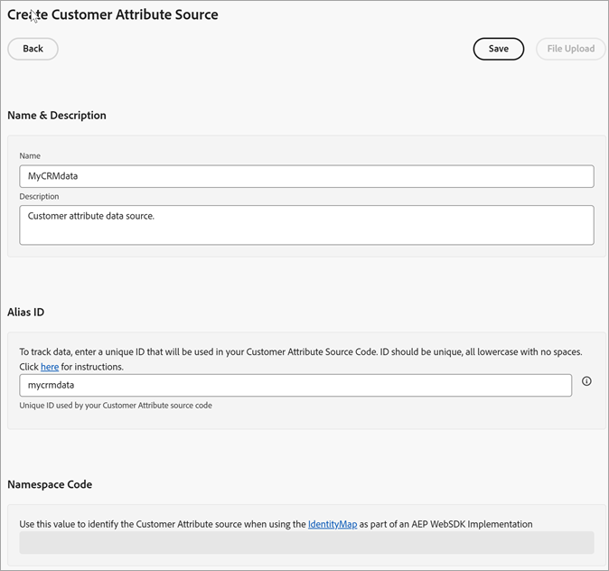

# Een gegevensbron maken en het bestand uploaden

Maak de bron van klantkenmerken (`.csv` en `.fin` bestanden) en upload de gegevens. U kunt de gegevensbron activeren wanneer u klaar bent. Nadat de gegevensbron actief is, deelt u de kenmerkgegevens naar [!DNL Analytics] en [!DNL Target] .

**[!DNL Customer Attributes]workflow**


## Zoeken [!DNL Customer Attributes]

In [!DNL Experience Cloud], klik **[!UICONTROL Apps]**  > **[!DNL Customer Attributes]**.

## Vereisten voor het gebruik van [!DNL Customer Attributes] {#prerequisites}

* **het lidmaatschap van de Groep:** om de gegevens te uploaden, moeten de gebruikers lid van de [!DNL Customer Attributes] groep zijn. U moet ook tot een Adobe Analytics-groep of een Adobe Target-groep behoren.

  Om te weten of uw bedrijf toegang tot klantenattributen heeft, zou uw [!DNL Experience Cloud] beheerder in [ Experience Cloud ](https://experience.adobe.com) moeten registreren. Navigeer naar **[!UICONTROL Admin Console]** > **[!UICONTROL Products]** . Als *[!DNL Customer Attributes]* wordt weergegeven als een van de [!UICONTROL product profiles] , kunt u beginnen.

  Gebruikers die aan [!DNL Customer Attributes] zijn toegevoegd, zien de [!DNL Customer Attributes] -menuoptie aan de linkerkant van de Experience Cloud-interface.

* **Adobe Target** `at.js` (om het even welke versie) of `mbox.js` versie 58 of recenter wordt vereist voor klantenattributen.

  Zie [ hoe te om at.js ](https://experienceleague.adobe.com/docs/target-dev/developer/client-side/overview.html) op te stellen.

## Een gegevensbestand maken {#create-data}

Dit gegeven is gegevens van ondernemingsklanten van uw CRM. De gegevens kunnen abonneegegevens voor producten bevatten, waaronder id&#39;s van leden, producten met de naam, de meest gestarte producten enzovoort.

1. Maak een `.csv` -bestand.

   >[!NOTE]
   >
   >Later in dit proces sleept u het `.csv` -bestand om het bestand te uploaden. Nochtans, als u [ via FTP ](t-upload-attributes-ftp.md#task_591C3B6733424718A62453D2F8ADF73B) uploadt, hebt u ook een `.fin` dossier met de zelfde naam zoals `.csv` nodig.

   Voorbeeld bedrijfsklantenbestand:

   

1. Alvorens verder te gaan, herzie de belangrijke informatie in [ Vereisten van het Dossier van Gegevens ](crs-data-file.md), alvorens u het dossier uploadt.
1. [ creeer een bron van de klantenattributen en upload de gegevens ](t-crs-usecase.md#create-source), hieronder beschreven.

## De kenmerkbron maken en het gegevensbestand uploaden {#create-source}

Voer deze stappen uit op de pagina [!UICONTROL Create Customer Attribute Source] in Experience Cloud.

>[!IMPORTANT]
>
>Wanneer het creëren van, het wijzigen van, of het schrappen van de bronnen van de klantenattributen, is er een vertraging van maximaal één uur alvorens IDs begint synchroniserend met de nieuwe gegevensbron. U moet beheerdersrechten in Audience Manager hebben om bronnen voor klantkenmerken te maken of te wijzigen. Neem contact op met de klantenservice of consultatie van Audience Manager om beheerrechten te verkrijgen.

1. In [!DNL Experience Cloud], klik **[!UICONTROL Apps]**  > **[!DNL Customer Attributes]**.

   

1. Klik op **[!UICONTROL New]**.

   

1. Configureer op de pagina [!UICONTROL Create Customer Attribute Source] de volgende velden:

   * **[!UICONTROL Name:]** Een vriendelijke naam voor de bron van het gegevenskenmerk. Voor [!DNL Adobe Target] mogen kenmerknamen geen spaties bevatten. Wanneer een kenmerk met een spatie wordt doorgegeven, negeert [!DNL Target] dit. Andere niet-ondersteunde tekens zijn: `< , >, ', "` .

   * **[!UICONTROL Description:]** (Optioneel) Een beschrijving van de bron van het gegevenskenmerk.

   * **[!UICONTROL Alias ID:]** Vertegenwoordigt een bron van klantkenmerkgegevens, zoals een specifiek systeem van CRM. [!UICONTROL Alias ID] is een unieke id die wordt gebruikt in uw [!UICONTROL customer attribute Source] -code. De id moet uniek zijn, in kleine letters en zonder spaties. De waarde die wordt ingevoerd in het veld [!UICONTROL Alias ID] voor een bron van klantkenmerken in Experience Cloud, moet overeenkomen met de waarden die worden doorgegeven vanuit de implementatie (via Platform Data Collection of JavaScript van Mobile SDK.)

     >[!IMPORTANT]
     >
     >Als u een gegevensbron verwijdert die aan een Alias-id is gekoppeld, maakt u de Alias-id niet beschikbaar, omdat de Alias-id in meerdere services wordt opgeslagen en wordt gebruikt om profielen tussen deze id&#39;s toe te wijzen.

     De alias-id komt overeen met bepaalde gebieden waar u extra waarden voor de klant-id instelt. Bijvoorbeeld:

      * **Markeringen:** identiteitskaart van de Alias beantwoordt aan de *waarde van de Code van de Integratie* onder [!UICONTROL customer Settings], in het [ hulpmiddel van de Dienst van identiteitskaart van Experience Cloud ](https://experienceleague.adobe.com/docs/experience-platform/tags/home.html?lang=nl).

      * **Bezoeker API:** identiteitskaart van de Alias beantwoordt aan extra [ klant IDs ](https://experienceleague.adobe.com/docs/id-service/using/reference/authenticated-state.html) die u met elke bezoeker kunt associëren.

        Bijvoorbeeld, *&quot;crm_id&quot;* in:

        ```
        "crm_id":"67312378756723456"
        ```

      * **iOS:** identiteitskaart van de Alias beantwoordt aan *&quot;idType&quot;* in [ bezoekorSyncIdentifiers :identifiers ](https://experienceleague.adobe.com/docs/mobile-services/ios/overview.html).

        Bijvoorbeeld:

        `[ADBMobile visitorSyncIdentifiers:@{@<`**`"idType"`**`:@"idValue"}];`

      * **Android™:** identiteitskaart van de Alias beantwoordt aan *&quot;idType&quot;* in [ syncIdentifiers ](https://experienceleague.adobe.com/docs/mobile-services/android/overview.html).

        Bijvoorbeeld:

        `identifiers.put(`**`"idType"`**`, "idValue");`

        Zie [ Leveraging veelvoudige gegevensbronnen ](crs-data-file.md#section_76DEB6001C614F4DB8BCC3E5D05088CB) voor extra informatie over gegevensverwerking betreffende het gebied van identiteitskaart van de Alias en klant IDs.

   * **[!UICONTROL Namespace Code:]** Gebruik deze waarde om de bron van de klantenattributen te identificeren wanneer het gebruiken van [ IdentityMap ](https://experienceleague.adobe.com/en/docs/experience-platform/web-sdk/identity/overview) als deel van een Implementatie WebSDK van AEP.

1. Klik op **[!UICONTROL Save]**.

## Bestand uploaden {#upload}

Het verslag van het klantenattribuut wordt gecreeerd, en u kunt het dossier uploaden door het klantenattribuut uit te geven.

1. Klik op de pagina [!DNL Customer Attributes] op de kenmerkbron.

1. Klik op de pagina [!UICONTROL Edit Customer Data Source] op **[!UICONTROL File Upload]** .

   

1. Sleep het gegevensbestand `.csv` of `.zip` of `.gzip` naar het venster voor slepen en neerzetten.

>[!IMPORTANT]
>
>Er zijn specifieke gegevensbestandsvereisten. Zie [ Vereisten van het Dossier van Gegevens ](crs-data-file.md) voor meer informatie.

Nadat u het bestand hebt geüpload, worden tabelgegevens weergegeven onder de kop [!UICONTROL File Upload] op deze pagina. U kunt het schema valideren, abonnementen configureren of de FTP instellen.


* **[!UICONTROL Unique customer ID:]** Geeft aan hoeveel unieke id&#39;s u naar deze kenmerkbron hebt geüpload.

* **[!UICONTROL customer-Provided IDs Aliased to Experience Cloud Visitor IDs:]** Hiermee geeft u aan hoeveel id&#39;s zijn toegewezen aan de id&#39;s van de Experience Cloud-bezoeker.

* **[!UICONTROL customer-Provided IDs with High Alias Counts:]** Hiermee geeft u het aantal door de klant opgegeven id&#39;s weer met 500 of meer aliased Experience Cloud-bezoeker-id&#39;s. Deze door de klant opgegeven id&#39;s vertegenwoordigen hoogstwaarschijnlijk geen personen, maar een soort gedeelde aanmelding. Het systeem verdeelt de attributen verbonden aan deze IDs aan 500 meest recente aliased identiteitskaart van de Bezoeker van Experience Cloud, tot het aliasaantal 10.000 bereikt. Vervolgens maakt het systeem de door de klant opgegeven id ongeldig en worden de bijbehorende kenmerken niet meer gedistribueerd. —>

## Het schema valideren {#validate-schema}

Met het validatieproces kunt u weergavenamen en beschrijvingen toewijzen aan geüploade kenmerken (tekenreeksen, gehele getallen, getallen, enzovoort). U kunt kenmerken ook verwijderen door het schema bij te werken.

Zie [ het schema ](validate-schema.md) bevestigen.

Om attributen te schrappen, zie [ (Facultatieve) Update het schema (schrapt attributen) ](t-crs-usecase.md).

## (Optioneel) Werk het schema bij (verwijder kenmerken) {#task_6568898BB7C44A42ABFB86532B89063C}

Hoe te om attributen te schrappen en attributen in het schema te vervangen.

1. Verwijder op de pagina [!UICONTROL Edit Customer Attribute Source] het abonnement **[!UICONTROL Target]** of **[!UICONTROL Analytics]** (onder **[!UICONTROL Configure Subscriptions]** ).

1. [ upload een nieuw gegevensdossier met bijgewerkte gebieden ](t-crs-usecase.md).

## Abonnementen configureren en kenmerkbron activeren {#task_1ACA21198F0E46A897A320C244DFF6EA}

Als u een abonnement configureert, wordt de gegevensstroom tussen Experience Cloud en toepassingen ingesteld. Door de kenmerkbron te activeren, kunnen de gegevens naar geabonneerde toepassingen stromen. De klantrecords die u hebt geüpload, komen overeen met binnenkomende id-signalen van uw website of toepassing.

Zie [ abonnementen vormen en de gegevensbron ](subscription.md) activeren.

## [!DNL Customer Attributes] -gegevens gebruiken in Adobe Analytics {#task_7EB0680540CE4B65911B2C779210915D}

Met de gegevens die nu beschikbaar zijn in toepassingen zoals Adobe Analytics, kunt u de gegevens rapporteren, analyseren en de juiste actie ondernemen in uw marketingcampagnes.

In het volgende voorbeeld wordt een [!DNL Analytics] -segment weergegeven op basis van de geüploade kenmerken. Dit segment toont [!DNL Photoshop Lightroom] abonnees van wie het meest gestarte product Photoshop is.

 wordt gebaseerd

Wanneer u een segment publiceert naar Experience Cloud, wordt dit beschikbaar in Experience Cloud Audiences en Audience Manager.

## [!DNL Customer Attributes] -gegevens gebruiken in Adobe Target {#task_FC5F9D9059114027B62DB9B1C7D9E257}

In [!DNL Target], kunt u een klantenattribuut van de [!UICONTROL Visitor Profile] sectie selecteren wanneer het creëren van een publiek. Alle klantkenmerken hebben het voorvoegsel `crs.` in de lijst. U kunt deze kenmerken desgewenst combineren met andere gegevenskenmerken om een publiek te maken.


Zie [ een Publiek ](https://experienceleague.adobe.com/docs/target/using/audiences/create-audiences/audiences.html) in [!DNL Target] hulp creëren.
