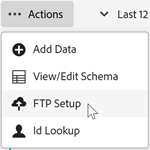

# Het gegevensbestand uploaden via FTP (optioneel)

Als u niet uploadt via slepen en neerzetten, kunt u klantkenmerkgegevens uploaden via FTP naar Experience Cloud.

U kunt de gegevens uploaden nadat u in Experience Cloud een bron voor klantkenmerken en een FTP-account hebt gemaakt. U maakt één FTP-account per kenmerkbron. De geüploade bestanden worden opgeslagen in de hoofdmap van dat account. De gegevens moeten de `.csv` -indeling hebben, met een tweede `.fin` -bestand om aan te geven dat het uploaden is voltooid.

>[!IMPORTANT]
>
>De het dossiervereisten van het overzicht [ Gegevens voor het uploaden van klantenattributen ](crs-data-file.md) alvorens het dossier te uploaden.

Het uploaden van bestanden naar de attributen FTP-site kan via FTP of SFTP worden uitgevoerd:

* U hebt een client nodig die SFTP-verbindingen ondersteunt.
* U kunt met SFTP verbinden gebruikend of gebruikersbenaming/wachtwoord of gebruikend geen wachtwoord, zoals die [ hier ](https://experienceleague.adobe.com/docs/analytics/export/ftp-and-sftp/secure-file-transfer-protocol/ftp-sftp-cert-auth.html) wordt beschreven.

**om het gegevensdossier via FTP te uploaden**

1. [ creeer een bron van het klantenattribuut en upload het gegevensbestand... ](t-crs-usecase.md).

   Controleer of u bent aangemeld bij uw FTP-site op `ftp.adobe.com/<sftpname>` .

1. Klik op **[!UICONTROL Actions]** > **[!UICONTROL File Upload]** .

1. Upload een `.fin` -bestand, zodat het bestand kan worden opgehaald.

   Het bestandstype `.fin` wordt door de gebruiker gemaakt en geeft aan dat het uploaden is voltooid. Het kan een leeg notebookbestand zijn. Als u bijvoorbeeld `crs123.csv` uploadt, uploadt u ook `crs123.fin` .

   Als uploaden succesvol is, worden beide dossiers verplaatst naar een omslag genoemd **verwerkt**.

   Zie [ de dossiervereisten van Gegevens voor het uploaden van klantenattributen ](crs-data-file.md) voor belangrijke informatie over dossiernamen en structuur.

## Een FTP-account instellen

Stel één FTP-account per kenmerkbron in.

Klik op de pagina [!UICONTROL File Upload and Schema Validation] op **[!UICONTROL FTP Setup]** .

 uit

De geüploade bestanden worden opgeslagen in de hoofdmap van dat account. De gegevens moeten de `.csv` -indeling hebben, met een tweede `.fin` -bestand om aan te geven dat het uploaden is voltooid.

De namen die u toepast op tekenreeksen, gehele getallen en getallen worden gebruikt om [!DNL Analytics] -metriek te maken.

* **[!UICONTROL attribute:]** -kenmerkgegevens die worden gelezen uit het geüploade `.csv` -bestand.

* **[!UICONTROL Type:]** Het gegevenstype, zoals:

   * **Koord:** een opeenvolging van karakters.

   * **Gehele aantallen:** Gehele aantallen.

   * **Aantallen:** kan tot twee decimalen hebben.

* **[!UICONTROL Display Name:]** Een vriendelijke naam voor het kenmerk. Bijvoorbeeld, kunt u een attribuut *klantenleeftijd* aan *klant veranderen aangezien*.

* **[!UICONTROL Description:]** Een vriendelijke beschrijving van het kenmerk.