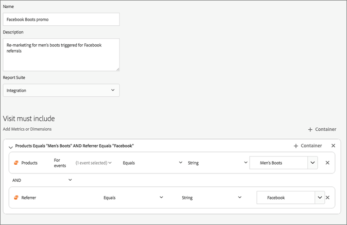

# Experience Cloud Triggers

[!UICONTROL Triggers] in Experience Cloud kunt u belangrijke gedragingen van consumenten identificeren, definiëren en controleren en vervolgens communicatie tussen toepassingen genereren om bezoekers opnieuw te betrekken. U kunt triggers gebruiken in realtime beslissingen en personalisatie.

Bijvoorbeeld:

* Snel opnieuw op de markt brengen voor winkels met winkelwagentjes of winkels met winkels met winkels met winkels en winkels met verwijderde producten configureren
* Incomplete formulieren en toepassingen
* Handelingen of reeksen handelingen op de site

>[!NOTE]
>
>Meer informatie over het gebruiken van [!UICONTROL Triggers] is beschikbaar in [ Campaign Standard ](https://experienceleague.adobe.com/docs/campaign-standard/using/integrating-with-adobe-cloud/working-with-campaign-and-triggers/using-triggers-in-campaign.html).

## Typen triggers

Over het algemeen kan het 15 tot 90 minuten duren voordat een marketingcampagne wordt gestart. Deze vertraging is afhankelijk van de implementatie van gegevensverzameling, het laden op de pijplijn, de aangepaste configuratie van de gedefinieerde trigger en de workflow in Adobe Campaign.

* **Afschaffing:** u kunt een trekker tot stand brengen om in brand te steken wanneer een bezoeker een product bekijkt maar om het even wat niet aan de kar toevoegt.
* **Actie:** U kunt trekkers tot stand brengen, bijvoorbeeld, aan brand na nieuwsbrief-ups, e-mailabonnementen, of toepassingen voor creditcards (bevestigingen). Als u een retailer bent, kunt u een trigger maken voor een bezoeker die zich aanmeldt voor een loyaliteitsprogramma. In media en vermaak, creeer trekkers voor bezoekers die op een bepaalde show letten, en misschien wilt u met een onderzoek antwoorden.
* **Begin van de Zitting en Eind van de Zitting:** creeer een trekker voor zittingsbegin en zittingseindgebeurtenissen.

## Een Experience Cloud-trigger maken {#task_821F37183AC045E5AC8EED20317598FE}

Maak een trigger en configureer de voorwaarden voor de trigger. U kunt bijvoorbeeld de criteria voor de regels van een trigger tijdens een bezoek opgeven, zoals maateenheden zoals Kart Abandon of afmetingen zoals de productnaam. Wanneer aan de regels wordt voldaan, loopt de trekker.

>[!NOTE]
>
>Er bestaat momenteel een technische limiet van 100 triggers.

1. In Experience Cloud, klik , dan klik **[!UICONTROL Data Collection/Launch]**.
2. Klik op de [!UICONTROL Triggers] -kaart op **[!UICONTROL Manage Triggers]** .
3. Klik op **[!UICONTROL New Trigger]** en geef vervolgens het type trigger op:

   

4. Vorm de trekker door de volgende gebieden te voltooien en metriek en afmetingspunten aan de containers van de regel te slepen:

   | Element | Beschrijving |
   |--- |--- |
   | [!UICONTROL Name] | De vriendelijke naam voor deze trigger. |
   | [!UICONTROL Description] | De beschrijving van deze trigger, hoe u deze gebruikt, enzovoort. |
   | [!UICONTROL Report Suite] | De Analytics [ rapportreeks ](https://experienceleague.adobe.com/docs/analytics/admin/manage-report-suites/report-suites-admin.html) die voor deze trekker wordt gebruikt. Deze instelling identificeert de te gebruiken rapportgegevens. |
   | Het bezoek moet   Bezoek omvatten moet niet   Trekker na geen actie   omvatten meta- gegevens | U kunt criteria of gedrag van bezoekers bepalen die u wilt voorkomen, en gedrag dat u niet wilt voorkomen. De regels voor een eenvoudige trigger voor het verlaten van een winkelwagentje kunnen bijvoorbeeld zijn:<ul><li>Bezoek moet het volgende bevatten: [!UICONTROL Cart Addition] (metrisch) en [!UICONTROL Exists] . (U kunt de regel verder verfijnen met een specifieke productweergave of met afmetingen zoals Browsertypen.)</li><li>Bezoek mag het volgende niet bevatten: [!UICONTROL Checkout] .</li><li>Trigger na geen actie gedurende: 10 minuten.</li><li>[!UICONTROL Include Meta Data]: hiermee kunt u een bepaalde [!DNL Campaign] -dimensie of -variabelen toevoegen die relevant zijn voor het gedrag van een bezoeker. Dit veld kan handig zijn voor Adobe Campaign bij het samenstellen van de juiste e-mail voor opnieuw in de handel brengen.</li></ul>  u kunt [!UICONTROL Any] specificeren, [!UICONTROL And] of [!UICONTROL Or] logica binnen of tussen containers, afhankelijk van de criteria u belangrijk voor de regel bepaalt. |
   | [!UICONTROL Container] | In [!UICONTROL Containers] kunt u regels, voorwaarden of filters instellen en opslaan die een trigger definiëren. Als u wilt dat gebeurtenissen tegelijkertijd plaatsvinden, plaatst u ze in dezelfde container. Met andere woorden, elke container verwerkt onafhankelijk op raakniveau. Bijvoorbeeld, als u twee containers hebt die door de exploitant worden aangesloten van En, kunt u de regels verwachten om te kwalificeren wanneer twee klappen aan de vereisten voldoen. |
   | Nieuwe sessie starten na | Maak een trigger voor het starten en beëindigen van de sessie. |

   {style="table-layout:auto"}

5. Klik op **[!UICONTROL Save]**.
6. De trekkers van het gebruik voor [ remarketing in real time ](https://experienceleague.adobe.com/docs/campaign-standard/using/integrating-with-adobe-cloud/working-with-campaign-and-triggers/about-adobe-experience-cloud-triggers.html) in [!DNL Adobe Campaign].

## Voorbeeld-triggers

Voorbeelden van Experience Cloud-triggers:

### Trigger voor afstotingen van winkelwagentje

De volgende pagina bevat bijvoorbeeld regels die u kunt gebruiken voor een trigger van het type [!UICONTROL Cart Abandonment] , op basis van producten die tijdens een bezoek worden weergegeven.

### Referentietrigger

De volgende trigger wordt geactiveerd wanneer een hit wordt geleverd bij het product van Men&#39;s Boots en referentie van Facebook. Voor de twee criteria (*producten* en *verwijzer*) om in de zelfde klap worden geëvalueerd, zouden zij aan de zelfde container moeten worden toegevoegd.

