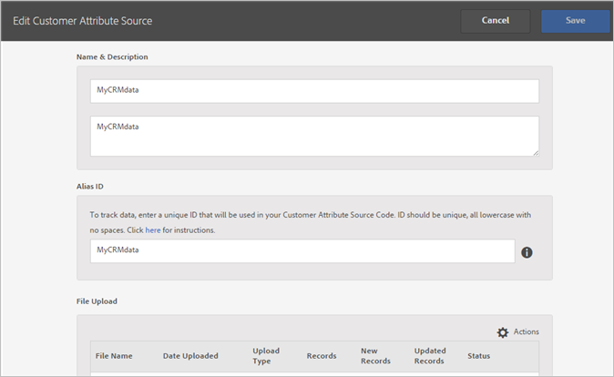

# Een bron voor klantkenmerken maken en het gegevensbestand uploaden

Maak de bron van het klantkenmerk (CSV- en FIN-bestanden) en upload de gegevens. U kunt de gegevensbron activeren wanneer u klaar bent. Nadat de gegevensbron actief is, deel de attributengegevens aan Analytics en Doel.

## Workflow voor klantkenmerken {#concept_BF0AF88E9EF841219ED4D10754CD7154}


1. [Een gegevensbestand maken](t-crs-usecase.md#task_B5FB8C0649374C7A94C45DCF2878EA1A)
1. [De kenmerkbron maken en het gegevensbestand uploaden](t-crs-usecase.md#task_09DAC0F2B76141E491721C1E679AABC8)
1. [Het schema valideren](t-crs-usecase.md#task_09DAC0F2B76141E491721C1E679AABC8)
1. [Abonnementen configureren en kenmerkbron activeren](t-crs-usecase.md#task_1ACA21198F0E46A897A320C244DFF6EA)

Nadat de gegevensbron actief is, kunt u:

* [Klantkenmerken gebruiken in Adobe Analytics](t-crs-usecase.md#task_7EB0680540CE4B65911B2C779210915D)
* [Klantkenmerken gebruiken in Adobe Target](t-crs-usecase.md#task_FC5F9D9059114027B62DB9B1C7D9E257)

>[!IMPORTANT]
>
>Om toegang te krijgen tot deze functie, moeten gebruikers worden toegewezen aan het productprofiel Klantkenmerken (Klantkenmerken - Standaardtoegang. Ga naar **[!UICONTROL Administration]** > **[!UICONTROL Admin Console]** > **[!UICONTROL Products]**. Als *Klantkenmerken* als één van [!UICONTROL Product Profiles] toont, bent u klaar om te beginnen. De gebruikers die aan de groep van Attributen van de Klant worden toegevoegd zien [!UICONTROL Customer Attributes] menu op de linkerkant van de interface van Experience Cloud.
>
>Om de eigenschap van Attributen van de Klant te gebruiken, moeten de gebruikers tot oplossing-vlakke groepen (Analytics of [!DNL Target]) ook behoren.

Zie [Gebruikers en producten van Experience Cloud beheren](admin-getting-started.md#task_3295A85536BF48899A1AB40D207E77E9).

## Een gegevensbestand maken {#task_B5FB8C0649374C7A94C45DCF2878EA1A}

Dit gegeven is gegevens van ondernemingsklanten van uw CRM. De gegevens kunnen abonneegegevens voor producten bevatten, waaronder id&#39;s van leden, producten met de naam, de meest gestarte producten enzovoort.

1. Maak een `.csv`.

   >[!NOTE]
   >
   >Later in dit proces, sleept u - en - laat vallen `.csv` om het dossier te uploaden. Als u echter [uploadt via FTP](t-upload-attributes-ftp.md#task_591C3B6733424718A62453D2F8ADF73B), hebt u ook een `.fin` bestand met dezelfde naam nodig als de `.csv`.

   Voorbeeld bedrijfsklantenbestand:

   

1. Lees voordat u verdergaat de belangrijke informatie in [Gegevensbestandsvereisten](crs-data-file.md#concept_DE908F362DF24172BFEF48E1797DAF19) voordat u het bestand uploadt.
1. [Maak een bron voor klantkenmerken en upload de gegevens](t-crs-usecase.md#task_BCC327B2A0EF4A1BBB2934013AB92B78), zoals hieronder beschreven.

## De kenmerkbron maken en het gegevensbestand uploaden {#task_09DAC0F2B76141E491721C1E679AABC8}

Voer deze stappen op de Create Nieuwe Bron van Attributen van de Klant in de Experience Cloud uit.

>[!IMPORTANT]
>
>Wanneer het creëren van, het wijzigen van, of het schrappen van de bronnen van de klantenattributen, is er een vertraging van maximaal één uur alvorens IDs begint synchroniserend met de nieuwe gegevensbron. U moet administratieve rechten in Audience Manager hebben om de bronnen van de klantenattributen tot stand te brengen of te wijzigen. Neem contact op met de klantenservice of de Audience Manager voor advies om beheerrechten te verkrijgen.

1. Klik in [!DNL Experience Cloud] op het pictogram Menu .
1. Klik onder **[!DNL Experience Platform]** op **[!UICONTROL People]** > **[!UICONTROL Customer Attributes]**.

   Op de pagina [!UICONTROL Customer Attributes] kunt u bestaande bronnen van kenmerkgegevens beheren en bewerken.

   
1. Klik op **[!UICONTROL New]**.

   
1. Configureer op de pagina [!UICONTROL Edit Customer Attribute Source] de volgende velden:

   * **[!UICONTROL Name:]** Een vriendelijke naam voor de bron van het gegevenskenmerk. Voor [!DNL Adobe Target], kunnen de attributennamen geen ruimten omvatten. Als een kenmerk met een spatie wordt doorgegeven, wordt dit door [!DNL Target] genegeerd. Andere tekens worden niet ondersteund: `< , >, ', "`.

   * **[!UICONTROL Description:]** (Optioneel) Een beschrijving van de bron van het gegevenskenmerk.

   * **[!UICONTROL Alias ID:]** Vertegenwoordigt een bron van de gegevens van de klanteneigenschap, zoals een specifiek systeem van CRM. Een unieke id die wordt gebruikt in de broncode van het kenmerk Klant. De id moet uniek zijn, in kleine letters en zonder spaties. De waarde die is ingevoerd in het veld Alias-id voor een bron van klantkenmerken in de gebruikersinterface van Experience Cloud moet overeenkomen met de waarden die worden doorgegeven vanuit de implementatie (via dynamisch tagbeheer of JavaScript van de mobiele SDK.)

      De alias-id komt overeen met bepaalde gebieden waar u extra waarden voor de klant-id instelt. Bijvoorbeeld:

      * **Dynamisch tagbeheer:** De Alias-id komt overeen met de  *Integratie-* codewaarde onder  [!UICONTROL Customer Settings], in het  [Experience Cloud ID-](https://experienceleague.adobe.com/docs/dtm/using/tools/macid.html?lang=en) servicetool.

      * **Bezoeker-API:** De Alias-id komt overeen met de extra  [klant-id&#39;](https://experienceleague.adobe.com/docs/id-service/using/reference/authenticated-state.html?lang=en) s die u aan elke bezoeker kunt koppelen.

         Bijvoorbeeld *&quot;crm_id&quot;* in:

         ```
         "crm_id":"67312378756723456"
         ```

      * **iOS:** De Alias-id komt overeen met  *&quot;idType&quot;* in  [bezoekerSyncIdentifiers:IDs](https://experienceleague.adobe.com/docs/mobile-services/ios/overview.html?lang=en).

         Bijvoorbeeld:

         `[ADBMobile visitorSyncIdentifiers:@{@<`**`"idType"`**`:@"idValue"}];`

      * **Android™:** De alias-id komt overeen met  *&quot;idType&quot;* in  [syncIdentifiers](https://experienceleague.adobe.com/docs/mobile-services/android/overview.html?lang=en).

         Bijvoorbeeld:

         `identifiers.put(`**`"idType"`**`, "idValue");`

         Zie [Meerdere gegevensbronnen gebruiken](crs-data-file.md#section_76DEB6001C614F4DB8BCC3E5D05088CB) voor aanvullende informatie over gegevensverwerking met betrekking tot het veld Alias-id en de id&#39;s van de klant.
   * **[!UICONTROL File Upload:]** U kunt het  `.csv` gegevensbestand slepen en neerzetten, of de gegevens uploaden via FTP. (Voor het gebruik van FTP is ook een `.fin`-bestand vereist.) Zie [De gegevens uploaden via FTP](t-upload-attributes-ftp.md#task_591C3B6733424718A62453D2F8ADF73B).

      >[!IMPORTANT]
      >
      >Er zijn specifieke gegevensbestandsvereisten. Zie [Gegevensbestandsvereisten](crs-data-file.md#concept_DE908F362DF24172BFEF48E1797DAF19) voor meer informatie.


      Nadat u het bestand hebt geüpload, worden de tabelgegevens weergegeven onder de kop [!UICONTROL File Upload] op deze pagina. U kunt het schema valideren, abonnementen configureren of de FTP instellen.

      **Afbeelding voor uploaden bestand**

      

   * **[!UICONTROL Unique Customer ID:]** Hiermee geeft u weer hoeveel unieke id&#39;s u naar deze kenmerkbron hebt geüpload.

   * **[!UICONTROL Customer-Provided IDs Aliased to Experience Cloud Visitor IDs:]** Hiermee wordt weergegeven hoeveel id&#39;s zijn aliased aan Experience Cloud-bezoeker-id&#39;s.

   * **[!UICONTROL Customer-Provided IDs with High Alias Counts:]** Geeft het aantal door de klant opgegeven id&#39;s weer met 500 of meer aliased Experience Cloud Bezoeker-id&#39;s. Deze door de klant opgegeven id&#39;s vertegenwoordigen hoogstwaarschijnlijk geen personen, maar een soort gedeelde aanmelding. Het systeem verdeelt de attributen verbonden aan deze IDs aan 500 meest recente aliased Experience Cloud Bezoeker IDs, tot de aliastelling 10.000 bereikt. Vervolgens maakt het systeem de door de klant opgegeven id ongeldig en worden de bijbehorende kenmerken niet meer gedistribueerd.


## Het schema valideren {#task_404AAC411B0D4E129AB3AC8B7BE85859}

Met het validatieproces kunt u weergavenamen en beschrijvingen toewijzen aan geüploade kenmerken (tekenreeksen, gehele getallen, getallen, enzovoort). U kunt kenmerken ook verwijderen door het schema bij te werken.

Zie [Het schema valideren](validate-schema.md#concept_B3A01A15D04E4F998118E09B3A9B5043).

Zie [ (Optioneel) Het schema bijwerken (kenmerken verwijderen)](t-crs-usecase.md#task_6568898BB7C44A42ABFB86532B89063C) om kenmerken te verwijderen.

## (Optioneel) Werk het schema bij (verwijder kenmerken) {#task_6568898BB7C44A42ABFB86532B89063C}

Hoe te om attributen te schrappen en attributen in het schema te vervangen.

1. Verwijder op de [!UICONTROL Edit Customer Attribute Source] pagina het **[!UICONTROL Target]** of **[!UICONTROL Analytics]** abonnement (onder [!UICONTROL Configure Subscriptions]).
1. [Upload een nieuw gegevensbestand met bijgewerkte gebieden](t-crs-usecase.md#task_09DAC0F2B76141E491721C1E679AABC8).

## Abonnementen configureren en kenmerkbron activeren {#task_1ACA21198F0E46A897A320C244DFF6EA}

Als u een abonnement configureert, wordt de gegevensstroom tussen de Experience Cloud en de oplossingen ingesteld. Door de kenmerkbron te activeren, kunnen de gegevens naar ingetekende oplossingen stromen. De klantrecords die u hebt geüpload, komen overeen met binnenkomende id-signalen van uw website of toepassing.

Zie [Abonnementen configureren](subscription.md#concept_ECA3C44FA6D540C89CC04BA3C49E63BF).

**Een kenmerkbron activeren**

Zoek op de pagina [!UICONTROL Create New [or Edit] Customer Attribute Source] de koptekst [!UICONTROL Activate] en klik vervolgens op **[!UICONTROL Active]**.


## Klantkenmerken gebruiken in Adobe Analytics {#task_7EB0680540CE4B65911B2C779210915D}

Met de gegevens die nu beschikbaar zijn in oplossingen als Adobe Analytics, kunt u de gegevens rapporteren, analyseren en de juiste actie ondernemen in uw marketingcampagnes.

In het volgende voorbeeld wordt een [!DNL Analytics]-segment weergegeven op basis van de geüploade kenmerken. Dit segment toont [!DNL Photoshop Lightroom] abonnees van wie het meest-gelanceerde product Photoshop is.


Wanneer u een segment aan de Experience Cloud publiceert, wordt het beschikbaar in het Publiek van de Experience Cloud en Audience Manager.

## Klantkenmerken gebruiken in Adobe Target {#task_FC5F9D9059114027B62DB9B1C7D9E257}

In [!DNL Target], kunt u een klantenattribuut van &lt;a1 selecteren/> sectie wanneer het creëren van een publiek. [!UICONTROL Visitor Profile] Alle Klantkenmerken hebben het voorvoegsel `crs.` in de lijst. U kunt deze kenmerken desgewenst combineren met andere gegevenskenmerken om een publiek te maken.


Zie [Een nieuw publiek maken](https://experienceleague.adobe.com/docs/target/using/audiences/create-audiences/audiences.html?lang=en) in [!DNL Target] Help.
