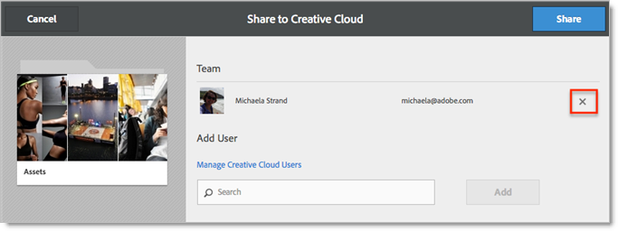

# Een map met Experiencen Cloud delen

Een map met Experiencen Cloud-elementen delen met gebruikers van Creatives Cloud.

1. Selecteer in een map met middelen de optie **[!UICONTROL Share to Creative Cloud]**.

   
1. Zoek op de pagina Delen naar Creative Cloud naar de gebruiker en selecteer vervolgens **[!UICONTROL Add]**.

   

1. Selecteer **[!UICONTROL Share]**.
1. De [!DNL Creative Cloud] (of navigeer naar de [!UICONTROL Creative Cloud Files] (in een browser) en zoek naar de melding van een aanvraag.

   
1. Open het verzoek en selecteer **[!UICONTROL Accept]**.

   
1. Selecteer **[!UICONTROL Open Folder]** (of **[!UICONTROL View on Web]**).

   
1. Voeg verder opmerkingen toe op het gedeelde element:

   In Creative Cloud kunt u in een afbeelding selecteren en vervolgens **[!UICONTROL Activity]** om een opmerking aan de afbeelding toe te voegen. Opmerkingen worden gesynchroniseerd op de elementen in het dialoogvenster [!DNL Creative Cloud] en [!DNL Experience Cloud].

   

   Selecteer in Experience Cloud een afbeelding en selecteer vervolgens het tijdlijnpictogram om een opmerking aan de afbeelding toe te voegen. Opmerkingen worden gesynchroniseerd op de elementen in het Creative Cloud en het Experience Cloud.

   

1. Als u een map niet meer wilt delen, selecteert u **[!UICONTROL Share Using Creative Cloud]** (vergelijkbaar met [Stap 3](t-share-creative-cloud.md#step_BA17CFA185284641A9B878BA29551996)), dan verwijdert u gebruikers door X te selecteren, dan selecteren **[!UICONTROL Share]**.

Nadat u alle gebruikers van het Creative Cloud hebt verwijderd, wordt de map niet meer gedeeld en hebben de gebruikers van het Creative Cloud geen toegang meer.

U kunt een gedeeld element onder andere gebruiken:

* Elementen gebruiken in het dialoogvenster [!UICONTROL Asset Selector] in [!DNL Adobe Social] voor sociale posten.
* Elementen laden of wisselen in het dialoogvenster [Biedt bibliotheek](https://experienceleague.adobe.com/docs/target/using/experiences/offers/manage-content.html?lang=en) in [!DNL Adobe Target] voor afbeeldingen in activiteiten.

Nadat u een map naar het Creative Cloud hebt gedeeld, ziet u het logo van het Creative Cloud in de map.

Verwante hulp:

* [Help bij Creative Cloud - Bestanden beheren en synchroniseren](https://helpx.adobe.com/creative-cloud/help/sync-creative-cloud-files.html)
* [Help bij Creative Cloud - Samenwerken met anderen](https://helpx.adobe.com/creative-cloud/help/collaboration.html)
* [Help bij Creative Cloud - Veelgestelde vragen over samenwerking](https://helpx.adobe.com/creative-cloud/help/collaboration-faq.html)
