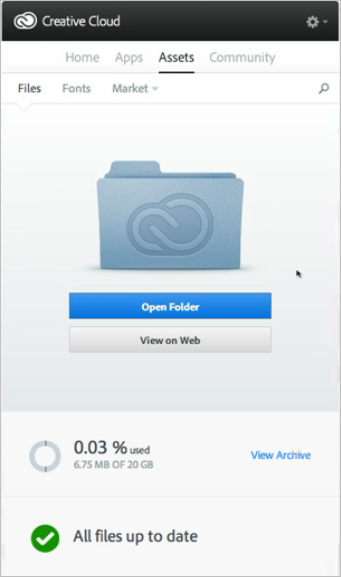

# Een map met Experience Cloud-elementen delen

U kunt een map met Experience Cloud-middelen delen met gebruikers van Creative Cloud.

1. Selecteer **[!UICONTROL Share to Creative Cloud]** in een map Asset.

   
1. Zoek op de pagina Delen naar Creative Cloud naar de gebruiker en selecteer **[!UICONTROL Add]**.

   

1. Selecteer **[!UICONTROL Share]**.
1. Start het [!DNL Creative Cloud]-bureaublad (of navigeer naar de [!UICONTROL Creative Cloud Files]-pagina in een browser) en zoek het aanvraagbericht.

   
1. Open het verzoek en selecteer **[!UICONTROL Accept]**.

   
1. Selecteer **[!UICONTROL Open Folder]** (of **[!UICONTROL View on Web]**) om de inhoud van de map te openen.

   
1. Voeg verder opmerkingen toe op het gedeelde element:

   In Creative Cloud kunt u een afbeelding selecteren en vervolgens **[!UICONTROL Activity]** selecteren om een opmerking aan de afbeelding toe te voegen. Opmerkingen worden gesynchroniseerd op de elementen in de [!DNL Creative Cloud] en [!DNL Experience Cloud].

   

   Selecteer in de Experience Cloud een afbeelding en selecteer vervolgens het tijdlijnpictogram om een opmerking aan de afbeelding toe te voegen. Opmerkingen worden gesynchroniseerd op de elementen in de Creative Cloud en de Experience Cloud.

   

1. Als u een map niet meer wilt delen, selecteert u **[!UICONTROL Share Using Creative Cloud]** (vergelijkbaar met [Stap 3](t-share-creative-cloud.md#step_BA17CFA185284641A9B878BA29551996)) en verwijdert u gebruikers door X te selecteren en vervolgens **[!UICONTROL Share]** te selecteren.

Nadat u alle gebruikers van de Creative Cloud hebt verwijderd, wordt de map niet meer gedeeld en hebben de gebruikers van de Creative Cloud geen toegang meer.

U kunt een gedeeld element onder andere gebruiken:

* Gebruik elementen in [!UICONTROL Asset Selector] in [!DNL Adobe Social] voor sociale posten.
* Laad- of wisselmiddelen in [Biedt Bibliotheek](https://experienceleague.adobe.com/docs/target/using/experiences/offers/manage-content.html?lang=en) in [!DNL Adobe Target] voor afbeeldingen in activiteiten.

Nadat u een map aan de Creative Cloud hebt gedeeld, wordt het logo van de Creative Cloud weergegeven in de map.

Verwante hulp:

* [Creative Cloud Help - Bestanden beheren en synchroniseren](https://helpx.adobe.com/creative-cloud/help/sync-creative-cloud-files.html)
* [Creative Cloud Help - Samenwerken met anderen](https://helpx.adobe.com/creative-cloud/help/collaboration.html)
* [Creative Cloud Help - Veelgestelde vragen over samenwerking](https://helpx.adobe.com/creative-cloud/help/collaboration-faq.html)
