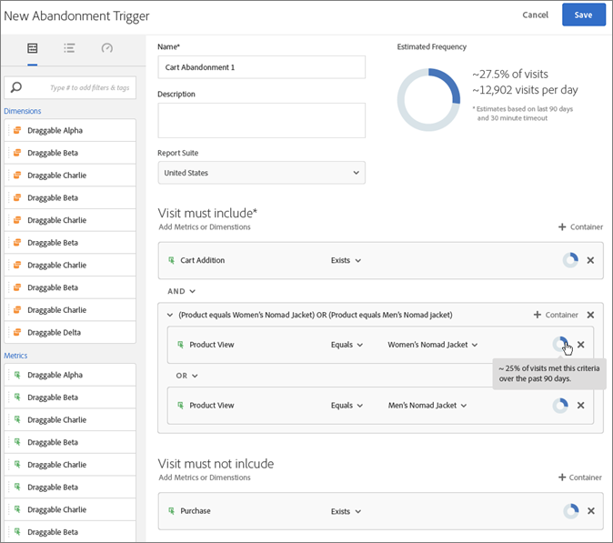
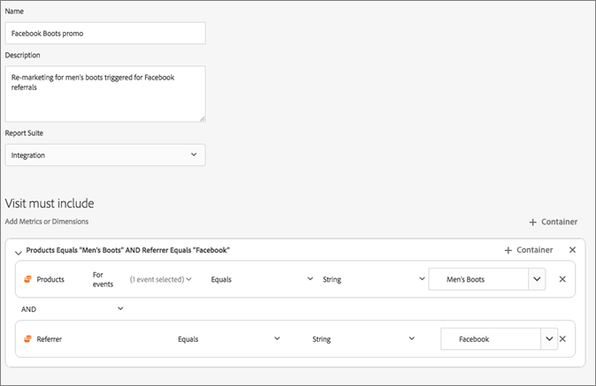

# Experience Cloud Triggers

[!UICONTROL Triggers] in Experience Cloud kunt u het gedrag van de consument identificeren, definiëren en controleren en vervolgens communicatie tussen toepassingen genereren om bezoekers opnieuw aan te trekken.

## Overzicht van triggers {#topic_4F21FCE9A64E46E8B6D51F494FA652A7}

U kunt triggers gebruiken in realtime beslissingen en personalisatie. Bijvoorbeeld:

* Snel opnieuw op de markt brengen voor winkels met winkelwagentjes of winkels met winkels met winkels met winkels en winkels met verwijderde producten configureren
* Incomplete formulieren en toepassingen
* Handelingen of reeksen handelingen op de site

>[!NOTE]
>
>Meer informatie over het gebruik [!UICONTROL Triggers] is beschikbaar in [Campaign Standard](https://experienceleague.adobe.com/docs/campaign-standard/using/integrating-with-adobe-cloud/working-with-campaign-and-triggers/using-triggers-in-campaign.html?lang=en).

### Typen triggers

Over het algemeen kan het 15 tot 90 minuten duren voordat een marketingcampagne wordt gestart. Deze vertraging is afhankelijk van de implementatie van gegevensverzameling, het laden op de pijplijn, de aangepaste configuratie van de gedefinieerde trigger en de workflow in Adobe Campaign.

* **Afschaffing:** U kunt een trigger maken die moet worden geactiveerd wanneer een bezoeker een product weergeeft, maar er niets aan toevoegt.
* **Handeling:** U kunt bijvoorbeeld triggers maken om na aanmelding voor nieuwsbrieven, e-mailabonnementen of aanvragen voor creditcards (bevestigingen) te activeren. Als u een detailhandelaar bent, kunt u een trekker voor een bezoeker tot stand brengen die zich voor een loyaliteitsprogramma ondertekent. In media en vermaak, creeer trekkers voor bezoekers die op een bepaalde show letten, en misschien wilt u met een onderzoek antwoorden.
* **Begin en einde sessie:** Maak een trigger voor het starten en beëindigen van de sessie.

## Een Experience Cloud-trigger maken {#task_821F37183AC045E5AC8EED20317598FE}

Maak een trigger en configureer de voorwaarden voor de trigger. U kunt bijvoorbeeld de criteria voor de regels van een trigger tijdens een bezoek opgeven, zoals maateenheden zoals Kart Abandon of afmetingen zoals de productnaam. Wanneer aan de regels wordt voldaan, loopt de trekker.

>[!NOTE]
>
>Er bestaat momenteel een technische limiet van 100 triggers.

1. Selecteer in de Experience Cloud de optie selecteert u vervolgens **[!UICONTROL Data Collection/Launch]**.
2. Op de [!UICONTROL Triggers] kaart, selecteren **[!UICONTROL Manage Triggers]**.
3. Selecteren **[!UICONTROL New Trigger]** geeft u vervolgens het type trigger op:

   

4. Vorm de trekker door de volgende gebieden te voltooien en metriek en afmetingspunten aan de containers van de regel te slepen:

   | Element | Beschrijving |
   |--- |--- |
   | [!UICONTROL Name] | De vriendelijke naam voor deze trigger. |
   | [!UICONTROL Description] | De beschrijving van deze trigger, hoe u deze gebruikt, enzovoort. |
   | [!UICONTROL Report Suite] | De analyse [rapportsuite](https://experienceleague.adobe.com/docs/analytics/admin/manage-report-suites/report-suites-admin.html) wordt gebruikt voor deze trigger. Deze instelling identificeert de te gebruiken rapportgegevens. |
   | Bezoek moet Bezoek mag geen Trigger na geen handeling Metagegevens opnemen | U kunt criteria of gedrag van bezoekers bepalen die u wilt voorkomen, en gedrag dat u niet wilt voorkomen. De regels voor een eenvoudige trigger voor het verlaten van een winkelwagentje kunnen bijvoorbeeld zijn:<ul><li>Het bezoek moet het volgende omvatten: [!UICONTROL Cart Addition] (metrisch) en  [!UICONTROL Exists]. (U kunt de regel verder verfijnen met een specifieke productweergave of met afmetingen zoals Browsertypen.)</li><li>Bezoek mag niet omvatten:  [!UICONTROL Checkout].</li><li>Trigger na geen actie voor: 10 minuten.</li><li>[!UICONTROL Include Meta Data]: Hiermee kunt u een bepaalde [!DNL Campaign] dimensie of variabelen die relevant zijn voor het gedrag van de bezoeker. Dit veld kan handig zijn voor Adobe Campaign bij het samenstellen van de juiste e-mail voor opnieuw in de handel brengen.</li></ul> U kunt  [!UICONTROL Any],  [!UICONTROL And] of  [!UICONTROL Or] logica binnen of tussen containers, afhankelijk van de criteria u bepaalt zijn belangrijk voor de regel. |
   | [!UICONTROL Container] | [!UICONTROL Containers] Hier kunt u regels, voorwaarden of filters instellen en opslaan die een trigger definiëren. Als u wilt dat gebeurtenissen tegelijkertijd plaatsvinden, plaatst u ze in dezelfde container. Met andere woorden, elke container verwerkt onafhankelijk op raakniveau. Bijvoorbeeld, als u twee containers hebt die door de exploitant worden aangesloten van En, kunt u de regels verwachten om te kwalificeren wanneer twee klappen aan de vereisten voldoen. |
   | Nieuwe sessie starten na | Maak een trigger voor het starten en beëindigen van de sessie. |

   {style=&quot;table-layout:auto&quot;}

5. Selecteer **[!UICONTROL Save]**.
6. Gebruik triggers voor [real-time remarketing](https://experienceleague.adobe.com/docs/campaign-standard/using/integrating-with-adobe-cloud/working-with-campaign-and-triggers/about-adobe-experience-cloud-triggers.html?lang=en) in [!DNL Adobe Campaign].

### Voorbeeld triggers

Voorbeelden van Experience Cloud-triggers:

#### Trigger voor weglating van winkelwagentje

De volgende pagina bevat bijvoorbeeld regels die u kunt gebruiken voor een [!UICONTROL Cart Abandonment] trigger, op basis van producten die tijdens een bezoek worden bekeken.

#### Referrer Trigger

De volgende trigger wordt geactiveerd wanneer een treffer wordt geleverd met het product van Men&#39;s Boots en referrer van Facebook. Voor de twee criteria (*producten* en *referentie*) die in dezelfde hit moeten worden geëvalueerd, moeten ze aan dezelfde container worden toegevoegd.

