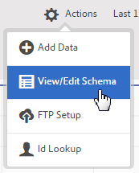

# Het schema valideren

Met het validatieproces kunt u weergavenamen en beschrijvingen toewijzen aan geüploade kenmerken (tekenreeksen, gehele getallen, getallen, enzovoort). Op basis van deze instellingen wordt een schema gemaakt. Het schema wordt gebruikt om alle toekomstige gegevens te bevestigen die aan deze gegevensbron worden geupload. De oorspronkelijke gegevens worden niet gewijzigd door het toewijzingsproces.

>[!NOTE]
>
>Wanneer u het schema bijwerkt nadat de validatie is uitgevoerd, worden de klantkenmerken verwijderd. Zie [Het schema bijwerken (ook kenmerken worden verwijderd)](t-crs-usecase.md#task_6568898BB7C44A42ABFB86532B89063C).

**[!UICONTROL Customer Attribute Source]** > **[!UICONTROL Create New Customer Attribute Source]** > **[!UICONTROL View/Edit Schema]**

Op de [!UICONTROL Validate Schema] pagina, vertegenwoordigt elke rij van het schema een kolom van het geüploade Csv- dossier.

* **[!UICONTROL Add Data:]** Nieuwe kenmerkgegevens uploaden naar deze gegevensbron.

* **[!UICONTROL View/Edit Schema:]** Wijs weergavenamen toe aan de kenmerkgegevens, zoals in de volgende stap wordt beschreven.

* **[!UICONTROL FTP Setup:]** [De gegevens uploaden via FTP](t-upload-attributes-ftp.md#task_591C3B6733424718A62453D2F8ADF73B).

* **[!UICONTROL ID Lookup:]** Geef een Customer ID (CID) op van je `.csv` om Experience Cloud-informatie voor de id op te zoeken. Deze functie is handig voor het oplossen van problemen waarom kenmerkgegevens niet worden weergegeven voor een bezoeker:

   * **[!UICONTROL ECID (Experience Cloud ID):]** Toont als u de recentste Dienst van identiteitskaart van het Experience Cloud gebruikt. Als u zich op de dienst MCID bevindt maar geen IDs hier vermeld is, heeft het Experience Cloud geen alias voor die CID ontvangen. Dit betekent dat de bezoeker zich niet heeft aangemeld of dat uw implementatie die id niet doorgeeft.

   * **[!UICONTROL CID (Customer ID):]** De kenmerken die aan deze CID zijn gekoppeld. Als u een profiel of eVar gebruikt om CID&#39;s (AVID) te uploaden en u kenmerken ziet die worden weergegeven maar geen AVID, geeft dit aan dat de bezoeker zich niet heeft aangemeld bij uw site.

   * **[!UICONTROL AVID (Analytics visitor ID):]** Hier wordt weergegeven of u een profiel of eVar gebruikt om CID&#39;s te uploaden. Als deze id&#39;s worden doorgegeven aan het Experience Cloud, worden hier alle bezoekers-id&#39;s weergegeven die zijn gekoppeld aan de ingevoerde CID.

U kunt gegevens ook uploaden via FTP nadat u een bron voor klantkenmerken en een FTP-account in Experience Cloud hebt gemaakt. U maakt één FTP-account per kenmerkbron. De geüploade bestanden worden opgeslagen in de hoofdmap van dat account. De gegevens moeten in `.csv` formaat, met een tweede formaat `.fin` om aan te geven dat het uploaden is voltooid.

De namen die u toepast op tekenreeksen, gehele getallen en getallen worden gebruikt om [!DNL Analytics] metriek.

* **[!UICONTROL Attribute:]** Kenmerkgegevens die worden gelezen van het geüploade `.csv` bestand.

* **[!UICONTROL Type:]** Het gegevenstype, zoals:

   * **Tekenreeks:** Een reeks tekens.

   * **Geheel getal:** Hele getallen.

   * **Getallen:** Kan uit maximaal twee decimalen bestaan.

* **[!UICONTROL Display Name:]** Een vriendelijke naam voor het kenmerk. U kunt bijvoorbeeld een kenmerk wijzigen *klantleeftijd* tot *Klant sinds*.

* **[!UICONTROL Description:]** Een vriendelijke beschrijving van het kenmerk.
